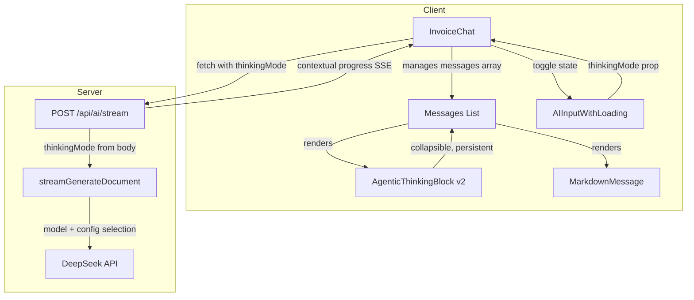
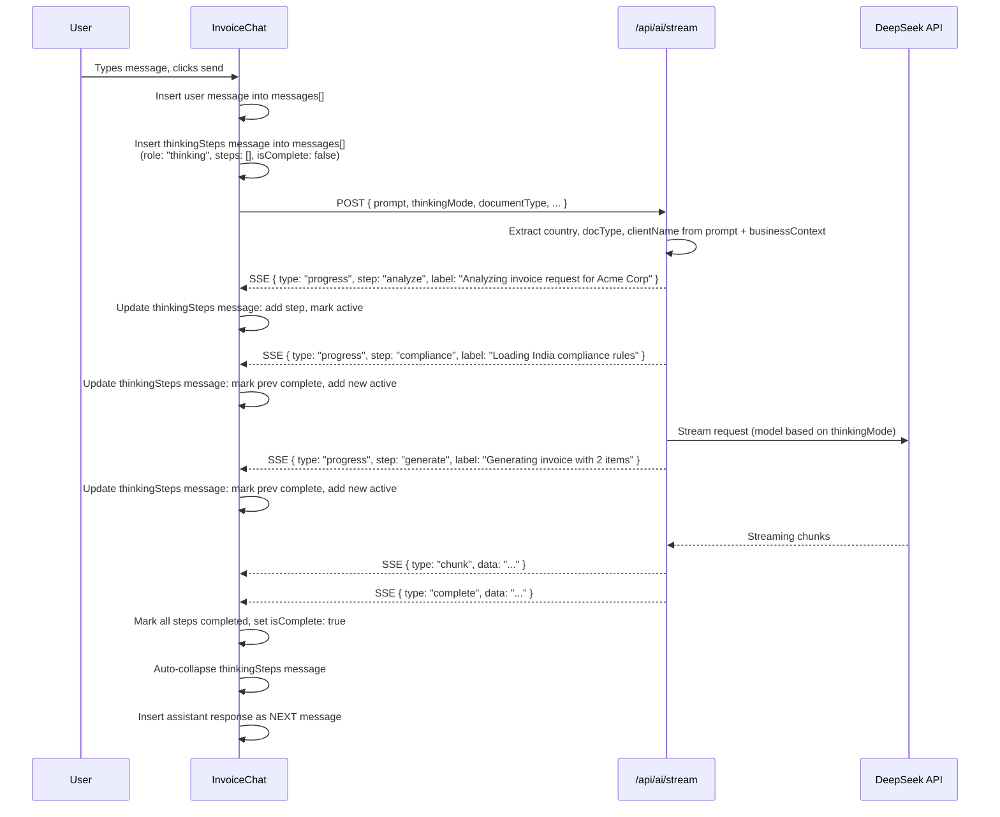
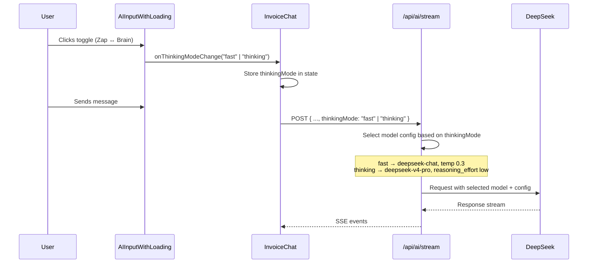

# Design Document: Agentic Thinking UI

## Overview

The Agentic Thinking UI feature transforms the ephemeral, loading-state-bound thinking block into a permanent, collapsible chat message that persists in the conversation history. Currently, the `AgenticThinkingBlock` component is rendered conditionally based on `isLoading` state — when generation completes, it vanishes. The new design treats thinking steps as a first-class message type in the messages array, ensuring they remain visible and expandable after completion.

Additionally, this feature re-introduces a fast/thinking mode toggle in the chat input area. The toggle switches between `deepseek-chat` (fast, temperature 0.3) and `deepseek-v4-pro` (thinking mode, reasoning_effort low), flowing the selection from the UI through the API body to the DeepSeek configuration. The entire UI follows a monochromatic design language — no colored icons, no card borders, just clean foreground/muted-foreground styling that feels native to the chat.

The server-side stream route is also enhanced to send contextual progress messages that include the actual country name, document type, and client name extracted from the user's prompt, replacing the current generic labels.

## Architecture



## Sequence Diagrams

### Main Flow: User Sends Message with Thinking Steps



### Fast/Thinking Mode Toggle Flow



## Components and Interfaces

### Component 1: AgenticThinkingBlock (Rewrite)

**Purpose**: Renders a persistent, collapsible thinking steps block as part of the chat message history. Monochromatic design with no colored icons.

**Interface**:
```typescript
export type StepStatus = "pending" | "active" | "completed"

export interface ThinkingStep {
  id: string
  label: string
  status: StepStatus
}

interface AgenticThinkingBlockProps {
  steps: ThinkingStep[]
  isComplete: boolean
  className?: string
}
```

**Responsibilities**:
- Render a collapsible header with chevron, summary text, and step count
- Show individual steps as clean bullet points (no timeline, no icons per step)
- Active step: small spinner (Loader2, w-3 h-3) + foreground/70 text
- Completed step: small check (Check, w-3 h-3) + muted-foreground text
- Auto-collapse 800ms after `isComplete` becomes true
- User can toggle expand/collapse at any time via chevron click
- Collapsed state shows: "▼ Worked on your {docType}    N steps"
- Expanded state shows clean bullet list of all steps
- All styling uses only `foreground` and `muted-foreground` colors — no green, violet, or emerald
- No border, no card background, no shadow — blends into chat

### Component 2: AIInputWithLoading (Modified)

**Purpose**: Chat input with file attachment and the re-added fast/thinking mode toggle.

**Interface changes**:
```typescript
interface AIInputWithLoadingProps {
  // ... existing props unchanged ...
  thinkingMode?: "fast" | "thinking"
  onThinkingModeChange?: (mode: "fast" | "thinking") => void
}
```

**Responsibilities**:
- Render a small icon-only toggle button to the left of the send button (or right of the attach button)
- Zap icon = fast mode, Brain icon = thinking mode
- Monochromatic: `text-muted-foreground` default, `text-foreground` when active/hovered
- Smooth crossfade animation between icons (opacity transition, 200ms)
- Toggle state is controlled by parent (InvoiceChat) via props
- Disabled state when `isLoading` or `isUploading`

### Component 3: InvoiceChat (Modified)

**Purpose**: Manages the messages array, thinking mode state, and coordinates thinking steps as permanent messages.

**Interface changes**:
```typescript
// Extended message type to support thinking steps
interface ChatMessage {
  role: "user" | "assistant" | "thinking"
  content: string
  // Existing card types
  sendCard?: { email: string }
  shareCard?: boolean
  paymentCard?: boolean
  cancelledCard?: boolean
  // New: thinking steps data
  thinkingSteps?: ThinkingStep[]
  thinkingComplete?: boolean
}
```

**Responsibilities**:
- Maintain `thinkingMode` state ("fast" | "thinking"), default "fast"
- When sending a message: insert a `{ role: "thinking", content: "", thinkingSteps: [], thinkingComplete: false }` message into the array BEFORE starting the API call
- On progress SSE events: update the thinking message's `thinkingSteps` array in-place (via index)
- On stream complete: set `thinkingComplete: true` on the thinking message
- The assistant's actual response is appended as the NEXT message after the thinking message
- Pass `thinkingMode` to the API request body
- Pass `thinkingMode` and `onThinkingModeChange` to `AIInputWithLoading`

## Data Models

### ThinkingStep

```typescript
interface ThinkingStep {
  id: string        // e.g., "analyze", "compliance", "generate"
  label: string     // Contextual label, e.g., "Looking up India compliance rules"
  status: StepStatus // "pending" | "active" | "completed"
}
```

**Validation Rules**:
- `id` must be a non-empty string
- `label` must be a non-empty string
- `status` must be one of the three valid values

### ThinkingMode

```typescript
type ThinkingMode = "fast" | "thinking"
```

**Mapping to DeepSeek config**:
- `"fast"` → `{ model: "deepseek-chat", temperature: 0.3 }`
- `"thinking"` → `{ model: "deepseek-v4-pro", temperature: undefined, reasoning_effort: "low" }`

### Extended AIGenerationRequest

```typescript
export interface AIGenerationRequest {
  // ... existing fields ...
  thinkingMode?: "fast" | "thinking"
}
```

### Contextual Progress Event (Server → Client)

```typescript
interface ProgressEvent {
  type: "progress"
  step: string       // "analyze" | "compliance" | "generate"
  label: string      // Contextual label with actual names
}
```

## Key Functions with Formal Specifications

### Function 1: extractContextFromPrompt()

```typescript
// Server-side: Extract country, document type, and client name from the prompt and business context
function extractContextFromPrompt(
  prompt: string,
  businessContext?: AIGenerationRequest["businessContext"],
  documentType?: string
): { country: string; docType: string; clientName: string }
```

**Preconditions:**
- `prompt` is a non-empty string
- `businessContext` may be undefined (graceful fallback)

**Postconditions:**
- Returns an object with `country`, `docType`, and `clientName`
- `country` defaults to the business profile country, or "your country" if unavailable
- `docType` defaults to `documentType` parameter or "document"
- `clientName` is extracted from prompt via regex patterns (e.g., "for Acme Corp", "to John Doe"), or empty string if not found
- No side effects

### Function 2: getModelConfig()

```typescript
// Server-side: Map thinkingMode to DeepSeek model configuration
function getModelConfig(thinkingMode?: "fast" | "thinking"): {
  model: string
  temperature?: number
  reasoning_effort?: string
}
```

**Preconditions:**
- `thinkingMode` is either "fast", "thinking", or undefined

**Postconditions:**
- If "fast" or undefined: returns `{ model: "deepseek-chat", temperature: 0.3 }`
- If "thinking": returns `{ model: "deepseek-v4-pro", reasoning_effort: "low" }`
- No side effects, pure function

### Function 3: updateThinkingMessage()

```typescript
// Client-side: Immutably update the thinking message in the messages array
function updateThinkingMessage(
  messages: ChatMessage[],
  thinkingIndex: number,
  newStep: ThinkingStep
): ChatMessage[]
```

**Preconditions:**
- `messages` is a valid array
- `thinkingIndex` is a valid index pointing to a message with `role: "thinking"`
- `newStep` has a valid `id`, `label`, and `status`

**Postconditions:**
- Returns a new array (immutable update)
- The thinking message at `thinkingIndex` has its `thinkingSteps` updated:
  - All previously "active" steps are marked "completed"
  - `newStep` is appended with status "active"
- All other messages in the array are unchanged
- Original array is not mutated

## Example Usage

### Rendering a thinking message in the chat

```typescript
// Inside InvoiceChat's message rendering loop
{messages.map((msg, idx) => {
  if (msg.role === "thinking" && msg.thinkingSteps) {
    return (
      <div key={idx} className="flex justify-start w-full">
        <div className="w-full max-w-[85%]">
          <AgenticThinkingBlock
            steps={msg.thinkingSteps}
            isComplete={msg.thinkingComplete ?? false}
          />
        </div>
      </div>
    )
  }
  // ... render user/assistant messages as before
})}
```

### Inserting thinking message on send

```typescript
// Inside sendMessage callback, before the fetch call
const thinkingMsg: ChatMessage = {
  role: "thinking",
  content: "",
  thinkingSteps: [],
  thinkingComplete: false,
}
setMessages(prev => [...prev, { role: "user", content: displayText }, thinkingMsg])
const thinkingIndex = messages.length + 1 // index of the thinking message we just added
```

### Handling progress events from SSE

```typescript
if (parsed.type === "progress") {
  setMessages(prev => {
    const updated = [...prev]
    const thinkingMsg = updated.find(m => m.role === "thinking" && !m.thinkingComplete)
    if (thinkingMsg && thinkingMsg.thinkingSteps) {
      // Mark previous active step as completed
      thinkingMsg.thinkingSteps = thinkingMsg.thinkingSteps.map(s =>
        s.status === "active" ? { ...s, status: "completed" } : s
      )
      // Add new active step
      thinkingMsg.thinkingSteps.push({
        id: parsed.step,
        label: parsed.label,
        status: "active",
      })
    }
    return updated
  })
}
```

### Toggle in the input area

```typescript
<AIInputWithLoading
  // ... existing props ...
  thinkingMode={thinkingMode}
  onThinkingModeChange={setThinkingMode}
/>
```

### Server-side contextual progress

```typescript
// In app/api/ai/stream/route.ts
const { country, docType, clientName } = extractContextFromPrompt(
  body.prompt,
  body.businessContext,
  body.documentType
)

sendEvent({
  type: "progress",
  step: "analyze",
  label: `Analyzing ${docType} request${clientName ? ` for ${clientName}` : ""}`,
})

sendEvent({
  type: "progress",
  step: "compliance",
  label: `Loading ${country} compliance rules`,
})

sendEvent({
  type: "progress",
  step: "generate",
  label: `Generating ${docType}${clientName ? ` for ${clientName}` : ""}`,
})
```

### Model selection based on thinkingMode

```typescript
// In streamGenerateDocument or stream route
const modelConfig = getModelConfig(body.thinkingMode)

const response = await fetch(DEEPSEEK_API_URL, {
  method: "POST",
  headers: { ... },
  body: JSON.stringify({
    model: modelConfig.model,
    messages: [...],
    max_tokens: 3000,
    ...(modelConfig.temperature !== undefined && { temperature: modelConfig.temperature }),
    ...(modelConfig.reasoning_effort && { reasoning_effort: modelConfig.reasoning_effort }),
    stream: true,
  }),
})
```

## Correctness Properties

1. **Thinking message persistence**: For all user messages that trigger an API call, a thinking message is inserted into the messages array and remains there after generation completes. It is never removed from the array.

2. **Step ordering**: Thinking steps within a message are always in chronological order. Each new progress event appends to the end. No step is ever reordered or removed.

3. **Single active step**: At any point in time, at most one step in a thinking message has `status: "active"`. When a new step becomes active, all previously active steps become "completed".

4. **Auto-collapse on completion**: When `isComplete` transitions from false to true, the block auto-collapses after a delay. The user can still manually expand it.

5. **Toggle state consistency**: The `thinkingMode` value in the UI always matches the value sent in the API request body, which always matches the model configuration used by the server.

6. **Monochromatic constraint**: The AgenticThinkingBlock component uses only `foreground`, `muted-foreground`, and their opacity variants. No color utility classes (green, emerald, violet, blue, etc.) are present.

7. **Message ordering**: The thinking message always appears immediately after the user message and immediately before the assistant response message. No other messages are inserted between them.

## Error Handling

### Error Scenario 1: Stream fails mid-progress

**Condition**: The SSE stream errors out after some progress events have been sent but before completion.
**Response**: Mark all active steps as completed, set `thinkingComplete: true`. The thinking message stays in the chat showing whatever steps completed. The error message appears as the next assistant message.
**Recovery**: User can retry by sending another message. A new thinking message will be created.

### Error Scenario 2: No progress events received

**Condition**: The API responds but sends no progress events (e.g., immediate error).
**Response**: The thinking message stays with an empty steps array and `thinkingComplete: true`. It renders as a minimal collapsed block. The error appears as the assistant message.
**Recovery**: Automatic — the empty thinking block is unobtrusive.

### Error Scenario 3: Invalid thinkingMode value

**Condition**: An unexpected value is passed for `thinkingMode`.
**Response**: Server defaults to "fast" mode configuration. No error is thrown.
**Recovery**: Automatic fallback.

## Testing Strategy

### Unit Testing Approach

- Test `extractContextFromPrompt()` with various prompt patterns: "create invoice for Acme Corp", "generate quotation", "make a contract for John Doe in India"
- Test `getModelConfig()` returns correct model/temperature for each mode
- Test `AgenticThinkingBlock` renders correct number of steps, correct icons, correct collapsed/expanded state
- Test that auto-collapse fires after `isComplete` becomes true
- Test toggle button renders correct icon for each mode

### Integration Testing Approach

- Test full SSE flow: send message → receive progress events → thinking message updates → completion → assistant message appears
- Test that `thinkingMode` flows from toggle click → state → API body → server model selection
- Test that thinking messages persist across re-renders and don't vanish when `isLoading` changes

## Performance Considerations

- The thinking message update uses React state updates. Since we're updating a specific message in an array, we use a targeted update pattern (find the thinking message, update its steps) rather than replacing the entire array.
- The auto-collapse timer is cleaned up on unmount to prevent memory leaks.
- The toggle animation uses CSS transitions (opacity, transform) rather than JS animation for smooth 60fps performance.
- No new dependencies are introduced — all icons come from Lucide React, all styling from Tailwind.

## Security Considerations

- The `thinkingMode` parameter is validated server-side. Only "fast" and "thinking" are accepted; any other value falls back to "fast".
- Client name extraction from prompts is done server-side and only used for display labels in progress events — no security-sensitive operations depend on it.
- The contextual progress labels are generated server-side from trusted data (business profile country, document type from validated input).

## Dependencies

- No new dependencies required
- Existing: `lucide-react` (Zap, Brain, ChevronDown, Loader2, Check icons), `tailwindcss`, `react`
