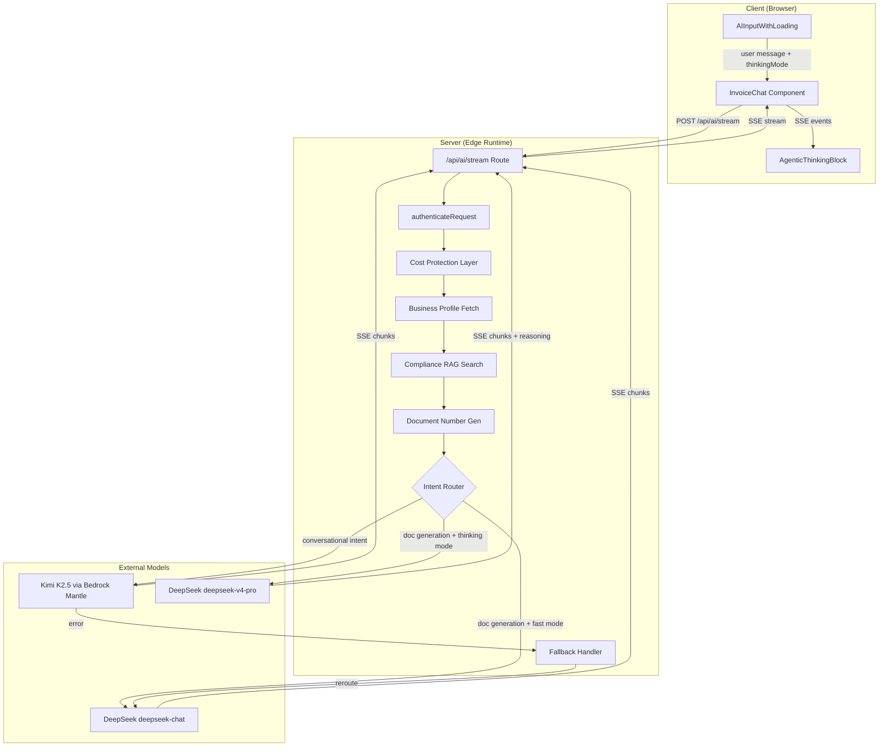

# Design Document: AI Dual-Model Chat

## Overview

This design describes a dual-model AI architecture where two LLMs serve distinct roles within a single chat interface. Kimi K2.5 (via Amazon Bedrock Mantle) handles conversational responses — business questions, explanations, and general chat. DeepSeek handles structured document generation — invoices, contracts, quotations, and proposals with JSON output.

A server-side Router in `app/api/ai/stream/route.ts` classifies each incoming message as either "document generation" or "conversational" and dispatches to the appropriate model. If Kimi K2.5 is unavailable (auth failure, rate limit, network error), a Fallback Handler transparently reroutes to DeepSeek. The entire pipeline streams responses via SSE, with real-time activity events rendered in an agentic thinking UI.

Key design decisions:
- **Regex-based intent classification** over ML classifiers — simpler, deterministic, zero latency, and sufficient for the verb-based heuristic needed here.
- **Bedrock Mantle's OpenAI-compatible API** — avoids AWS SDK dependency, keeping the implementation edge-runtime compatible for Cloudflare Workers.
- **Single streaming endpoint** — both models share `/api/ai/stream` with unified SSE event types, simplifying client-side handling.
- **Fallback is transparent** — the client sees a model label change in the activity stream but otherwise processes the response identically.

## Architecture



### Request Lifecycle

1. **Client** sends POST to `/api/ai/stream` with prompt, documentType, sessionId, thinkingMode, conversationHistory, and currentData.
2. **Auth & Cost** — `authenticateRequest()` validates the user, `checkCostLimit()` and `checkMessageLimit()` enforce tier limits.
3. **Context Enrichment** — Business profile, compliance rules (via RAG), and document number are fetched. Each step emits an SSE activity event.
4. **Intent Classification** — The Router evaluates the prompt against regex patterns to determine document generation vs. conversational intent.
5. **Model Dispatch** — The request is routed to the appropriate model. For chat, Kimi K2.5 is tried first with DeepSeek as fallback.
6. **Streaming** — Model responses stream as SSE events (`chunk`, `reasoning`, `complete`, `error`) through a `ReadableStream`.
7. **Post-Processing** — Usage is tracked, document count incremented, and audit log written.

## Components and Interfaces

### 1. Intent Router (`app/api/ai/stream/route.ts`)

The Router is a pure function that classifies user messages into document generation or conversational intent.

```typescript
// Intent classification logic (inline in route handler)
const isDocGeneration: boolean =
    /create|generate|make|build|draft|prepare|change|update|add|remove|modify/i.test(prompt)
    && !(/what|how|why|explain|tell me|can you|is it|does|should/i.test(prompt)
         && !/create|generate|make/i.test(prompt))
```

**Classification rules:**
- Document generation verbs present AND no question-word-only pattern → `Document_Model`
- Question words present without generation verbs → `Chat_Model`
- Both present (e.g., "can you create an invoice") → generation verbs take priority → `Document_Model`
- Ambiguous (neither pattern matches) → `Chat_Model` (default)
- Classification is stateless — each message evaluated independently.

### 2. Bedrock Chat Client (`lib/bedrock.ts`)

```typescript
interface BedrockChatConfig {
    endpoint: "https://bedrock-mantle.us-east-1.api.aws/v1/chat/completions"
    model: "moonshotai.kimi-k2.5"
    maxTokens: 2000
    temperature: 0.3
    stream: true
}

async function* streamBedrockChat(
    systemPrompt: string,
    userPrompt: string,
    apiKey: string
): AsyncGenerator<{ type: "chunk" | "complete" | "error"; data: string }>
```

- Uses OpenAI-compatible chat completions format (messages array with system + user roles).
- Authenticates via `Authorization: Bearer {apiKey}`.
- Parses SSE stream with line buffering for TCP chunk boundaries.
- Yields `chunk` events for incremental content, `complete` for full accumulated text, `error` for failures.

### 3. DeepSeek Document Client (`lib/deepseek.ts`)

```typescript
async function* streamGenerateDocument(
    request: AIGenerationRequest,
    apiKeyOverride?: string
): AsyncGenerator<{ type: "chunk" | "complete" | "error" | "reasoning"; data: string }>
```

- **Fast mode** (`thinkingMode: "fast"`): Uses `deepseek-chat` model, `temperature: 0.3`, no reasoning tokens.
- **Thinking mode** (`thinkingMode: "thinking"`): Uses `deepseek-v4-pro` model, `reasoning_effort: "low"`, emits `reasoning` events from `reasoning_content` field.
- Strips markdown code fences from final output before emitting `complete`.
- `buildPrompt()` constructs the full user-context prompt with business profile, compliance context, conversation history, and document data.

### 4. Fallback Handler (inline in route handler)

```typescript
// Fallback logic in route handler
if (bedrockKey && bedrockKey.length > 10) {
    // Try Kimi K2.5
    for await (const chunk of streamBedrockChat(...)) {
        if (chunk.type === "error" && isAuthOrNetworkError(chunk.data)) {
            bedrockFailed = true
            break  // Discard partial content
        }
        sendEvent(chunk)
    }
    if (bedrockFailed) {
        // Reroute to DeepSeek — emit updated activity label
        sendEvent({ type: "activity", action: "generate", label: "Responding", detail: "DeepSeek (fallback)" })
        for await (const chunk of streamGenerateDocument(body, deepseekKey)) {
            sendEvent(chunk)
        }
    }
} else {
    // No valid key — skip directly to DeepSeek
    for await (const chunk of streamGenerateDocument(body, deepseekKey)) {
        sendEvent(chunk)
    }
}
```

**Fallback triggers:**
- HTTP 401/403 from Bedrock (invalid/expired key)
- HTTP 429 from Bedrock (rate limit)
- Network errors or exceptions during streaming
- API key missing or < 10 characters (skip Kimi entirely)

**Fallback behavior:**
- Partial content from Kimi is discarded (not forwarded to client).
- Activity stream updates to show "DeepSeek (fallback)".
- Usage tracked only once for the successful model.

### 5. Activity Stream (SSE events from server)

```typescript
interface ActivityEvent {
    type: "activity"
    action: "read" | "search" | "generate"
    label: string
    detail?: string
}
```

Events are emitted at each real processing step:
1. `{ action: "read", label: "Business profile" }` → updated with business name or "Not found"
2. `{ action: "search", label: "{country} compliance rules" }` → updated with rule count + tax rate
3. `{ action: "generate", label: "Document number", detail: "INV-2025-01-001" }`
4. `{ action: "generate", label: "Generating document" | "Responding", detail: "DeepSeek" | "Kimi K2.5" | "DeepSeek (fallback)" }`

### 6. AgenticThinkingBlock (`components/ui/agentic-thinking-block.tsx`)

```typescript
interface ActivityItem {
    id: string
    action: "read" | "think" | "search" | "generate"
    label: string
    detail?: string
    reasoningText?: string  // Only for "think" items
}

interface AgenticThinkingBlockProps {
    activities: ActivityItem[]
    isWorking: boolean
    className?: string
}
```

- Renders a vertical timeline with icons per action type (FileText, Search, Sparkles).
- Pulse animation on last row while `isWorking` is true.
- Expandable rows for "think" activities showing reasoning tokens with streaming cursor.
- Vertical dotted connecting line between rows when > 1 activity.
- Monochromatic styling — `text-muted-foreground` icons, `bg-muted/50` backgrounds.
- Persists in chat history after completion as a collapsible element.

### 7. AIInputWithLoading (`components/ui/ai-input-with-loading.tsx`)

- Thinking mode toggle button (Zap icon for fast, Brain icon for thinking).
- Toggle state managed by parent component, persists within browser session.
- Defaults to "fast" on initial load.
- Disabled during loading/uploading states.

### 8. InvoiceChat (`components/invoice-chat.tsx`)

Client-side SSE consumer that:
- Opens a fetch stream to `/api/ai/stream`.
- Buffers incomplete SSE lines across TCP chunks using `sseBuffer`.
- Routes parsed events to appropriate state updates:
  - `activity` → updates thinking block activities
  - `reasoning` → appends to think activity's reasoningText
  - `chunk` → accumulates content, streams text for non-JSON responses
  - `complete` → finalizes response, parses JSON for document data
  - `error` → displays error message
- Detects JSON vs. plain text responses after 200 chars to decide streaming behavior.
- Strips markdown code fences from complete responses before JSON parsing.

## Data Models

### SSE Event Types

```typescript
// Server → Client SSE events
type SSEEvent =
    | { type: "activity"; action: "read" | "search" | "generate"; label: string; detail?: string }
    | { type: "chunk"; data: string }           // Incremental content text
    | { type: "reasoning"; data: string }       // Chain-of-thought tokens (thinking mode only)
    | { type: "complete"; data: string }        // Full cleaned response
    | { type: "error"; data: string }           // Error message
```

### Request Payload

```typescript
interface AIStreamRequest {
    prompt: string                              // User message (max 10,000 chars)
    documentType: string                        // "invoice" | "contract" | "quotation" | "proposal"
    sessionId?: string                          // For message limit tracking
    thinkingMode?: "fast" | "thinking"          // Defaults to "fast"
    currentData?: Partial<InvoiceData>          // Existing document for edits
    conversationHistory?: Array<{               // Last 20 messages
        role: "user" | "assistant"
        content: string
    }>
    fileContext?: string                         // Uploaded file contents (max 5,000 chars)
    parentContext?: {                            // Linked document context
        documentType: string
        data: Record<string, any>
    }
}
```

### Model Configuration

| Property | Kimi K2.5 (Chat) | DeepSeek Fast | DeepSeek Thinking |
|---|---|---|---|
| Model ID | `moonshotai.kimi-k2.5` | `deepseek-chat` | `deepseek-v4-pro` |
| Endpoint | Bedrock Mantle | DeepSeek API | DeepSeek API |
| Max Tokens | 2,000 | 3,000 | 3,000 |
| Temperature | 0.3 | 0.3 | N/A (reasoning_effort) |
| Reasoning | No | No | Yes (`reasoning_effort: "low"`) |
| Stream | Yes | Yes | Yes |
| Auth | Bearer token (`amazon_beadrocl_key`) | Bearer token (`DEEPSEEK_API_KEY`) | Bearer token (`DEEPSEEK_API_KEY`) |

### Environment Variables

| Variable | Source | Description |
|---|---|---|
| `amazon_beadrocl_key` | `process.env` or `globalThis` | Bedrock Mantle API key (typo preserved) |
| `DEEPSEEK_API_KEY` | Vault via `getSecret()` | DeepSeek API key |
| `OPENAI_API_KEY` | Vault via `getSecret()` | OpenAI embeddings for RAG (compliance search) |


## Correctness Properties

*A property is a characteristic or behavior that should hold true across all valid executions of a system — essentially, a formal statement about what the system should do. Properties serve as the bridge between human-readable specifications and machine-verifiable correctness guarantees.*

### Property 1: Intent classification follows priority rules

*For any* user prompt string, the intent classification SHALL satisfy all of the following:
- If the prompt contains document generation verbs ("create", "generate", "make", "build", "draft", "prepare", "change", "update", "add", "remove", "modify") and does not contain only question words without generation verbs, then `isDocGeneration` SHALL be `true`.
- If the prompt contains question words ("what", "how", "why", "explain", "tell me") without any document generation verbs, then `isDocGeneration` SHALL be `false`.
- If the prompt contains both question words and document generation verbs, then `isDocGeneration` SHALL be `true` (generation takes priority).
- If the prompt contains neither generation verbs nor question words, then `isDocGeneration` SHALL be `false` (defaults to chat).

**Validates: Requirements 1.1, 1.2, 1.3, 1.4**

### Property 2: buildPrompt includes all provided context sections

*For any* valid `AIGenerationRequest` with a non-empty business profile (name, country, currency), the output of `buildPrompt()` SHALL contain the business name, country, currency, and document type. If `complianceContext` is provided, the output SHALL contain the compliance context string. If `conversationHistory` is provided, the output SHALL contain at least the last message from the history. If `fileContext` is provided, the output SHALL contain the file context string.

**Validates: Requirements 3.1**

### Property 3: Code fence stripping preserves inner content

*For any* non-empty content string that does not itself contain the sequence "```", wrapping it in any of the markdown code fence patterns (`` ```json\n{content}\n``` ``, `` ```\n{content}\n``` ``) and then applying the stripping logic SHALL produce a result that, when trimmed, equals the original content string trimmed.

**Validates: Requirements 3.5**

### Property 4: API key validation boundary at 10 characters

*For any* string of length less than 10 (including empty string), the Bedrock key guard SHALL evaluate to `false` (skip Kimi, route to DeepSeek). *For any* string of length 10 or greater, the guard SHALL evaluate to `true` (attempt Kimi).

**Validates: Requirements 4.3**

### Property 5: SSE parser correctly reassembles events across arbitrary chunk boundaries

*For any* sequence of valid SSE events (each formatted as `data: {json}\n\n`), when the concatenated byte stream is split at arbitrary positions into chunks and fed sequentially to the SSE line-buffering parser, the parser SHALL extract exactly the same set of parsed JSON objects as parsing the unsplit stream. Additionally, if malformed JSON lines are interspersed among valid lines, the parser SHALL skip malformed lines and still extract all valid events without throwing.

**Validates: Requirements 2.2, 2.3, 3.4, 11.1, 11.3**

### Property 6: AgenticThinkingBlock renders one row per activity

*For any* non-empty array of `ActivityItem` objects (each with unique id, valid action, and label), the `AgenticThinkingBlock` component SHALL render exactly `activities.length` activity rows, each containing the corresponding label text.

**Validates: Requirements 6.1**

## Error Handling

### Server-Side Error Handling

| Error Source | HTTP Status | Behavior |
|---|---|---|
| Bedrock 401/403 | N/A (internal) | Fallback to DeepSeek, log error, emit fallback activity |
| Bedrock 429 | N/A (internal) | Fallback to DeepSeek, log error, emit fallback activity |
| Bedrock network error | N/A (internal) | Fallback to DeepSeek, log error |
| DeepSeek 401/403 | Streamed as error event | "DeepSeek API key is invalid or expired." |
| DeepSeek 402 | Streamed as error event | "DeepSeek account has insufficient credits." |
| DeepSeek 429 | Streamed as error event | "DeepSeek API rate limit exceeded. Please wait and try again." |
| Both models fail | Streamed as error event | Last model's error message (consolidated) |
| Missing prompt | 400 JSON | "Prompt is required" |
| Prompt too long | 400 JSON | "Prompt too long. Maximum 10,000 characters." |
| Cost limit exceeded | 429 JSON | "Monthly document limit reached" with tier info |
| Message limit exceeded | 429 JSON | "Session message limit reached" with count info |
| Document type restricted | 403 JSON | "Document type not available on your plan" |

### Client-Side Error Handling

- **HTTP error responses** (non-200): Parsed as JSON, specific handling for 429 (message/document limits) and 403 (type restrictions). Shows upgrade modal for limit errors.
- **Stream errors** (`type: "error"` events): Displayed as assistant message in chat. Partial content accumulated before the error is discarded.
- **Malformed SSE lines**: Silently skipped by the parser (try/catch around JSON.parse).
- **Network failures**: Caught by the fetch try/catch, displayed as toast notification.

### Error Logging

All model errors are logged server-side via `console.error` with:
- Model name (Bedrock/DeepSeek)
- Error type (auth, rate limit, network, API error)
- HTTP status code when available
- Error message

The `sanitizeError()` utility strips internal details before sending error messages to the client.

## Testing Strategy

### Unit Tests (Example-Based)

Unit tests cover specific scenarios, edge cases, and integration points:

**Intent Router:**
- Specific prompt examples for each classification path (doc gen, conversational, ambiguous, mixed)
- Edge cases: empty string, single word, very long prompts

**Fallback Handler:**
- Mock Bedrock returning 401, 403, 429 → verify fallback triggers
- Mock Bedrock network error → verify fallback triggers
- Mock both models failing → verify single error message
- Verify partial content discarded on fallback

**Activity Stream:**
- Verify correct activity events for each processing step
- Verify no activity events for skipped steps (e.g., no compliance search when country is empty)
- Verify activity detail updates (initial → completed)

**Thinking Mode:**
- Fast mode → deepseek-chat model, no reasoning events
- Thinking mode → deepseek-v4-pro model, reasoning events present
- Default to "fast" when invalid mode provided

**Error Handling:**
- Each HTTP error code → correct error message
- Streaming error after partial content → content discarded
- Cost/message limit errors → correct response format

**Edge Runtime Compatibility:**
- Verify no Node.js module imports in lib/bedrock.ts, lib/deepseek.ts, route.ts
- Verify ReadableStream + TextEncoder usage

### Property-Based Tests

Property-based tests verify universal correctness properties across many generated inputs. Uses `fast-check` (already installed) with `vitest` (already configured).

Each property test runs a minimum of 100 iterations and is tagged with the design property it validates.

**Property 1: Intent Classification** — Generate random prompts with controlled verb/question-word presence, verify classification matches expected rules.

**Property 2: buildPrompt Context Inclusion** — Generate random AIGenerationRequest objects, verify output contains all provided context fields.

**Property 3: Code Fence Stripping** — Generate random content strings, wrap in code fences, verify stripping recovers original content.

**Property 4: API Key Validation Boundary** — Generate random strings of varying lengths, verify the 10-character boundary is respected.

**Property 5: SSE Parser Chunk Reassembly** — Generate random SSE event sequences, split at random positions, verify parser extracts all valid events.

**Property 6: ThinkingBlock Row Count** — Generate random ActivityItem arrays, verify rendered row count matches array length.

**Test Configuration:**
- Framework: vitest + fast-check
- Minimum iterations: 100 per property
- Tag format: `Feature: ai-dual-model-chat, Property {N}: {title}`
