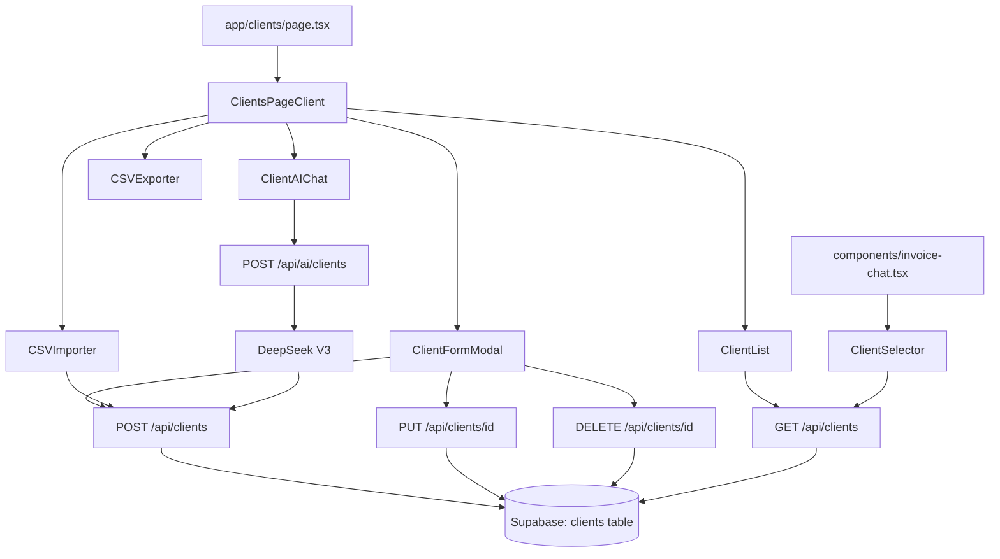

# Design Document: Client Management

## Overview

The Client Management feature adds a dedicated `/clients` page where users can store, manage, and reuse client contact records. It integrates with the existing document creation flow so users can auto-fill the "Bill To" section by selecting a saved client, eliminating repetitive data entry.

The feature is built entirely within the existing Next.js 16 App Router / Supabase / Tailwind / shadcn/ui stack. No new dependencies are required — CSV parsing is done client-side with a manual split, CSV export uses a Blob download, and AI extraction reuses the existing DeepSeek V3 + streaming infrastructure.

Key capabilities:
- Full CRUD for client records (manual form)
- Real-time search/filter across the client list
- CSV import (client-side parse, preview, bulk insert) and CSV export (Blob download)
- AI chat for creating/editing clients via natural language (paid tiers only)
- Client selector embedded in `invoice-chat.tsx` to auto-fill Bill To fields
- Navigation link in the hamburger menu
- RLS-enforced data isolation per user

---

## Architecture



The page is a Server Component shell (`app/clients/page.tsx`) that authenticates the user server-side and passes the initial client list to a Client Component (`ClientsPageClient`) for interactive state. All mutations go through the API routes, which enforce authentication and RLS.

---

## Components and Interfaces

### Page: `app/clients/page.tsx`

Server Component. Authenticates via `createServerClient`, redirects unauthenticated users to `/auth/login`, fetches the initial client list, and renders `ClientsPageClient`.

### Component: `ClientsPageClient`

Client Component (`"use client"`). Owns the full page state:
- `clients: Client[]` — the live list, updated optimistically on mutations
- `search: string` — real-time filter value
- `modalState: { mode: "add" | "edit" | "closed"; client?: Client }`
- `deleteTarget: Client | null` — drives the confirmation dialog
- `isImporting: boolean` — CSV import in progress

Renders: search bar, stats bar (total count), Add/Import/Export buttons, `ClientList`, `ClientFormModal`, delete `AlertDialog`, `ClientAIChat` (paid tiers) or upgrade prompt (free tier), and `CSVImporter`.

### Component: `ClientList`

Receives the filtered `clients` array and renders a responsive card grid. Each card shows name, email, phone, and action buttons (edit, delete). Empty state shows a prompt to add the first client.

### Component: `ClientFormModal`

Controlled by `modalState`. Renders a shadcn/ui `Dialog` with a `react-hook-form` + Zod form. Fields: name (required), email, phone, address, tax ID, notes. Handles both create and edit modes. Displays inline validation errors. On success: closes modal, shows `sonner` toast, updates parent state optimistically.

### Component: `ClientAIChat`

Visible only to paid-tier users. A compact chat input (reuses `AIInputWithLoading`) that sends messages to `POST /api/ai/clients`. Streams the response and on completion refreshes the client list. Free-tier users see an upgrade prompt card instead.

### Component: `CSVImporter`

Hidden file input (`.csv` only). On file selection: parses client-side (manual `split('\n')` / `split(',')` with quoted-field handling), maps headers case-insensitively to `{name, email, phone, address, tax_id, notes}`, shows a preview table in a `Dialog`, skips rows with empty name, reports skip count. On confirm: calls `POST /api/clients/bulk` (or sequential POSTs) and refreshes the list.

### Component: `CSVExporter`

Pure function component. On click: serialises `clients[]` to CSV string, creates a `Blob`, triggers `<a download>` with filename `clients_export_YYYY-MM-DD.csv`. No API call needed.

### Component: `ClientSelector`

Embedded in `components/invoice-chat.tsx`. A `Popover` (or `Sheet` on mobile) triggered by a "Select Client" button near the Bill To section. Shows a search input and a scrollable list of the user's clients. On selection: calls `onChange` with the mapped Bill To fields and closes. Empty state links to `/clients`.

### API: `GET /api/clients`

Returns all clients for the authenticated user, ordered by `name ASC`.

```typescript
// Response
{ clients: Client[] }
```

### API: `POST /api/clients`

Creates a single client record.

```typescript
// Request body
{ name: string; email?: string; phone?: string; address?: string; tax_id?: string; notes?: string }
// Response
{ client: Client }
```

### API: `POST /api/clients/bulk`

Bulk-inserts an array of client records (used by CSV import). Skips rows with empty name server-side as a second validation layer.

```typescript
// Request body
{ clients: ClientInput[] }
// Response
{ inserted: number; skipped: number }
```

### API: `PUT /api/clients/[id]`

Updates a client record. Returns 404 if the record does not belong to the authenticated user.

### API: `DELETE /api/clients/[id]`

Deletes a client record. Returns 404 if the record does not belong to the authenticated user.

### API: `POST /api/ai/clients`

Accepts a natural-language message and conversation history. Uses DeepSeek V3 to extract client fields, then calls the appropriate CRUD operation. Restricted to paid tiers. Streams a response back to the client.

```typescript
// Request body
{ message: string; conversationHistory: Array<{role: "user"|"assistant"; content: string}> }
// Response: SSE stream (same pattern as /api/ai/stream)
```

---

## Data Models

### Database Table: `clients`

```sql
CREATE TABLE clients (
  id          uuid PRIMARY KEY DEFAULT gen_random_uuid(),
  user_id     uuid NOT NULL REFERENCES auth.users(id) ON DELETE CASCADE,
  name        text NOT NULL,
  email       text,
  phone       text,
  address     text,
  tax_id      text,
  notes       text,
  created_at  timestamptz NOT NULL DEFAULT now(),
  updated_at  timestamptz NOT NULL DEFAULT now()
);

-- Index for fast per-user queries
CREATE INDEX clients_user_id_idx ON clients(user_id);

-- Auto-update updated_at
CREATE OR REPLACE FUNCTION update_updated_at_column()
RETURNS TRIGGER AS $$
BEGIN NEW.updated_at = now(); RETURN NEW; END;
$$ LANGUAGE plpgsql;

CREATE TRIGGER clients_updated_at
  BEFORE UPDATE ON clients
  FOR EACH ROW EXECUTE FUNCTION update_updated_at_column();
```

### RLS Policies

```sql
ALTER TABLE clients ENABLE ROW LEVEL SECURITY;

CREATE POLICY "clients_select_own" ON clients
  FOR SELECT USING (auth.uid() = user_id);

CREATE POLICY "clients_insert_own" ON clients
  FOR INSERT WITH CHECK (auth.uid() = user_id);

CREATE POLICY "clients_update_own" ON clients
  FOR UPDATE USING (auth.uid() = user_id);

CREATE POLICY "clients_delete_own" ON clients
  FOR DELETE USING (auth.uid() = user_id);
```

### TypeScript Type: `Client`

```typescript
export interface Client {
  id: string
  user_id: string
  name: string
  email: string | null
  phone: string | null
  address: string | null
  tax_id: string | null
  notes: string | null
  created_at: string
  updated_at: string
}

export interface ClientInput {
  name: string
  email?: string
  phone?: string
  address?: string
  tax_id?: string
  notes?: string
}
```

### Zod Validation Schema

```typescript
export const clientSchema = z.object({
  name: z.string().min(1, "Name is required").max(200),
  email: z.string().email("Invalid email").optional().or(z.literal("")),
  phone: z.string().max(50).optional(),
  address: z.string().max(500).optional(),
  tax_id: z.string().max(100).optional(),
  notes: z.string().max(2000).optional(),
})
```

### Bill To Mapping (Client → InvoiceData)

When a client is selected in `ClientSelector`, the following mapping is applied:

```typescript
onChange({
  toName: client.name,
  toEmail: client.email ?? "",
  toAddress: client.address ?? "",
  toPhone: client.phone ?? "",
  toTaxId: client.tax_id ?? "",
})
```

### AI Extraction Response Schema

The `/api/ai/clients` route instructs DeepSeek to return structured JSON:

```typescript
interface AIClientExtractionResult {
  action: "create" | "update" | "clarify"
  clientData?: ClientInput
  targetClientName?: string  // for update: name to search for
  clarifyingQuestion?: string
  message: string
}
```

---

## Correctness Properties

*A property is a characteristic or behavior that should hold true across all valid executions of a system — essentially, a formal statement about what the system should do. Properties serve as the bridge between human-readable specifications and machine-verifiable correctness guarantees.*

### Property 1: Client creation round-trip

*For any* valid `ClientInput` (with non-empty name), inserting it via the API and then fetching the client list should return a record whose fields match the inserted values exactly.

**Validates: Requirements 1.1, 1.2, 3.2**

### Property 2: Name is required

*For any* `ClientInput` where `name` is empty or composed entirely of whitespace, the API SHALL reject the request with a 400 error and the client list SHALL remain unchanged.

**Validates: Requirements 1.4, 3.3**

### Property 3: Search filter is a subset

*For any* client list and any non-empty search string, the set of clients returned by the filter function SHALL be a subset of the full client list, and every returned client SHALL contain the search string in at least one of: name, email, or phone (case-insensitive).

**Validates: Requirements 2.4**

### Property 4: CSV import skips nameless rows

*For any* CSV input containing a mix of rows with and without names, the number of successfully inserted clients SHALL equal the number of rows with a non-empty name, and the number of skipped rows SHALL equal the number of rows with an empty name.

**Validates: Requirements 6.5**

### Property 5: CSV export round-trip

*For any* non-empty client list, exporting to CSV and then re-importing that CSV (using the importer's column mapping) SHALL produce a set of client records whose name, email, phone, address, tax_id, and notes fields are identical to the originals.

**Validates: Requirements 7.2, 7.3**

### Property 6: Data isolation

*For any* two distinct authenticated users A and B, a client record created by user A SHALL NOT appear in the results of `GET /api/clients` when called by user B, and user B's attempt to update or delete user A's client SHALL receive a 404 response.

**Validates: Requirements 11.2, 11.3, 11.5**

### Property 7: Client selector populates all Bill To fields

*For any* saved client record, selecting it in `ClientSelector` SHALL populate all five Bill To fields (toName, toEmail, toAddress, toPhone, toTaxId) with the corresponding client values (substituting empty string for null fields).

**Validates: Requirements 9.2**

---

## Error Handling

| Scenario | Handling |
|---|---|
| Unauthenticated request to any `/api/clients*` route | `authenticateRequest()` returns 401 |
| `name` field empty on create/update | API returns 400; form shows inline validation error |
| Client not found or belongs to another user | API returns 404 (no 403 to avoid leaking existence) |
| Supabase insert/update/delete error | API returns 500 with sanitized message; client shows error toast |
| CSV file cannot be parsed | `CSVImporter` shows error dialog; no insert attempted |
| CSV row missing name | Row skipped; skip count reported to user after import |
| Export with zero clients | Informational toast shown; no download triggered |
| AI route called by free-tier user | API returns 403; UI shows upgrade prompt (never reaches API) |
| DeepSeek API unavailable | AI route returns 503; chat shows error message |
| AI cannot identify target client for update | AI responds with clarifying question (no mutation) |
| Network error during optimistic update | Client reverts optimistic state; error toast shown |

---

## Testing Strategy

### Unit Tests

- `clientSchema` Zod validation: valid inputs pass, empty name fails, email format validated
- `CSVImporter` parsing logic: correct column mapping, case-insensitive headers, skip empty-name rows, quoted fields
- `CSVExporter` serialisation: all fields present, correct filename format, null fields become empty strings
- `ClientSelector` mapping: all five Bill To fields populated correctly, null → empty string
- Search filter function: subset property, case-insensitive matching across name/email/phone

### Property-Based Tests

Using a property-based testing library (e.g., `fast-check` for TypeScript):

- **Property 1** — Generate random `ClientInput` objects with valid names; verify round-trip via API mock
  - *Feature: client-management, Property 1: client creation round-trip*
- **Property 2** — Generate strings of whitespace/empty; verify all rejected by `clientSchema`
  - *Feature: client-management, Property 2: name is required*
- **Property 3** — Generate random client arrays and search strings; verify filter returns only matching subset
  - *Feature: client-management, Property 3: search filter is a subset*
- **Property 4** — Generate CSV rows with random mix of named/unnamed rows; verify insert/skip counts
  - *Feature: client-management, Property 4: CSV import skips nameless rows*
- **Property 5** — Generate random client lists; export to CSV string, re-parse, verify field equality
  - *Feature: client-management, Property 5: CSV export round-trip*
- **Property 7** — Generate random `Client` objects; verify selector mapping produces correct `InvoiceData` partial
  - *Feature: client-management, Property 7: client selector populates all Bill To fields*

Each property test runs a minimum of 100 iterations.

### Integration Tests

- `GET /api/clients` returns only the authenticated user's records (RLS enforcement)
- `PUT /api/clients/[id]` with another user's client ID returns 404
- `DELETE /api/clients/[id]` with another user's client ID returns 404
- Unauthenticated requests to all client API routes return 401
- `POST /api/ai/clients` with a free-tier user returns 403

### Manual / E2E Tests

- Full add → edit → delete flow on the clients page
- CSV import with the provided template file
- CSV export and re-import round-trip
- Client selector in invoice-chat auto-fills Bill To fields
- Hamburger menu shows "Clients" link for authenticated users
- Unauthenticated access to `/clients` redirects to login
