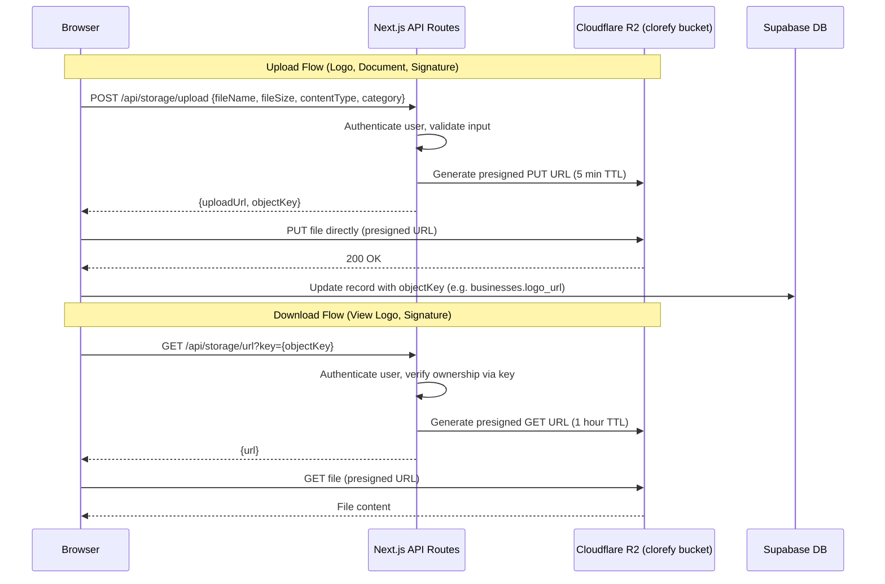

# Design Document: Cloudflare R2 Storage

## Overview

This design migrates all file storage from Supabase Storage to Cloudflare R2 and adds business logo upload capability. The architecture uses a presigned URL pattern: the server generates short-lived, scoped URLs using the AWS S3 SDK, and the browser uploads/downloads directly to/from R2 — keeping credentials server-side and avoiding server bottlenecks.

The system introduces three new server-side components:
1. **Storage Service** (`lib/r2.ts`) — centralized R2 client with presigned URL generation, object deletion
2. **Upload API** (`/api/storage/upload`) — authenticated endpoint returning presigned PUT URLs
3. **Download API** (`/api/storage/url`) — authenticated endpoint returning presigned GET URLs

And one new client component:
4. **Logo Uploader** (`components/logo-uploader.tsx`) — reusable drag-and-drop image upload, used in onboarding and profile settings

Existing components (`upload-screen.tsx`, `editor-panel.tsx`, `/api/signatures/sign`) are modified to use R2 instead of Supabase Storage.

### Key Design Decisions

- **Presigned URLs over proxy uploads**: Files go directly from browser to R2, avoiding server memory/bandwidth limits. The server only generates the signed URL (~200 bytes response).
- **User-scoped object keys**: Every object key contains the user ID (`{prefix}/{user_id}/{uuid}.{ext}`), enabling server-side ownership verification without a database lookup.
- **No public bucket access**: All reads go through presigned GET URLs. This ensures access control even if an object key leaks.
- **AWS SDK v3 compatibility**: Cloudflare R2 is S3-compatible. Using `@aws-sdk/client-s3` and `@aws-sdk/s3-request-presigner` (new dependencies to install) provides a well-tested, maintained interface.
- **CORS via Wrangler CLI**: R2 CORS rules are set using `wrangler r2 bucket cors set` with a JSON config, allowing PUT/GET from `https://clorefy.com` and `http://localhost:3000`.

## Architecture



### Object Key Structure

```
logos/{user_id}/{uuid}.{ext}         — Business logos
documents/{user_id}/{uuid}.{ext}     — Onboarding uploads (PDFs, images)
signatures/{signature_id}_{ts}.png   — Signature images (not user-scoped, token-based)
uploads/{user_id}/{uuid}.{ext}       — General uploads
```

Signatures use `signature_id` instead of `user_id` because external signers (non-authenticated) submit signatures via token-based access. The `/api/signatures/sign` route handles this server-side without the upload API.

## Components and Interfaces

### 1. Storage Service (`lib/r2.ts`)

```typescript
// lib/r2.ts
import { S3Client, PutObjectCommand, GetObjectCommand, DeleteObjectCommand } from "@aws-sdk/client-s3"
import { getSignedUrl } from "@aws-sdk/s3-request-presigner"
import { getSecret } from "@/lib/secrets"

let _client: S3Client | null = null

async function getR2Client(): Promise<S3Client> {
  if (_client) return _client
  const accountId = await getSecret("R2_ACCOUNT_ID")
  const accessKeyId = await getSecret("R2_ACCESS_KEY_ID")
  const secretAccessKey = await getSecret("R2_SECRET_ACCESS_KEY")
  if (!accountId || !accessKeyId || !secretAccessKey) {
    throw new Error("Missing R2 credentials: R2_ACCOUNT_ID, R2_ACCESS_KEY_ID, or R2_SECRET_ACCESS_KEY")
  }
  _client = new S3Client({
    region: "auto",
    endpoint: `https://${accountId}.r2.cloudflarestorage.com`,
    credentials: { accessKeyId, secretAccessKey },
  })
  return _client
}

async function getBucketName(): Promise<string> {
  const bucket = await getSecret("R2_BUCKET_NAME")
  if (!bucket) throw new Error("Missing R2_BUCKET_NAME environment variable")
  return bucket
}

export async function generatePresignedPutUrl(
  objectKey: string,
  contentType: string,
  maxSizeBytes?: number
): Promise<string> {
  const client = await getR2Client()
  const bucket = await getBucketName()
  const command = new PutObjectCommand({
    Bucket: bucket,
    Key: objectKey,
    ContentType: contentType,
    ...(maxSizeBytes ? { ContentLength: maxSizeBytes } : {}),
  })
  return getSignedUrl(client, command, { expiresIn: 300 }) // 5 minutes
}

export async function generatePresignedGetUrl(objectKey: string): Promise<string> {
  const client = await getR2Client()
  const bucket = await getBucketName()
  const command = new GetObjectCommand({ Bucket: bucket, Key: objectKey })
  return getSignedUrl(client, command, { expiresIn: 3600 }) // 1 hour
}

export async function deleteObject(objectKey: string): Promise<void> {
  const client = await getR2Client()
  const bucket = await getBucketName()
  await client.send(new DeleteObjectCommand({ Bucket: bucket, Key: objectKey }))
}
```

### 2. Upload API (`/api/storage/upload/route.ts`)

```typescript
// POST /api/storage/upload
// Request: { fileName: string, fileSize: number, contentType: string, category: "logos"|"documents"|"signatures"|"uploads" }
// Response: { uploadUrl: string, objectKey: string }

interface UploadRequest {
  fileName: string
  fileSize: number
  contentType: string
  category: "logos" | "documents" | "signatures" | "uploads"
}

// Validation constants
const ALLOWED_CONTENT_TYPES = ["image/png", "image/jpeg", "image/webp", "image/gif", "application/pdf"]
const MAX_FILE_SIZE = 10 * 1024 * 1024 // 10 MB
const VALID_CATEGORIES = ["logos", "documents", "signatures", "uploads"] as const
```

Flow:
1. Authenticate via `authenticateRequest(request)`
2. Parse and validate body (content type whitelist, file size ≤ 10MB, valid category)
3. Generate object key: `{category}/{user.id}/{crypto.randomUUID()}.{ext}`
4. Call `generatePresignedPutUrl(objectKey, contentType)`
5. Return `{ uploadUrl, objectKey }`

### 3. Download API (`/api/storage/url/route.ts`)

```typescript
// GET /api/storage/url?key={objectKey}
// Response: { url: string }
```

Flow:
1. Authenticate via `authenticateRequest(request)`
2. Extract `key` from query params
3. Verify ownership: extract user ID segment from key, compare with `auth.user.id`
   - For signature keys (`signatures/...`), skip user-ID check (server-side only access)
4. Call `generatePresignedGetUrl(key)`
5. Return `{ url }`

### 4. Logo Uploader Component (`components/logo-uploader.tsx`)

A reusable React component used in both onboarding and profile settings.

```typescript
interface LogoUploaderProps {
  currentLogoKey?: string | null  // Existing logo object key from businesses.logo_url
  onUploadComplete: (objectKey: string) => void
  onRemove?: () => void
  maxSizeMB?: number  // Default: 5
}
```

Features:
- Drag-and-drop or click-to-browse file selection
- Client-side validation: image types only (PNG, JPEG, WebP, GIF), max 5 MB
- Image preview before upload (via `URL.createObjectURL`)
- Calls `/api/storage/upload` to get presigned PUT URL
- Uploads directly to R2 via `fetch(uploadUrl, { method: "PUT", body: file, headers: { "Content-Type": contentType } })`
- Shows upload progress states: idle → previewing → uploading → complete
- Displays current logo by fetching presigned GET URL from `/api/storage/url`
- "Remove" button that calls parent's `onRemove` callback

### 5. Modified Components

**`components/upload-screen.tsx`** — Replace Supabase Storage upload with:
1. Call `/api/storage/upload` with category `"documents"`
2. PUT file to R2 via presigned URL
3. Pass file to `/api/ai/analyze-file` for extraction (unchanged)
4. Remove all `supabase.storage.from("onboarding-uploads")` references

**`app/api/signatures/sign/route.ts`** — Replace Supabase Storage upload with:
1. Convert base64 data URL to `Uint8Array`
2. Use `generatePresignedPutUrl` with key `signatures/{signature_id}_{timestamp}.png`
3. Upload via server-side fetch to presigned URL
4. Store object key in `signature_image_url` column
5. Keep base64 data URL fallback if R2 upload fails

**`components/editor-panel.tsx`** — Replace `FileReader.readAsDataURL` logo upload with:
1. Call `/api/storage/upload` with category `"logos"`
2. PUT file to R2 via presigned URL
3. Update `businesses.logo_url` with object key
4. Load logo via presigned GET URL from `/api/storage/url`

**`app/onboarding/page.tsx`** — Add Logo Uploader step before final confirmation:
1. Show `LogoUploader` component with "Skip" option
2. On upload complete, store object key in `collectedData.logoUrl`
3. Save to `businesses.logo_url` on onboarding completion

**`app/profile/page.tsx`** — Add Logo Uploader in Business Information section:
1. Show `LogoUploader` with current logo key from `profile.logo_url`
2. On new upload, delete old logo from R2 via `/api/storage/upload` (or a delete endpoint)
3. Update `businesses.logo_url` with new object key

### 6. CORS Configuration

Applied via Wrangler CLI to the `clorefy` bucket:

```json
{
  "rules": [
    {
      "allowed": {
        "origins": ["https://clorefy.com", "http://localhost:3000"],
        "methods": ["GET", "PUT", "HEAD"],
        "headers": ["Content-Type", "Content-Length"]
      },
      "exposeHeaders": ["ETag"],
      "maxAgeSeconds": 3600
    }
  ]
}
```

Applied with: `npx wrangler r2 bucket cors set clorefy --file cors.json`

## Data Models

### Existing Tables Modified

**`businesses` table** — `logo_url` column (already exists):
- Currently stores a full URL or null
- Will now store an R2 object key (e.g., `logos/{user_id}/{uuid}.png`)
- When displaying, the client fetches a presigned GET URL from `/api/storage/url`

**`signatures` table** — `signature_image_url` column (already exists):
- Currently stores a Supabase Storage public URL or base64 data URL
- Will now store an R2 object key (e.g., `signatures/{sig_id}_{ts}.png`)
- Fallback: base64 data URL if R2 upload fails (preserves current behavior)

### No New Tables Required

Object metadata is stored in R2 itself. The object key stored in existing database columns is sufficient to retrieve files. No separate `files` or `uploads` table is needed because:
- Logos are referenced from `businesses.logo_url`
- Signatures are referenced from `signatures.signature_image_url`
- Onboarding uploads are ephemeral (used for AI extraction, not stored long-term)

### Environment Variables

| Variable | Description | Example |
|---|---|---|
| `R2_ACCOUNT_ID` | Cloudflare account ID | `dae4a21a82b4300d8dc4415efb23d33e` |
| `R2_ACCESS_KEY_ID` | R2 API token access key | `eb69f0b6...` |
| `R2_SECRET_ACCESS_KEY` | R2 API token secret | `c2e7a1f8...` |
| `R2_BUCKET_NAME` | R2 bucket name | `clorefy` |

All loaded via `getSecret()` from `lib/secrets.ts`, supporting process.env, Cloudflare Worker bindings, and Supabase Vault fallback.


## Correctness Properties

*A property is a characteristic or behavior that should hold true across all valid executions of a system — essentially, a formal statement about what the system should do. Properties serve as the bridge between human-readable specifications and machine-verifiable correctness guarantees.*

### Property 1: Object key generation follows the correct pattern

*For any* valid category (logos, documents, signatures, uploads), user ID, and file name with a valid extension, the generated object key SHALL match the pattern `{category}/{user_id}/{uuid}.{ext}` where the user ID segment equals the authenticated user's ID and the UUID is a valid v4 UUID.

**Validates: Requirements 2.4, 10.4**

### Property 2: Content type validation rejects disallowed types

*For any* string that is NOT in the allowed content type list (`image/png`, `image/jpeg`, `image/webp`, `image/gif`, `application/pdf`), the Upload API validation SHALL reject the request. Conversely, for any string that IS in the allowed list, validation SHALL accept it.

**Validates: Requirements 2.2, 2.7**

### Property 3: File size validation enforces the 10 MB limit

*For any* positive integer file size, the Upload API validation SHALL reject the request if and only if the file size exceeds 10 MB (10,485,760 bytes).

**Validates: Requirements 2.3, 2.7**

### Property 4: Presigned PUT URL includes the exact content type from the request

*For any* allowed content type, when generating a presigned PUT URL, the `PutObjectCommand` SHALL include a `ContentType` parameter equal to the requested content type, ensuring R2 rejects uploads with mismatched types.

**Validates: Requirements 2.5, 10.8**

### Property 5: Download API ownership verification

*For any* object key and authenticated user, the Download API SHALL return a presigned GET URL if and only if the user ID segment extracted from the object key matches the authenticated user's ID. If they do not match, the API SHALL return 403.

**Validates: Requirements 3.2, 3.3, 10.5**

### Property 6: Logo validation accepts only valid image types within size limit

*For any* file with a MIME type and size, the Logo Uploader validation SHALL accept the file if and only if the MIME type is one of `image/png`, `image/jpeg`, `image/webp`, `image/gif` AND the file size does not exceed 5 MB (5,242,880 bytes).

**Validates: Requirements 6.2, 6.3, 7.5, 9.3**

### Property 7: Logo replacement deletes the previous object

*For any* logo replacement operation where an old logo object key exists, the system SHALL call `deleteObject` with the old object key before or after uploading the new logo, ensuring no orphaned files remain in R2.

**Validates: Requirements 7.4**

## Error Handling

### Storage Service Errors

| Error Condition | Handling | User Impact |
|---|---|---|
| Missing R2 credentials at init | Throw descriptive error identifying missing variable | API routes return 503 "Storage temporarily unavailable" |
| Presigned URL generation fails | Catch S3Client error, log details, return 500 | User sees "Upload failed, please try again" |
| Object deletion fails | Log error, do not block the replacement upload | Old file may remain (orphaned), new upload succeeds |
| R2 bucket unreachable | S3Client timeout (default 3s), return 500 | User sees "Storage temporarily unavailable" |

### Upload API Errors

| Error Condition | HTTP Status | Response |
|---|---|---|
| Not authenticated | 401 | `{ error: "Unauthorized. Please log in." }` |
| Invalid content type | 400 | `{ error: "Unsupported file type. Allowed: PNG, JPEG, WebP, GIF, PDF." }` |
| File size exceeds 10 MB | 400 | `{ error: "File too large. Maximum 10MB." }` |
| Invalid category | 400 | `{ error: "Invalid upload category." }` |
| Missing required fields | 400 | `{ error: "Missing required fields: fileName, fileSize, contentType." }` |
| R2 presigned URL generation fails | 500 | `{ error: "Failed to generate upload URL. Please try again." }` |

### Download API Errors

| Error Condition | HTTP Status | Response |
|---|---|---|
| Not authenticated | 401 | `{ error: "Unauthorized. Please log in." }` |
| Missing key parameter | 400 | `{ error: "Missing required parameter: key" }` |
| Key does not belong to user | 403 | `{ error: "Access denied." }` |
| R2 presigned URL generation fails | 500 | `{ error: "Failed to generate download URL." }` |

### Signature Upload Fallback

When the R2 upload fails during signature submission (`/api/signatures/sign`):
1. Log the R2 error for debugging
2. Fall back to storing the base64 data URL directly in `signature_image_url`
3. The signing flow completes successfully — the signer is never blocked by a storage failure
4. This matches the current behavior exactly

### Client-Side Error Handling

The Logo Uploader and Upload Screen components handle errors with:
- Toast notifications for user-facing errors (file too large, wrong type, upload failed)
- Retry capability for transient failures
- Graceful degradation: if upload fails, user can skip (onboarding) or try again (profile)

## Testing Strategy

### Property-Based Tests (using `fast-check`)

Property-based testing is appropriate for this feature because the core logic involves pure validation functions and key generation with clear input/output behavior across a wide input space.

Each property test runs a minimum of 100 iterations and references its design document property.

| Property | Test File | What It Tests |
|---|---|---|
| Property 1: Object key pattern | `lib/__tests__/r2.test.ts` | Key generation for random categories, user IDs, file names |
| Property 2: Content type validation | `app/api/storage/__tests__/upload.test.ts` | Rejection of random invalid MIME types, acceptance of valid ones |
| Property 3: File size validation | `app/api/storage/__tests__/upload.test.ts` | Boundary testing around 10 MB limit |
| Property 4: ContentType in PUT command | `lib/__tests__/r2.test.ts` | PutObjectCommand includes correct ContentType for any allowed type |
| Property 5: Ownership verification | `app/api/storage/__tests__/url.test.ts` | User ID matching in object keys |
| Property 6: Logo validation | `components/__tests__/logo-uploader.test.ts` | Image type + 5 MB size validation |
| Property 7: Logo replacement cleanup | `app/profile/__tests__/logo-replace.test.ts` | Old object deletion on replacement |

Tag format: `Feature: cloudflare-r2-storage, Property {N}: {description}`

### Unit Tests (example-based)

- Upload API returns 401 for unauthenticated requests
- Download API returns 401 for unauthenticated requests
- Storage Service throws descriptive error when credentials are missing (each variable individually)
- Signature upload falls back to base64 when R2 fails
- Logo Uploader renders preview after file selection
- Logo Uploader shows "Skip" option during onboarding
- Presigned PUT URL uses 300s expiry
- Presigned GET URL uses 3600s expiry

### Integration Tests

- Full upload flow: get presigned URL → PUT to R2 → verify object exists
- Full download flow: upload object → get presigned GET URL → fetch content matches
- Onboarding upload flow: file → R2 → analyze-file API
- Signature submission: base64 → R2 upload → object key stored in DB
- Logo replacement: upload new → old deleted → DB updated
- CORS verification: browser PUT from allowed origin succeeds

### Dependencies to Install

```bash
pnpm add @aws-sdk/client-s3 @aws-sdk/s3-request-presigner
```

These are the only new production dependencies. `fast-check` is already in devDependencies.
