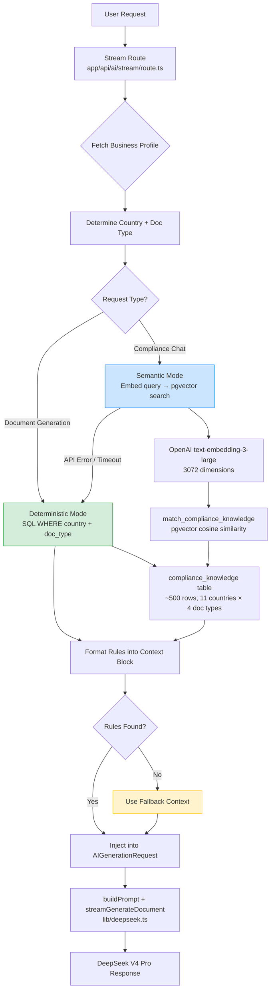

# Design Document: Compliance RAG Implementation

## Overview

This design replaces the hardcoded country-specific compliance blocks in `DUAL_MODE_SYSTEM_PROMPT` (lines 242–549 of `lib/deepseek.ts`, ~3,860 tokens across 11 countries × 4 document types) with a dynamic Retrieval-Augmented Generation (RAG) system. The system operates in two modes:

1. **Deterministic mode** — SQL `WHERE` filter on `country` + `document_type` for document generation. Zero embedding cost.
2. **Semantic mode** — OpenAI `text-embedding-3-large` vector embedding (3072 dimensions, MTEB 64.6 — highest accuracy) + pgvector cosine similarity for conversational compliance questions. ~$0.000013 per query.

The RAG module lives in `lib/compliance-rag.ts` and is invoked by the stream route (`app/api/ai/stream/route.ts`) after the business profile fetch and before `streamGenerateDocument()`. A one-time embedding script (`scripts/embed-compliance-rules.ts`) populates the `embedding` column on the existing `compliance_knowledge` table.

**Key invariant:** If RAG fails for any reason (DB error, OpenAI timeout, unknown country), the system falls back to generic compliance guidance and continues document generation. The user is never blocked.

### Token Impact

| Metric | Before RAG | After RAG | Saved |
|--------|-----------|-----------|-------|
| System prompt | ~9,646 tokens | ~6,795 tokens | ~2,851 |
| RAG context injected | 0 | ~420 tokens (7 rules × 60 tokens) | — |
| **Net input per call** | **~10,666** | **~8,235** | **~2,431 (23%)** |

### What Changes vs. What Stays

| Component | Action |
|-----------|--------|
| `lib/deepseek.ts` lines 242–549 (country blocks) | **Remove** |
| `lib/deepseek.ts` `getTaxApplyRule()` | **Keep unchanged** |
| `lib/deepseek.ts` all other prompt sections | **Keep unchanged** |
| `app/api/ai/stream/route.ts` | **Modify** — add RAG retrieval call |
| `lib/compliance-rag.ts` | **Create** — new RAG module |
| `scripts/embed-compliance-rules.ts` | **Create** — one-time embedding script |
| `compliance_knowledge` table | **Extend** — add `embedding vector(3072)` column + HNSW index |
| `match_compliance_knowledge` DB function | **Create** — semantic search function |

---

## Architecture



### Request Flow

1. Stream route authenticates user and fetches business profile (existing logic, unchanged).
2. Stream route calls `getComplianceContext()` from `lib/compliance-rag.ts` with the user's country, document type, and optionally the user's message.
3. RAG module determines retrieval mode:
   - **Document generation** → deterministic SQL lookup (always free).
   - **Conversational query** → semantic embedding search (falls back to deterministic on failure).
4. Retrieved rules are formatted into a structured text block (max 2,000 tokens).
5. The compliance context is injected into the `AIGenerationRequest` as a `complianceContext` field.
6. `buildPrompt()` includes the compliance context in the user prompt, after the business profile and before conversation history.
7. `streamGenerateDocument()` sends the prompt to DeepSeek with the reduced system prompt (country blocks removed).

---

## Components and Interfaces

### 1. `lib/compliance-rag.ts` — RAG Module

```typescript
// Country name normalization mapping
const COUNTRY_MAP: Record<string, string> = {
  // ISO alpha-2 → compliance_knowledge table format
  "IN": "India", "US": "USA", "GB": "UK", "DE": "Germany",
  "CA": "Canada", "AU": "Australia", "SG": "Singapore",
  "AE": "UAE", "PH": "Philippines", "FR": "France", "NL": "Netherlands",
  // Full names (case-insensitive lookup)
  "INDIA": "India", "USA": "USA", "UK": "UK", "GERMANY": "Germany",
  "CANADA": "Canada", "AUSTRALIA": "Australia", "SINGAPORE": "Singapore",
  "UAE": "UAE", "PHILIPPINES": "Philippines", "FRANCE": "France",
  "NETHERLANDS": "Netherlands",
  // Common variants
  "UNITED STATES": "USA", "UNITED KINGDOM": "UK",
  "UNITED ARAB EMIRATES": "UAE",
}

interface ComplianceRule {
  country: string
  document_type: string
  category: string
  requirement_key: string
  requirement_value: any  // JSONB
  description: string | null
  similarity?: number  // Only present in semantic mode
}

interface ComplianceContext {
  mode: "deterministic" | "semantic" | "fallback"
  country: string
  documentType: string
  rules: ComplianceRule[]
  formattedContext: string  // Ready to inject into prompt
}

// Main entry point — called by stream route
export async function getComplianceContext(
  supabase: SupabaseClient<Database>,
  country: string,
  documentType: string,
  userMessage?: string
): Promise<ComplianceContext>

// Normalize country identifier to compliance_knowledge format
export function normalizeCountry(country: string): string | null

// Deterministic retrieval — SQL WHERE filter
async function getDeterministicRules(
  supabase: SupabaseClient<Database>,
  country: string,
  documentType: string
): Promise<ComplianceRule[]>

// Semantic retrieval — embedding + pgvector
async function getSemanticRules(
  supabase: SupabaseClient<Database>,
  country: string,
  documentType: string,
  query: string
): Promise<ComplianceRule[]>

// Format rules into prompt-ready text block
export function formatComplianceContext(
  rules: ComplianceRule[],
  country: string,
  documentType: string,
  mode: "deterministic" | "semantic"
): string

// Fallback context when no rules found or errors occur
export function getFallbackContext(): string
```

### 2. `scripts/embed-compliance-rules.ts` — Embedding Script

```typescript
// One-time script to generate embeddings for all compliance rules
// Usage: npx tsx scripts/embed-compliance-rules.ts

// Reads rows with NULL embedding from compliance_knowledge
// Generates embeddings via OpenAI text-embedding-3-large (3072 dimensions)
// Writes vectors back to the embedding column
// Processes in batches of 100 with retry logic
```

### 3. Modified `lib/deepseek.ts`

```typescript
// AIGenerationRequest extended with optional compliance context
export interface AIGenerationRequest {
  // ... existing fields ...
  complianceContext?: string  // RAG-retrieved compliance rules
}

// buildPrompt() updated to inject complianceContext after business profile
// DUAL_MODE_SYSTEM_PROMPT updated:
//   - Lines 242–549 (country blocks) REMOVED
//   - Replaced with: "Country-specific compliance rules are provided dynamically
//     in the COMPLIANCE CONTEXT section of the user prompt. Use these as the
//     authoritative source for tax rates, mandatory fields, legal requirements,
//     and formatting rules."
```

### 4. Modified `app/api/ai/stream/route.ts`

```typescript
// After business profile fetch, before streamGenerateDocument:
import { getComplianceContext } from "@/lib/compliance-rag"

// Determine if this is a document generation or chat request
const isDocGeneration = !body.conversationHistory?.length || body.prompt.match(/create|generate|make|build/i)

const complianceResult = await getComplianceContext(
  auth.supabase,
  business?.country || "",
  body.documentType || "invoice",
  isDocGeneration ? undefined : body.prompt  // Pass message for semantic mode
)

body.complianceContext = complianceResult.formattedContext

// Track embedding usage if semantic mode was used
if (complianceResult.mode === "semantic") {
  await trackUsage(auth.supabase, auth.user.id, "embedding", 100)
}
```

---

## Data Models

### Database Schema Extension

```sql
-- 1. Add embedding column to existing compliance_knowledge table
ALTER TABLE compliance_knowledge
ADD COLUMN IF NOT EXISTS embedding vector(3072);

-- 2. HNSW index for fast approximate nearest neighbor search
CREATE INDEX IF NOT EXISTS idx_compliance_knowledge_embedding
ON compliance_knowledge
USING hnsw (embedding vector_cosine_ops)
WITH (m = 16, ef_construction = 64);

-- 3. Semantic search function
CREATE OR REPLACE FUNCTION match_compliance_knowledge(
  query_embedding vector(3072),
  match_country text,
  match_document_type text,
  match_threshold float DEFAULT 0.65,
  match_count int DEFAULT 8
)
RETURNS TABLE (
  id uuid,
  country text,
  document_type text,
  category text,
  requirement_key text,
  requirement_value jsonb,
  description text,
  similarity float
)
LANGUAGE plpgsql AS $$
BEGIN
  RETURN QUERY
  SELECT
    ck.id, ck.country, ck.document_type, ck.category,
    ck.requirement_key, ck.requirement_value, ck.description,
    1 - (ck.embedding <=> query_embedding) AS similarity
  FROM compliance_knowledge ck
  WHERE ck.country = match_country
    AND ck.document_type = match_document_type
    AND ck.embedding IS NOT NULL
    AND 1 - (ck.embedding <=> query_embedding) > match_threshold
  ORDER BY ck.embedding <=> query_embedding
  LIMIT match_count;
END;
$$;
```

### Existing Table Structure (unchanged)

```sql
-- compliance_knowledge (already exists, seeded with ~500 rows)
CREATE TABLE compliance_knowledge (
    id UUID PRIMARY KEY DEFAULT gen_random_uuid(),
    country TEXT NOT NULL,
    document_type TEXT NOT NULL,
    category TEXT NOT NULL,
    requirement_key TEXT NOT NULL,
    requirement_value JSONB NOT NULL,
    description TEXT,
    source_url TEXT,
    last_verified_date DATE DEFAULT CURRENT_DATE,
    effective_date DATE,
    created_at TIMESTAMPTZ DEFAULT NOW(),
    updated_at TIMESTAMPTZ DEFAULT NOW(),
    embedding vector(3072),  -- NEW: added by migration
    UNIQUE(country, document_type, category, requirement_key)
);
```

### TypeScript Types

```typescript
// ComplianceRule — represents a row from compliance_knowledge
interface ComplianceRule {
  id: string
  country: string
  document_type: string
  category: "tax_rates" | "mandatory_fields" | "legal_requirements" | "formatting" | "deadlines"
  requirement_key: string
  requirement_value: Record<string, any>
  description: string | null
  effective_date: string | null
  similarity?: number  // Present only in semantic mode results
}

// ComplianceContext — returned by getComplianceContext()
interface ComplianceContext {
  mode: "deterministic" | "semantic" | "fallback"
  country: string
  documentType: string
  rules: ComplianceRule[]
  formattedContext: string  // Max 2,000 tokens, ready for prompt injection
}

// Category priority for truncation (highest to lowest)
const CATEGORY_PRIORITY = [
  "tax_rates",
  "mandatory_fields",
  "legal_requirements",
  "formatting",
  "deadlines",
] as const
```

### Embedding Text Representation

Each compliance rule is embedded using a concatenated text representation:

```
{country} {document_type} {category} {requirement_key}: {description}
```

Example:
```
India invoice tax_rates gst_rates: GST rates in India: 0% (exempt), 5%, 12%, 18% (standard), 28% (luxury/sin goods)
```

This format ensures the embedding captures country, document type, category context, and the semantic meaning of the rule.


---

## Correctness Properties

*A property is a characteristic or behavior that should hold true across all valid executions of a system — essentially, a formal statement about what the system should do. Properties serve as the bridge between human-readable specifications and machine-verifiable correctness guarantees.*

### Property 1: Embedding text representation contains all source fields

*For any* compliance rule with non-null `country`, `document_type`, `category`, `requirement_key`, and `description` fields, the text representation produced by the embedding text builder should contain all five field values as substrings.

**Validates: Requirements 2.2**

### Property 2: Batching produces complete, bounded partitions

*For any* array of items with length N, batching into groups of at most 100 should produce `ceil(N/100)` batches where each batch has at most 100 items, and the concatenation of all batches equals the original array (preserving order and completeness).

**Validates: Requirements 2.5**

### Property 3: Country normalization is consistent and case-insensitive

*For any* supported country identifier (ISO alpha-2 code, full name, or common variant) in any combination of upper/lower case, the `normalizeCountry` function should return the same canonical country name used in the `compliance_knowledge` table. For any unsupported string, it should return `null`.

**Validates: Requirements 3.2, 10.2**

### Property 4: Document type normalization is case-insensitive

*For any* valid document type string ("invoice", "contract", "quotation", "proposal") in any case variation (e.g., "INVOICE", "Invoice", "iNvOiCe"), the normalization function should return the lowercase version.

**Validates: Requirements 3.3**

### Property 5: Effective date filtering excludes future rules

*For any* set of compliance rules with varying `effective_date` values (past dates, today, future dates, and null), the date filter should return only rules where `effective_date` is null or on or before the current date. No rule with a future `effective_date` should appear in the output.

**Validates: Requirements 3.4**

### Property 6: Deterministic formatting preserves all rules with structure

*For any* non-empty set of compliance rules for a given country and document type, the formatted deterministic context should: (a) contain a header identifying the country and document type, (b) contain the `category`, `requirement_key`, and `description` of every input rule, and (c) group rules by category.

**Validates: Requirements 3.5, 7.1**

### Property 7: Semantic formatting orders by descending similarity

*For any* set of compliance rules with distinct similarity scores, the formatted semantic context should list rules in strictly descending order of similarity score, and each rule should include a similarity score annotation.

**Validates: Requirements 4.3, 7.2**

### Property 8: Formatted context respects token limit

*For any* set of compliance rules (including very large sets with 50+ rules), the formatted context output should not exceed 2,000 tokens (estimated as character count / 4).

**Validates: Requirements 7.3**

### Property 9: Truncation preserves high-priority categories

*For any* set of compliance rules that would exceed the 2,000 token limit when fully formatted, the truncated output should always contain rules from `tax_rates`, `mandatory_fields`, and `legal_requirements` categories (if they exist in the input), and should remove `deadlines` before `formatting` before any higher-priority category.

**Validates: Requirements 7.4**

---

## Error Handling

### Failure Modes and Recovery

| Failure | Detection | Recovery | User Impact |
|---------|-----------|----------|-------------|
| `compliance_knowledge` table query fails | Supabase error response | Return `Fallback_Context`, log error | None — document generated with generic guidance |
| OpenAI embeddings API unreachable | Fetch error / timeout | Fall back to Deterministic_Mode, log error | None — rules fetched via SQL instead |
| OpenAI embeddings API timeout (>5s) | AbortController signal | Fall back to Deterministic_Mode, log error | None — slight delay, then SQL fallback |
| OpenAI embeddings API returns error | Non-200 status | Fall back to Deterministic_Mode, log error | None |
| Country not in `compliance_knowledge` | `normalizeCountry()` returns null | Return `Fallback_Context` (taxRate=0, ask user) | AI asks user to confirm tax requirements |
| No rules match country + doc type | Empty query result | Return `Fallback_Context` | AI uses generic compliance guidance |
| Semantic search returns no results above threshold | Empty result from `match_compliance_knowledge` | Fall back to Deterministic_Mode | None — deterministic rules used instead |
| Embedding script: OpenAI batch error | API error response | Retry up to 3× with exponential backoff, then skip batch | Script continues; failed rows logged |
| Embedding script: missing API key | `getSecret` returns empty | Script exits with descriptive error | Operator must configure key |

### Fallback Context Content

```typescript
const FALLBACK_CONTEXT = `
COMPLIANCE CONTEXT (Fallback — no country-specific rules available):
- Set taxRate to 0 (no tax applied)
- Do not include any country-specific tax labels or mandatory fields
- In your message, ask the user to confirm their country and tax requirements
- Generate the document with all other fields populated normally
`
```

### Error Logging Strategy

All RAG errors are logged with `console.error` including:
- The operation that failed (deterministic query, semantic query, embedding API call)
- The country and document type being queried
- The error message and stack trace
- The fallback mode activated

Errors are **never** surfaced to the user. The RAG system is designed to degrade gracefully — the worst case is that the AI generates a document without country-specific compliance context, which is the same behavior as if the user had no country set in their business profile.

---

## Testing Strategy

### Testing Approach

This feature uses a **dual testing approach**:

1. **Property-based tests** — Verify universal properties of pure functions (formatting, normalization, batching, filtering) using `fast-check` with minimum 100 iterations per property.
2. **Unit tests (example-based)** — Verify specific behaviors, edge cases, integration points, and error handling with concrete examples using Vitest.

### Property-Based Tests

Library: **fast-check** (with Vitest as the test runner)

Each property test runs a minimum of **100 iterations** with randomly generated inputs.

| Property | Test File | What It Validates |
|----------|-----------|-------------------|
| P1: Text representation | `__tests__/compliance-rag.property.test.ts` | Embedding text builder includes all fields |
| P2: Batching | `__tests__/compliance-rag.property.test.ts` | Batch size ≤ 100, all items covered |
| P3: Country normalization | `__tests__/compliance-rag.property.test.ts` | Case-insensitive, consistent mapping |
| P4: Doc type normalization | `__tests__/compliance-rag.property.test.ts` | Case-insensitive lowercase output |
| P5: Effective date filtering | `__tests__/compliance-rag.property.test.ts` | Future rules excluded |
| P6: Deterministic formatting | `__tests__/compliance-rag.property.test.ts` | Header, fields, grouping present |
| P7: Semantic ordering | `__tests__/compliance-rag.property.test.ts` | Descending similarity order |
| P8: Token limit | `__tests__/compliance-rag.property.test.ts` | Output ≤ 2,000 tokens |
| P9: Truncation priority | `__tests__/compliance-rag.property.test.ts` | High-priority categories preserved |

Tag format: `Feature: compliance-rag-implementation, Property {N}: {description}`

### Unit Tests (Example-Based)

| Test | What It Validates |
|------|-------------------|
| Deterministic mode returns correct rules for India + invoice | Req 3.1 |
| Deterministic mode makes zero OpenAI calls | Req 3.6 |
| Semantic mode falls back to deterministic on API error | Req 4.6, 8.2 |
| Semantic mode falls back when no results above threshold | Req 4.4 |
| Stream route continues on RAG failure | Req 5.4, 8.1 |
| Fallback context contains taxRate=0 instruction | Req 8.5 |
| System prompt no longer contains country blocks | Req 6.1 |
| System prompt retains getTaxApplyRule | Req 6.3 |
| System prompt retains all non-compliance sections | Req 6.5 |
| COUNTRY_MAP contains all 11 ISO codes | Req 10.1 |
| Embedding script retries on API error (up to 3×) | Req 2.7 |
| Embedding script logs summary on completion | Req 2.9 |
| OpenAI timeout (>5s) triggers deterministic fallback | Req 8.4 |
| Cost tracking called with "embedding" for semantic mode | Req 9.1 |
| OPERATION_COSTS includes "embedding" at $0.00001 | Req 9.2 |

### Integration Tests

| Test | What It Validates |
|------|-------------------|
| Migration adds embedding column and HNSW index | Req 1.1, 1.2 |
| Migration is idempotent (runs twice without error) | Req 1.5, 1.6 |
| `match_compliance_knowledge` function returns results | Req 1.3 |
| Embedding script processes only NULL-embedding rows | Req 2.1 |
| End-to-end: stream route with RAG produces compliant output | Req 5.1–5.3 |
