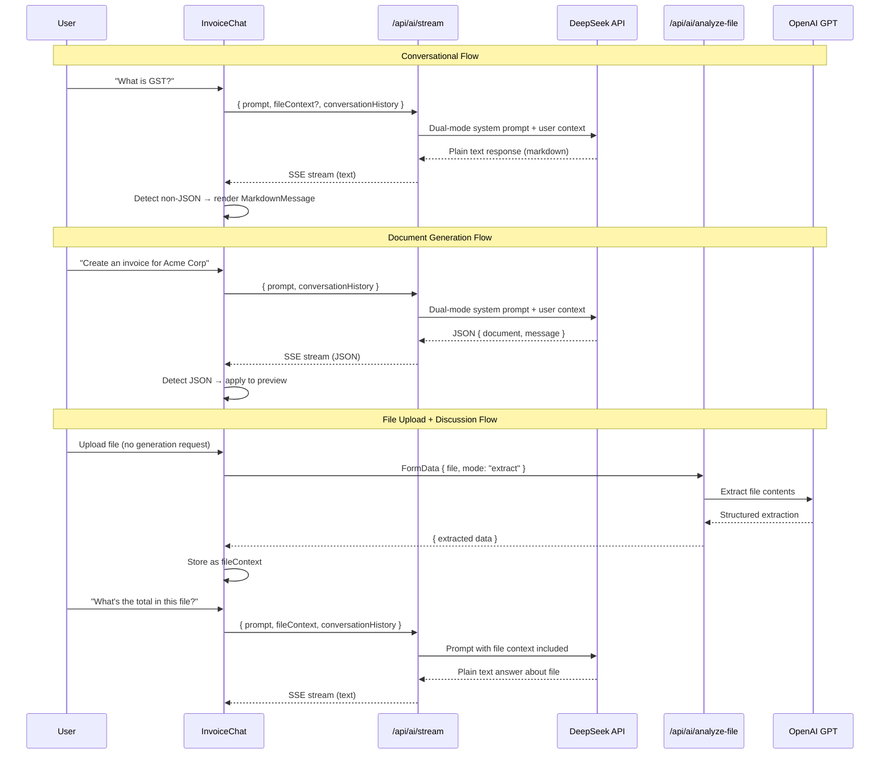

# Design Document: Conversational AI Assistant

## Overview

This design transforms the Clorefy AI chat from a JSON-only document generator into a dual-mode assistant that supports both natural conversation and document generation within the same session. The core challenge is that the current system prompt in `lib/deepseek.ts` enforces JSON-only responses (rule #1: "ALWAYS respond with valid JSON"), which must be replaced with an intent-aware prompt that lets the DeepSeek model decide the response format based on user intent.

The client at `components/invoice-chat.tsx` already has response detection logic — if the streamed response starts with `{` it parses as document JSON, otherwise it renders as plain text via `MarkdownMessage`. This means the primary change is server-side: restructuring the system prompt and enriching the request payload with file context and conversation history.

### Design Rationale

Rather than adding a separate classification endpoint or a pre-processing step, the intent classification is embedded directly in the system prompt. The DeepSeek model itself determines whether to respond with JSON (document generation) or plain text (conversation). This approach:

1. Avoids an extra API call for intent classification (latency + cost)
2. Leverages the model's natural language understanding to detect intent from context
3. Keeps the streaming architecture unchanged — the client just reads whatever comes back
4. Matches the existing client-side detection pattern (JSON vs text)

## Architecture

```mermaid
flowchart TD
    A[User Input] --> B{File Attached?}
    B -->|Yes| C[/api/ai/analyze-file<br/>GPT extracts content/]
    B -->|No| D[Build Request Payload]
    C -->|Extract mode| E[Store File_Context<br/>in client state]
    C -->|Generate mode| F[Apply document<br/>to preview]
    E --> D
    D --> G[/api/ai/stream<br/>DeepSeek with dual-mode prompt/]
    G --> H{Response starts with '{'?}
    H -->|Yes| I[Parse JSON → Document Preview]
    H -->|No| J[Render as Markdown Message]
    
    subgraph Client State
        K[messages: Array]
        L[fileContext: string | null]
        M[conversationHistory: last 10 pairs]
    end
    
    D -.->|includes| K
    D -.->|includes| L
    D -.->|includes| M
```

### Component Interaction Flow



## Components and Interfaces

### 1. Dual-Mode System Prompt (`lib/deepseek.ts`)

The existing `GENERATION_SYSTEM_PROMPT` constant is replaced with a `DUAL_MODE_SYSTEM_PROMPT` that contains two clearly separated sections:

**Section 1 — Conversational Behavior:**
- Defines the AI as "Clorefy AI, a knowledgeable business assistant"
- Instructs plain text responses with Markdown formatting for questions/conversation
- Covers topics: invoicing, contracts, tax compliance, payment terms, business guidance
- Includes legal disclaimer rules for tax/legal/financial advice
- Instructs the model to use business profile context for personalized answers (e.g., country-specific tax info)
- Instructs the model to use file context when available for answering file-related questions

**Section 2 — Document Generation Behavior:**
- Retains ALL existing document generation rules verbatim (math rules, compliance, templates, extraction logic, schemas)
- Triggered only when user explicitly requests document creation/modification
- Output format remains `{ "document": {...}, "message": "..." }`

**Intent Detection Rules (top of prompt):**
```
## RESPONSE MODE DETECTION
Determine your response mode based on the user's message:

1. DOCUMENT GENERATION — Respond with JSON when the user:
   - Explicitly requests creating, generating, or making a document
   - Uses phrases like "create an invoice", "generate a quotation", "make a contract", "build a proposal"
   - Asks to modify or update an existing document ("change the rate", "add an item", "update the client name")

2. CONVERSATION — Respond with plain text (Markdown) when the user:
   - Asks a question ("what is", "how do", "explain", "why")
   - Makes a greeting or general statement
   - Asks about an uploaded file's contents
   - Discusses business topics without requesting a document

3. AMBIGUOUS — If unclear, default to conversational mode and ask for clarification.

CRITICAL: Never respond with JSON document data unless the user explicitly requests document creation or modification.
```

### 2. Updated `AIGenerationRequest` Interface (`lib/deepseek.ts`)

```typescript
export interface AIGenerationRequest {
    prompt: string
    documentType: string
    businessContext?: { /* existing fields unchanged */ }
    currentData?: Partial<InvoiceData>
    conversationHistory?: Array<{ role: "user" | "assistant"; content: string }>
    parentContext?: { documentType: string; data: Record<string, any> }
    // NEW FIELD:
    fileContext?: string  // Extracted file content for follow-up questions
}
```

### 3. Updated `buildPrompt` Function (`lib/deepseek.ts`)

The existing `buildPrompt` function is extended to:
- Include `fileContext` in the prompt when present, under a `FILE CONTEXT` section
- Limit `conversationHistory` to the most recent 10 message pairs (server-side enforcement)
- Continue including business profile, current document data, and parent context as before

```typescript
// New section added to buildPrompt:
if (request.fileContext) {
    prompt += `\nFILE CONTEXT (previously uploaded file contents):\n${request.fileContext}\n`
    prompt += `Use this context to answer questions about the file. If the user asks to generate a document from this, use the details as client/project information.\n`
}

// Enforce conversation history limit server-side
if (request.conversationHistory && request.conversationHistory.length > 0) {
    const limited = request.conversationHistory.slice(-20) // 10 pairs = 20 messages
    prompt += `\nCONVERSATION HISTORY:\n${limited.map(msg => `${msg.role.toUpperCase()}: ${msg.content}`).join('\n')}\n`
}
```

### 4. Updated Stream Endpoint (`app/api/ai/stream/route.ts`)

Changes:
- Accept `fileContext` from the request body and pass it through to `buildPrompt`
- Sanitize `fileContext` with `sanitizeText()` just like the prompt
- Limit `fileContext` length (max 5,000 characters) to prevent token abuse
- Use `DUAL_MODE_SYSTEM_PROMPT` instead of `GENERATION_SYSTEM_PROMPT`
- Remove `response_format: { type: "json_object" }` from the non-streaming path (if used) since responses can now be plain text

### 5. Updated `streamGenerateDocument` Function (`lib/deepseek.ts`)

- References `DUAL_MODE_SYSTEM_PROMPT` instead of `GENERATION_SYSTEM_PROMPT`
- No other changes needed — the streaming logic is format-agnostic

### 6. Updated Chat Component (`components/invoice-chat.tsx`)

**New state:**
```typescript
const [fileContext, setFileContext] = useState<string | null>(null)
```

**File upload handler changes:**
- When `mode === "extract"` (file uploaded without explicit generation request): store the extracted content as `fileContext` string, display a summary message, do NOT generate a document
- When `mode === "generate"` (file uploaded with generation request): existing behavior unchanged
- New session clears `fileContext`
- New file upload replaces previous `fileContext`

**sendMessage changes:**
- Include `fileContext` in the request payload to `/api/ai/stream`
- Include up to 10 message pairs as `conversationHistory`

**Thinking indicator:**
- When `isLoading` is true and no document has been generated yet in this turn, show "Thinking..." instead of "Generating invoice..."
- After a document response is detected, the label can switch to "Generating document..."

**Welcome message:**
```typescript
const loadWelcome = useCallback(async () => {
    const msg = `Hi! I'm your AI assistant. I can help you create invoices, contracts, quotations, and proposals — or just answer your business questions.\n\nTry something like:\n• "Create an invoice for $5,000 for web design to Acme Corp"\n• "What is GST and how does it apply to my business?"\n• Upload a file and ask me about it`
    setMessages([{ role: "assistant", content: msg }])
    setWelcomeLoaded(true)
}, [])
```

**Header update:**
```tsx
<h3 className="font-semibold text-base">AI Assistant</h3>
```

### 7. Updated File Analysis Endpoint (`app/api/ai/analyze-file/route.ts`)

Add a new extraction mode behavior:
- When `mode === "extract"` (default): return the extracted data as before, but ALSO return a `summary` field — a human-readable summary of the file contents that can be stored as `fileContext`
- The `summary` field is a concatenation of key extracted fields into a readable string

```typescript
// After extraction, build a summary string for file context
const summary = buildFileContextSummary(sanitized)
return NextResponse.json({
    success: true,
    mode: "extract",
    extracted: sanitized,
    summary: summary, // NEW: human-readable summary for conversation context
    fieldsFound: Object.entries(sanitized).filter(([_, v]) => v !== null && v !== "").length,
})
```

### 8. Legal Disclaimer Handling

The legal disclaimer is handled entirely within the system prompt — no client-side logic needed. The prompt instructs the model to append the disclaimer when providing tax, legal, or financial advice:

```
## LEGAL DISCLAIMER
When your response contains advice about:
- Tax rates, tax compliance, tax filing
- Legal obligations, contract law, liability
- Financial regulations, dispute resolution

Append this disclaimer at the end:

⚠️ This is general information only and not professional legal, tax, or financial advice. Please consult a qualified professional for advice specific to your situation.

Do NOT append the disclaimer for purely factual information (e.g., "GST stands for Goods and Services Tax").
```

## Data Models

### Request Payload (Client → Stream Endpoint)

```typescript
interface StreamRequestBody {
    prompt: string                    // User's message (sanitized server-side)
    documentType: string              // Current document type context
    currentData?: Partial<InvoiceData> // Existing document data for edits
    conversationHistory?: Array<{     // Recent messages for context
        role: "user" | "assistant"
        content: string
    }>
    fileContext?: string              // Extracted file content summary (max 5000 chars)
}
```

### Client State Model

```typescript
// New/modified state in InvoiceChat component
interface ChatState {
    messages: Array<{ role: "user" | "assistant"; content: string }>
    fileContext: string | null         // NEW: retained file content for follow-up questions
    isLoading: boolean
    documentGenerated: boolean
    // ... existing state unchanged
}
```

### Response Types (Stream Endpoint → Client)

No changes to the SSE protocol. The `complete` event data is either:

1. **Document Response**: JSON string starting with `{` containing `{ "document": {...}, "message": "..." }`
2. **Conversation Response**: Plain text string (may contain Markdown formatting)

The client's existing detection logic (`cleaned.startsWith("{")`) handles both cases.

