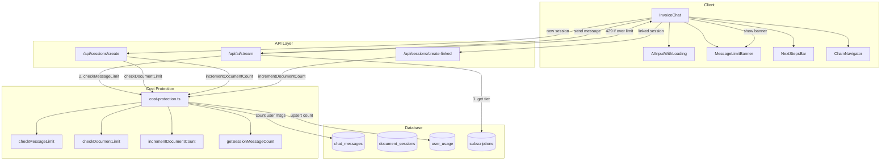

# Design Document: Document Linking and Usage Tracking

## Overview

This design covers the remaining integration work to complete Invo.ai's document linking and usage tracking system. The core infrastructure already exists — `cost-protection.ts` has tier definitions and limit-checking functions, `chain-navigator.tsx` and `next-steps-bar.tsx` handle chain UI, and `create-linked/route.ts` handles linked session creation with context propagation.

What remains is wiring these pieces together:
1. Updating tier message limits (Starter: 25→30, Pro: 30→50) in `cost-protection.ts`
2. Adding server-side message limit enforcement to `/api/ai/stream`
3. Building a `MessageLimitBanner` component that replaces the chat input when limits are hit
4. Adding `incrementDocumentCount` calls to both session creation routes
5. Exposing a `getSessionMessageCount` helper from the cost-protection module
6. Handling the "limit reached → create new document" flow in `InvoiceChat`

The design prioritizes minimal changes to existing working code, adding enforcement at the API boundary and graceful degradation in the UI.

## Architecture



The enforcement flow is:
1. User sends a message → `POST /api/ai/stream`
2. Stream route fetches user's subscription tier from `subscriptions` table
3. Calls `checkMessageLimit(supabase, userId, sessionId, tier)` which counts `role='user'` messages in `chat_messages`
4. If at/over limit → returns 429 with structured JSON (`error`, `currentMessages`, `limit`, `tier`, `sessionId`)
5. Client detects 429 → sets `messageLimitReached` state → renders `MessageLimitBanner` instead of input
6. Banner offers buttons to create new documents (linked if chain exists, standalone otherwise)

## Components and Interfaces

### 1. Updated Tier Limits (`lib/cost-protection.ts`)

Update the `TIER_LIMITS` constant:

```typescript
const TIER_LIMITS: Record<UserTier, TierLimits> = {
    free:    { documentsPerMonth: 3,   messagesPerSession: 10, allowedDocTypes: ["invoice", "contract"] },
    starter: { documentsPerMonth: 50,  messagesPerSession: 30, allowedDocTypes: ["invoice", "contract", "quotation", "proposal"] },
    pro:     { documentsPerMonth: 150, messagesPerSession: 50, allowedDocTypes: ["invoice", "contract", "quotation", "proposal"] },
    agency:  { documentsPerMonth: 0,   messagesPerSession: 0,  allowedDocTypes: ["invoice", "contract", "quotation", "proposal"] },
}
```

### 2. New Helper: `getSessionMessageCount`

```typescript
export async function getSessionMessageCount(
    supabase: SupabaseClient<Database>,
    sessionId: string
): Promise<number> {
    const { count, error } = await supabase
        .from("chat_messages")
        .select("*", { count: "exact", head: true })
        .eq("session_id", sessionId)
        .eq("role", "user")

    if (error) {
        console.error("Error counting session messages:", error)
        return 0  // fail-open
    }
    return count || 0
}
```

### 3. Stream Route Message Limit Enforcement (`/api/ai/stream`)

Add before the AI generation call:

```typescript
// Fetch user tier from subscriptions table
const { data: sub } = await auth.supabase
    .from("subscriptions")
    .select("plan")
    .eq("user_id", auth.user.id)
    .single()
const userTier = ((sub as any)?.plan || "free") as UserTier

// Check per-session message limit
const sessionId = body.sessionId  // client must send sessionId in request body
if (sessionId) {
    const limitError = await checkMessageLimit(auth.supabase, auth.user.id, sessionId, userTier)
    if (limitError) return limitError
}
```

The 429 response body shape:
```typescript
{
    error: "Session message limit reached",
    currentMessages: number,
    limit: number,
    tier: string,
    sessionId: string
}
```

### 4. MessageLimitBanner Component

New component: `components/message-limit-banner.tsx`

```typescript
interface MessageLimitBannerProps {
    currentMessages: number
    limit: number
    tier: string
    currentDocType: string
    hasChain: boolean
    parentSessionId: string
    onCreateDocument: (docType: string) => void
}
```

Renders:
- Warning icon + "You've reached the message limit for this session" text
- Message count display: `{currentMessages}/{limit} messages used`
- Four document type buttons (Invoice, Contract, Quotation, Proposal)
- If a document was generated in the current session, the current doc type button is highlighted as "Create another {type}"
- Uses the same `DOC_OPTIONS` icon mapping as `NextStepsBar` for visual consistency
- Styled with `bg-amber-50 border-amber-200` (light) / `bg-amber-950/20 border-amber-800` (dark) to signal a limit state without being alarming

### 5. Document Count Tracking in Session Creation

**`/api/sessions/create`** — Add after successful session insert:
```typescript
// Increment document count for usage tracking
await incrementDocumentCount(auth.supabase, auth.user.id)
```

**`/api/sessions/create-linked`** — Add after successful linked session insert:
```typescript
await incrementDocumentCount(auth.supabase, auth.user.id)
```

### 6. InvoiceChat Integration

New state in `InvoiceChat`:
```typescript
const [messageLimitReached, setMessageLimitReached] = useState(false)
const [limitInfo, setLimitInfo] = useState<{ currentMessages: number; limit: number; tier: string } | null>(null)
```

In the `sendMessage` error handling, detect 429:
```typescript
if (!response.ok) {
    if (response.status === 429) {
        const errorData = await response.json()
        if (errorData.error === "Session message limit reached") {
            setMessageLimitReached(true)
            setLimitInfo({
                currentMessages: errorData.currentMessages,
                limit: errorData.limit,
                tier: errorData.tier,
            })
            // Add a system message to the chat
            setMessages(prev => [...prev, {
                role: "assistant",
                content: `You've reached the message limit (${errorData.currentMessages}/${errorData.limit}) for this session. You can create a new document to continue.`
            }])
            return
        }
    }
    throw new Error(`API error: ${response.status}`)
}
```

Conditional rendering in the input area:
```tsx
{messageLimitReached && limitInfo ? (
    <MessageLimitBanner
        currentMessages={limitInfo.currentMessages}
        limit={limitInfo.limit}
        tier={limitInfo.tier}
        currentDocType={docType}
        hasChain={!!session?.chain_id}
        parentSessionId={session?.id || ""}
        onCreateDocument={(targetType) => {
            if (session?.chain_id) {
                handleCreateLinked(session.id, targetType)
            } else {
                // Create standalone session via onLinkedSessionCreate or navigate
                handleCreateLinked(session!.id, targetType)
            }
        }}
    />
) : (
    <AIInputWithLoading ... />
)}
```

### 7. Client Request Update

The `sendMessage` function in `InvoiceChat` must include `sessionId` in the request body to `/api/ai/stream`:

```typescript
body: JSON.stringify({
    prompt: userMessage,
    documentType: docType,
    sessionId: session.id,  // NEW: required for message limit check
    currentData: ...,
    conversationHistory: ...,
})
```

## Data Models

No new database tables are required. All changes operate on existing tables:

### Existing Tables Used

| Table | Usage in This Feature |
|---|---|
| `chat_messages` | Queried to count `role='user'` messages per session for limit enforcement |
| `document_sessions` | Created by session routes; `chain_id` used for linked document flow |
| `user_usage` | `documents_count` incremented via `increment_document_count` RPC on session creation |
| `subscriptions` | Queried to resolve user's current plan/tier |
| `document_links` | Created by `create-linked` route for parent→child relationships |

### Tier Limits Reference

| Tier | Docs/Month | Messages/Session |
|---|---|---|
| Free | 3 | 10 |
| Starter | 50 | 30 |
| Pro | 150 | 50 |
| Agency | Unlimited | Unlimited |

### 429 Response Schemas

**Message Limit (from `/api/ai/stream`):**
```json
{
    "error": "Session message limit reached",
    "currentMessages": 10,
    "limit": 10,
    "tier": "free",
    "sessionId": "uuid"
}
```

**Document Limit (from `/api/sessions/create`):**
```json
{
    "error": "Monthly document limit reached",
    "currentUsage": 3,
    "limit": 3,
    "tier": "free",
    "message": "Upgrade to Starter for 50 documents/month"
}
```


## Correctness Properties

*A property is a characteristic or behavior that should hold true across all valid executions of a system — essentially, a formal statement about what the system should do. Properties serve as the bridge between human-readable specifications and machine-verifiable correctness guarantees.*

### Property 1: Message limit enforcement returns structured 429

*For any* user tier (free, starter, pro) and *for any* session message count that equals or exceeds that tier's `messagesPerSession` limit, `checkMessageLimit` SHALL return a 429 response containing the fields `error` (equal to "Session message limit reached"), `currentMessages`, `limit`, `tier`, and `message`. For the agency tier (limit 0), `checkMessageLimit` SHALL return null regardless of message count.

**Validates: Requirements 2.2, 1.1, 1.2, 1.3, 1.4**

### Property 2: Message counting counts only user-role messages

*For any* session containing a random mix of messages with roles "user" and "assistant", `getSessionMessageCount` SHALL return a count equal to exactly the number of messages with `role = "user"`, ignoring all assistant messages.

**Validates: Requirements 2.3, 8.3**

### Property 3: MessageLimitBanner displays count and limit

*For any* `currentMessages` value and *for any* `limit` value, rendering the `MessageLimitBanner` component SHALL produce output containing the text "You've reached the message limit for this session", the `currentMessages` number, and the `limit` number.

**Validates: Requirements 3.2**

### Property 4: Context propagation copies correct fields by target type

*For any* parent context object containing client fields (toName, toEmail, toAddress, toPhone, currency, fromName, fromEmail, fromAddress, fromPhone, paymentTerms) and *for any* target document type, `mapParentContext` SHALL include all present client/business fields in the output. Additionally, *for any* target type in {"invoice", "quotation"} where the parent context contains `items`, `taxRate`, and `taxLabel`, the output SHALL include those fields. *For any* target type in {"contract", "proposal"}, the output SHALL NOT include `items`.

**Validates: Requirements 4.1, 4.2**

### Property 5: Chain ID resolution consistency

*For any* parent session, when creating a linked session: if the parent has a `chain_id`, the new session's `chain_id` SHALL equal the parent's `chain_id`. If the parent has no `chain_id` (null), the new session's `chain_id` SHALL equal the parent's own `id`, and the parent's `chain_id` SHALL be updated to its own `id`.

**Validates: Requirements 4.3, 4.4**

### Property 6: NextStepsBar excludes current document type

*For any* document type from the set {"invoice", "contract", "quotation", "proposal"}, the `NextStepsBar` SHALL render buttons for exactly the three other document types, never including the current type.

**Validates: Requirements 6.1**

### Property 7: Document limit enforcement across tiers

*For any* tier with a non-zero `documentsPerMonth` limit and *for any* document count that equals or exceeds that limit, `checkDocumentLimit` SHALL return a 429 response containing `currentUsage`, `limit`, `tier`, and an upgrade `message`. *For any* document count when the tier is "agency" (limit 0), `checkDocumentLimit` SHALL return null.

**Validates: Requirements 7.3, 10.1, 10.2, 10.3, 10.4**

### Property 8: Usage percentage calculation capped at 100

*For any* `documentsUsed` ≥ 0 and *for any* `documentsLimit` > 0, the computed `documentsPercent` SHALL equal `min(round(documentsUsed / documentsLimit * 100), 100)`. When `documentsLimit` is 0 (unlimited), `documentsPercent` SHALL be 0.

**Validates: Requirements 9.2, 9.3**

## Error Handling

### Fail-Open Strategy for Non-Critical Checks

The system uses a fail-open approach for usage checks to avoid blocking users due to transient database errors:

- **Message count query failure**: If `getSessionMessageCount` or `checkMessageLimit` fails to query `chat_messages`, the request proceeds and the error is logged to the server console (Requirement 8.2). This prevents database hiccups from blocking document generation.
- **Document count increment failure**: If `incrementDocumentCount` fails, the session creation still succeeds. The count will be slightly off but the user isn't blocked. Error is logged.
- **Tier resolution failure**: If the `subscriptions` table query fails, the system defaults to `"free"` tier (most restrictive), which is a safe fallback.

### 429 Response Handling

- **Message limit 429**: Client detects the specific error string `"Session message limit reached"` and transitions to the `MessageLimitBanner` UI. The chat input is disabled but all existing messages and the document preview remain visible.
- **Document limit 429**: Client shows a toast notification with the upgrade message. The user is not navigated away from their current session.
- **Rate limit 429** (existing): Existing rate limiter returns `Retry-After` header. Client shows "High demand" message.

### Edge Cases

- **Session ID missing from stream request**: If `sessionId` is not provided in the request body, the message limit check is skipped (backward compatibility with any older client code).
- **Concurrent message sends**: Two rapid messages could both pass the limit check before either is saved. This is acceptable — the limit is a soft cap, not a hard security boundary. The next request will be correctly blocked.
- **Chain navigation during limit state**: If a user navigates to a different session in the chain via `ChainNavigator`, the `messageLimitReached` state resets since it's per-session.

## Testing Strategy

### Property-Based Tests (fast-check)

Use `fast-check` as the property-based testing library. Each property test runs a minimum of 100 iterations.

Tests to implement for each correctness property:

1. **Property 1** — Generate random `(tier, messageCount)` pairs where `messageCount >= tierLimit`. Mock Supabase to return the count. Assert `checkMessageLimit` returns 429 with all required fields. For agency, assert null.
   - Tag: `Feature: document-linking-and-usage-tracking, Property 1: Message limit enforcement returns structured 429`

2. **Property 2** — Generate random arrays of `{role, content}` messages. Insert into mock. Call `getSessionMessageCount`. Assert result equals `messages.filter(m => m.role === "user").length`.
   - Tag: `Feature: document-linking-and-usage-tracking, Property 2: Message counting counts only user-role messages`

3. **Property 3** — Generate random `(currentMessages, limit)` number pairs. Render `MessageLimitBanner`. Assert output contains the limit text, both numbers.
   - Tag: `Feature: document-linking-and-usage-tracking, Property 3: MessageLimitBanner displays count and limit`

4. **Property 4** — Generate random parent context objects with optional fields. Generate random target types. Call `mapParentContext`. Assert client fields are present when source has them. Assert items present only for invoice/quotation.
   - Tag: `Feature: document-linking-and-usage-tracking, Property 4: Context propagation copies correct fields by target type`

5. **Property 5** — Generate random parent sessions with/without `chain_id`. Simulate the chain resolution logic. Assert new session gets correct `chain_id` and parent is updated when needed.
   - Tag: `Feature: document-linking-and-usage-tracking, Property 5: Chain ID resolution consistency`

6. **Property 6** — Generate random document types from the valid set. Render `NextStepsBar`. Assert exactly 3 buttons rendered, none matching the current type.
   - Tag: `Feature: document-linking-and-usage-tracking, Property 6: NextStepsBar excludes current document type`

7. **Property 7** — Generate random `(tier, documentCount)` pairs where `documentCount >= tierLimit`. Mock Supabase. Assert `checkDocumentLimit` returns 429 with required fields. For agency, assert null for any count.
   - Tag: `Feature: document-linking-and-usage-tracking, Property 7: Document limit enforcement across tiers`

8. **Property 8** — Generate random `(documentsUsed, documentsLimit)` pairs. Compute percentage. Assert equals `min(round(used/limit * 100), 100)`. For limit 0, assert 0.
   - Tag: `Feature: document-linking-and-usage-tracking, Property 8: Usage percentage calculation capped at 100`

### Unit Tests (example-based)

- Tier limit constants match expected values (Req 1.1–1.4)
- MessageLimitBanner renders all four document type buttons (Req 3.3)
- MessageLimitBanner highlights current doc type button (Req 3.4)
- Button click calls onCreateDocument with correct type (Req 3.5)
- Linked vs standalone session creation based on chain_id (Req 3.6)
- ChainNavigator renders pills in order, shows client name, highlights active, shows green dot (Req 5.1–5.5)
- NextStepsBar click calls onCreateLinked (Req 6.2)
- Agency tier returns 0 for documentsLimit and documentsPercent (Req 9.3)
- Free/Starter/Pro tier-specific upgrade messages (Req 10.1–10.3)
- Fail-open behavior when message count query fails (Req 8.2)

### Integration Tests

- Stream route calls checkMessageLimit before AI generation (Req 2.1, 8.1)
- Session create route calls incrementDocumentCount (Req 7.1)
- Linked session create route calls incrementDocumentCount (Req 7.2)
- Usage API returns all required fields (Req 9.1)
- Navigation after linked session creation from NextStepsBar (Req 6.3)
