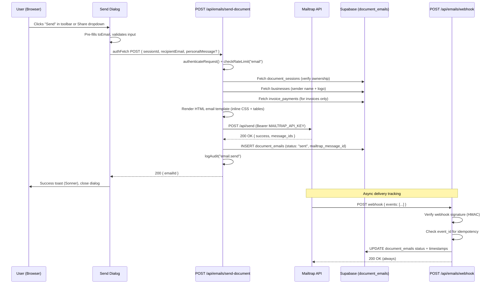

# Design Document: Email Sending

## Overview

The email sending feature enables Clorefy users to deliver documents (invoices, contracts, quotations, proposals) to clients via email directly from the document preview toolbar and the Share dropdown. The system uses the Mailtrap REST API with plain `fetch()` for Cloudflare Workers compatibility, renders branded HTML emails with inline CSS and table-based layout for Gmail/Outlook/Apple Mail compatibility, stores email history in a `document_emails` Supabase table, and tracks delivery status via Mailtrap webhooks with signature verification.

### Key Design Decisions

1. **Plain `fetch()` only** — No npm packages for HTTP. Cloudflare Workers don't support Node.js-only HTTP libraries. The Mailtrap REST API is called directly via `fetch()`.
2. **Inline CSS + table layout** — Gmail strips `<style>` blocks and `<link>` tags ([source](https://stackoverflow.com/questions/4829254/best-practices-for-styling-html-emails)). All styling must be inline. Table-based layout with max 600px content width ensures consistent rendering across Gmail, Outlook, and Apple Mail. Content rephrased for compliance with licensing restrictions.
3. **Keep email under 102KB** — Gmail clips emails exceeding 102KB ([source](https://copyprogramming.com/howto/formatting-e-mail-body-html)). The template is kept lightweight with no embedded images (logo loaded via HTTPS URL). Content rephrased for compliance with licensing restrictions.
4. **Single API route for all document types** — `POST /api/emails/send-document` handles invoices, contracts, quotations, and proposals. The email template adapts subject line, summary section, and CTA buttons based on `documentType`.
5. **Webhook signature verification** — Mailtrap supports webhook signature verification ([source](https://docs.mailtrap.io/email-api-smtp/advanced/webhooks)). When `MAILTRAP_WEBHOOK_SIGNATURE_KEY` is configured, the webhook handler verifies the HMAC signature to prevent forged requests. Content rephrased for compliance with licensing restrictions.
6. **Idempotent webhook processing** — Each Mailtrap event includes a unique `event_id` ([source](https://docs.mailtrap.io/email-api-smtp/advanced/webhooks)). The handler tracks processed event IDs to prevent duplicate processing. Content rephrased for compliance with licensing restrictions.
7. **Share button integration** — The existing Share dropdown gets a "Send via Clorefy Email" option that opens the same Send Dialog, providing a unified sharing experience.
8. **Reuse existing patterns** — `authenticateRequest()`, `checkRateLimit()`, `logAudit()`, `authFetch()`, Sonner toasts, and the PaymentLinkButton component pattern are all reused directly.

## Architecture



### Component Hierarchy

```
DocumentPreview (toolbar)
├── SendEmailButton          — New toolbar button (mail icon, between Share and Print)
│   └── SendEmailDialog      — Modal with email form
│       ├── Email input (pre-filled from toEmail)
│       ├── Personal message textarea (optional, 500 char max)
│       └── Send / Cancel buttons
├── ShareButton (existing)
│   └── "Send via Clorefy Email" menu item → opens SendEmailDialog
```

### API Routes

| Route | Method | Auth | Purpose |
|-------|--------|------|---------|
| `/api/emails/send-document` | POST | Required (`authenticateRequest()`) | Send document email for any of 4 doc types |
| `/api/emails/webhook` | POST | None (public, signature-verified) | Mailtrap delivery callbacks |

## Components and Interfaces

### 1. Email Service Utility (`lib/mailtrap.ts`)

```typescript
interface SendEmailParams {
  to: string                // recipient email
  subject: string           // email subject line
  html: string              // HTML body (inline CSS + tables)
  senderName: string        // "{BusinessName} via Clorefy"
  category?: string         // Mailtrap category for analytics (e.g., "invoice", "contract")
}

interface SendEmailResult {
  success: true
  messageIds: string[]      // Mailtrap message IDs for tracking
}

interface SendEmailError {
  success: false
  statusCode: number        // HTTP status from Mailtrap
  message: string           // Error description
  retryAfter?: number       // Seconds until retry (present on 429)
}

type SendEmailResponse = SendEmailResult | SendEmailError

/**
 * Send an email via Mailtrap REST API using plain fetch().
 * 
 * Mailtrap API payload format:
 * {
 *   from: { email: "no-reply@clorefy.com", name: "{BusinessName} via Clorefy" },
 *   to: [{ email: "recipient@example.com" }],
 *   subject: "Invoice INV-001 from Acme Corp",
 *   html: "<table>...</table>",
 *   category: "invoice"
 * }
 * 
 * From address is always no-reply@clorefy.com.
 * Throws if MAILTRAP_API_KEY is not configured.
 */
export async function sendEmail(params: SendEmailParams): Promise<SendEmailResponse>
```

### 2. Email Template Renderer (`lib/email-template.ts`)

```typescript
interface EmailTemplateData {
  businessName: string
  businessLogoUrl?: string | null    // HTTPS URL from businesses.logo_url
  documentType: "invoice" | "contract" | "quotation" | "proposal"
  referenceNumber: string            // invoiceNumber or referenceNumber
  recipientName: string              // toName from document
  totalAmount?: string | null        // Formatted, e.g. "₹12,500.00" (invoices/quotations only)
  currency?: string | null
  dueDate?: string | null            // For invoices/quotations
  description?: string | null        // For contracts/proposals
  personalMessage?: string | null    // Optional user message
  viewDocumentUrl: string            // https://clorefy.com/view/{sessionId}
  payNowUrl?: string | null          // https://clorefy.com/pay/{sessionId} (invoices with active payment link only)
}

/**
 * Renders a branded HTML email string using inline CSS + table layout.
 * Compatible with Gmail, Outlook, and Apple Mail.
 * 
 * Template structure:
 * - Max 600px content width
 * - All styles inline (no <style> blocks)
 * - Table-based layout throughout
 * - Dark mode meta tag support
 * - Images loaded via HTTPS URLs
 * - Total size kept under 102KB (Gmail clipping threshold)
 */
export function renderEmailTemplate(data: EmailTemplateData): string

/**
 * Generate the email subject line based on document type.
 * 
 * Invoice:   "Invoice {invoiceNumber} from {businessName}"
 * Contract:  "Contract {referenceNumber} from {businessName}"
 * Quotation: "Quotation {referenceNumber} from {businessName}"
 * Proposal:  "Proposal {referenceNumber} from {businessName}"
 */
export function generateEmailSubject(
  documentType: string,
  referenceNumber: string,
  businessName: string
): string
```

### 3. Send Document API (`app/api/emails/send-document/route.ts`)

```typescript
// POST /api/emails/send-document
interface SendDocumentRequest {
  sessionId: string
  recipientEmail: string
  personalMessage?: string  // max 500 chars, sanitized via sanitizeText()
  resend?: boolean          // if true, creates new record (doesn't check for existing)
}

// Response (200):
interface SendDocumentResponse {
  emailId: string
  message: string
}
```

**Flow:**
1. `authenticateRequest(request)` → 401 if unauthenticated
2. `checkRateLimit(userId, "email")` → 429 if exceeded (15 req/min)
3. Validate `recipientEmail` via `sanitizeEmail()`
4. Sanitize `personalMessage` via `sanitizeText()` (max 500 chars)
5. Fetch `document_sessions` where `id = sessionId AND user_id = userId` → 404 if not found
6. Fetch `businesses` where `user_id = userId` for sender name + logo URL
7. For invoices: fetch `invoice_payments` for active payment link (status "created" or "partially_paid")
8. Generate subject via `generateEmailSubject(documentType, ref, businessName)`
9. Render HTML via `renderEmailTemplate(data)` with all document-type-specific fields
10. Send via `sendEmail({ to, subject, html, senderName, category: documentType })`
11. Insert into `document_emails` with `mailtrap_message_id` from response
12. `logAudit(supabase, { user_id, action: "email.send", resource_type: "document", resource_id: sessionId, metadata: { document_type, recipient_email } })`
13. Return `{ emailId, message: "Email sent successfully" }`

### 4. Webhook Handler (`app/api/emails/webhook/route.ts`)

```typescript
// POST /api/emails/webhook
// Mailtrap sends events in JSON format with an events array:
// { events: [{ event, message_id, timestamp, event_id, email, ... }] }

interface MailtrapWebhookEvent {
  event: "delivery" | "bounce" | "reject" | "open" | "click" | "spam" | "soft bounce" | "suspension" | "unsubscribe"
  message_id: string
  timestamp: number          // Unix epoch
  event_id: string           // Unique, use for idempotency
  email: string              // Recipient email
  sending_stream: "transactional" | "bulk"
  sending_domain_name: string
  category?: string
  reason?: string            // For suspension/reject events
  response?: string          // For bounce events
  response_code?: number     // SMTP response code for bounces
}
```

**Flow:**
1. Read raw request body for signature verification
2. If `MAILTRAP_WEBHOOK_SIGNATURE_KEY` is set, verify HMAC signature from header → 200 + log warning if invalid (don't retry)
3. Parse JSON body, extract `events` array
4. For each event:
   a. Validate required fields (`event`, `message_id`, `event_id`)
   b. Check `event_id` hasn't been processed (idempotency)
   c. Map event type to status + timestamp field
   d. Update `document_emails` where `mailtrap_message_id = message_id`
5. Return 200 always (even on errors — prevents Mailtrap retries)

**Event-to-status mapping:**

| Mailtrap Event | Email Status | Timestamp Field |
|---------------|-------------|-----------------|
| `delivery` | `delivered` | `delivered_at` |
| `bounce` | `bounced` | `bounced_at` |
| `reject` | `bounced` | `bounced_at` |
| `soft bounce` | (no update, Mailtrap retries) | — |
| `open` | `opened` | `opened_at` |
| `spam` | `bounced` | `bounced_at` |

### 5. Send Email Button (`components/send-email-button.tsx`)

Follows the `PaymentLinkButton` pattern — a toolbar button that opens a dialog.

```typescript
interface SendEmailButtonProps {
  sessionId: string | null
  invoiceData: InvoiceData
  documentType: string
  onEmailSent?: () => void   // Callback to refresh email status
}
```

- Renders only when `sessionId` is truthy
- Styled like existing toolbar buttons: `rounded-xl border border-border bg-card hover:border-primary/40`
- Mail icon from Lucide (`Mail` or `Send`)
- Opens `SendEmailDialog` on click

### 6. Send Email Dialog (`components/send-email-dialog.tsx`)

Modal dialog following existing Clorefy patterns (rounded-3xl, backdrop blur, Sonner toasts).

```typescript
interface SendEmailDialogProps {
  open: boolean
  onClose: () => void
  sessionId: string
  invoiceData: InvoiceData
  documentType: string
  defaultEmail?: string      // Pre-populated from toEmail or last sent email
}
```

**Dialog layout:**
- Header: "Send {DocumentType}" with document icon
- Email input: required, pre-populated from `invoiceData.toEmail` or most recent email record
- Personal message: optional textarea, 500 char max with character counter
- Preview: shows subject line that will be used
- Actions: "Cancel" (secondary) + "Send" (primary, disabled until valid email)
- Loading state: spinner on Send button, all inputs disabled
- Success: close dialog + Sonner success toast
- Error: Sonner error toast, dialog stays open

### 7. Share Button Integration

Update `components/share-button.tsx` to add "Send via Clorefy Email" option:

```typescript
// New prop added to ShareButton:
interface ShareButtonProps {
  data: InvoiceData
  className?: string
  sessionId?: string | null          // NEW: needed for email sending
  onOpenSendDialog?: () => void      // NEW: callback to open SendEmailDialog
}
```

- Add "Send via Clorefy Email" as first item in "Share Document" section
- Only visible when `sessionId` is available
- Rename existing "Send via Email" (mailto:) to "Open in Email App"
- Works for all 4 document types

### 8. Rate Limiter Extension

Add `"email"` category to the existing `RouteCategory` type in `lib/rate-limiter.ts`:

```typescript
type RouteCategory = "ai" | "export" | "general" | "storage" | "payment" | "email"

const RATE_LIMITS = {
  // ... existing categories
  email: { maxRequests: 15, windowSeconds: 60 },  // 15 emails/min
}
```

### 9. Audit Log Extension

Add new audit actions to `lib/audit-log.ts`:

```typescript
| "email.send"
| "email.resend"
| "email.webhook"
```

## Data Models

### `document_emails` Table

```sql
CREATE TABLE document_emails (
  id UUID PRIMARY KEY DEFAULT gen_random_uuid(),
  user_id UUID NOT NULL REFERENCES auth.users(id) ON DELETE CASCADE,
  session_id UUID NOT NULL REFERENCES document_sessions(id) ON DELETE CASCADE,
  recipient_email TEXT NOT NULL,
  document_type TEXT NOT NULL CHECK (document_type IN ('invoice', 'contract', 'quotation', 'proposal')),
  personal_message TEXT,
  mailtrap_message_id TEXT,
  status TEXT NOT NULL DEFAULT 'sent'
    CHECK (status IN ('sent', 'delivered', 'opened', 'bounced', 'failed')),
  subject TEXT,                          -- stored for audit trail
  created_at TIMESTAMPTZ NOT NULL DEFAULT NOW(),
  delivered_at TIMESTAMPTZ,
  opened_at TIMESTAMPTZ,
  bounced_at TIMESTAMPTZ,
  updated_at TIMESTAMPTZ DEFAULT NOW()
);

-- Indexes for common query patterns
CREATE INDEX idx_document_emails_user_id ON document_emails(user_id);
CREATE INDEX idx_document_emails_session_id ON document_emails(session_id);
CREATE INDEX idx_document_emails_mailtrap_id ON document_emails(mailtrap_message_id)
  WHERE mailtrap_message_id IS NOT NULL;
CREATE INDEX idx_document_emails_status ON document_emails(status);

-- RLS
ALTER TABLE document_emails ENABLE ROW LEVEL SECURITY;

-- Users can read their own email records
CREATE POLICY "Users can read own emails"
  ON document_emails FOR SELECT
  USING (auth.uid() = user_id);

-- Users can insert their own email records (via authenticated API)
CREATE POLICY "Users can insert own emails"
  ON document_emails FOR INSERT
  WITH CHECK (auth.uid() = user_id);

-- Webhook handler uses Supabase service role for updates (bypasses RLS)
-- No UPDATE policy needed for regular users — they never update email records directly
```

### Email Template HTML Structure

```
┌─────────────────────────────────────────────────┐
│  600px max-width, centered table                │
├─────────────────────────────────────────────────┤
│                                                 │
│  [Logo img]  {Business Name}                    │  ← Header (table, bg: #1a1a2e)
│                                                 │
├─────────────────────────────────────────────────┤
│                                                 │
│  Your {Document Type}                           │
│  Reference: {INV-2024-001}                      │
│                                                 │
│  ┌─────────────────────────────────────┐        │
│  │ Amount: ₹12,500.00  Due: Jan 15    │        │  ← Invoice/Quotation only
│  └─────────────────────────────────────┘        │
│                                                 │
│  ┌─────────────────────────────────────┐        │
│  │ Description summary text...         │        │  ← Contract/Proposal only
│  └─────────────────────────────────────┘        │
│                                                 │
├─────────────────────────────────────────────────┤
│  ┌─────────────────────────────────────┐        │
│  │ "Personal message from sender..."   │        │  ← Optional (bg: #f8f9fa)
│  └─────────────────────────────────────┘        │
├─────────────────────────────────────────────────┤
│                                                 │
│  [ View Document ]    [ Pay Now ]               │  ← CTA buttons (inline styles)
│                                                 │  ← Pay Now: invoices with active link only
├─────────────────────────────────────────────────┤
│                                                 │
│  Sent via Clorefy · clorefy.com                 │  ← Footer (small text, #999)
│  You received this because {businessName}       │
│  sent you a document.                           │
│                                                 │
└─────────────────────────────────────────────────┘
```

All elements use `<table>` layout with inline `style` attributes. No `<style>` blocks, no CSS classes, no external stylesheets. Images loaded via HTTPS URLs only.


## Correctness Properties

*A property is a characteristic or behavior that should hold true across all valid executions of a system — essentially, a formal statement about what the system should do. Properties serve as the bridge between human-readable specifications and machine-verifiable correctness guarantees.*

### Property 1: Mailtrap payload construction invariants

*For any* valid `SendEmailParams` (with any recipient email, subject, HTML body, and sender name), the constructed Mailtrap API request payload SHALL always contain: (a) the URL `https://send.api.mailtrap.io/api/send`, (b) an `Authorization: Bearer {token}` header, (c) `from.email` equal to `no-reply@clorefy.com`, and (d) `from.name` equal to `"{senderName} via Clorefy"` when senderName is non-empty.

**Validates: Requirements 1.1, 1.2, 1.3**

### Property 2: Non-2xx error response structure

*For any* HTTP status code returned by the Mailtrap API that is outside the 2xx range and is not 429, the `sendEmail` function SHALL return an error object containing `success: false`, the HTTP status code, and the response body text. For status 429 specifically, the error object SHALL additionally contain a numeric `retryAfter` duration.

**Validates: Requirements 1.5, 1.6**

### Property 3: Email input validation and sanitization

*For any* string that does not match a valid email format (missing `@`, invalid domain, etc.), the Send Document API SHALL reject the request with a 400 error. *For any* personal message string containing HTML tags or control characters, the sanitized output SHALL have those characters removed while preserving the meaningful text content.

**Validates: Requirements 2.3, 2.11**

### Property 4: Successful send creates email record

*For any* successful email dispatch (Mailtrap returns 2xx), the Send Document API SHALL insert exactly one record into `document_emails` with `status = 'sent'`, the correct `user_id`, `session_id`, `recipient_email`, `document_type`, a non-null `mailtrap_message_id`, and a non-null `created_at` timestamp.

**Validates: Requirements 2.6, 6.1, 6.4**

### Property 5: Email template required elements

*For any* `EmailTemplateData` input (across all 4 document types), the rendered HTML string SHALL contain: (a) the business name text, (b) the document type label (Invoice/Contract/Quotation/Proposal), (c) the reference number, (d) an anchor element with href containing the `viewDocumentUrl`, and (e) the text "Sent via Clorefy" with a link to `https://clorefy.com`.

**Validates: Requirements 3.1, 3.3, 3.5, 3.9, 10.1**

### Property 6: Email template conditional elements

*For any* `EmailTemplateData` input: (a) if `businessLogoUrl` is non-null, the HTML SHALL contain an `` blocks, SHALL NOT contain any `<link` stylesheet references, and the total HTML size SHALL be under 102,400 bytes (Gmail clipping threshold).

**Validates: Requirements 3.10**

### Property 8: Subject line formatting for all document types

*For any* document type, reference number, and business name, the `generateEmailSubject` function SHALL produce: (a) for "invoice": `"Invoice {referenceNumber} from {businessName}"`; (b) for "contract": `"Contract {referenceNumber} from {businessName}"`; (c) for "quotation": `"Quotation {referenceNumber} from {businessName}"`; (d) for "proposal": `"Proposal {referenceNumber} from {businessName}"`.

**Validates: Requirements 10.2, 10.3, 10.4, 10.5**

### Property 9: Webhook event-to-status mapping

*For any* Mailtrap webhook event, the mapping function SHALL produce: `"delivery"` → status `"delivered"` with timestamp field `delivered_at`; `"bounce"` or `"reject"` or `"spam"` → status `"bounced"` with timestamp field `bounced_at`; `"open"` → status `"opened"` with timestamp field `opened_at`. The mapping SHALL be total for these known event types.

**Validates: Requirements 7.3, 7.4, 7.5**

### Property 10: Webhook handler always returns 200

*For any* incoming POST request to the webhook endpoint — whether the payload is valid, invalid, missing required fields, or references a non-existent message ID — the handler SHALL return HTTP status 200 to prevent Mailtrap from retrying delivery.

**Validates: Requirements 7.2, 7.6, 7.7**

## Error Handling

### Email Service (`lib/mailtrap.ts`)

| Error Condition | Handling |
|----------------|----------|
| `MAILTRAP_API_KEY` missing | Throw `Error("MAILTRAP_API_KEY is not configured. Set it in your environment variables.")` — fail fast |
| Mailtrap returns 429 | Return `{ success: false, statusCode: 429, message, retryAfter }` — extract `Retry-After` header |
| Mailtrap returns other non-2xx | Return `{ success: false, statusCode, message: responseBody }` |
| Network/fetch failure | Catch and return `{ success: false, statusCode: 0, message: "Network error: unable to reach email service" }` |
| Invalid response JSON | Return `{ success: false, statusCode, message: "Unexpected response from email service" }` |

### Send Document API (`/api/emails/send-document`)

| Error Condition | HTTP Status | Response |
|----------------|-------------|----------|
| Not authenticated | 401 | `{ error: "Unauthorized. Please log in." }` |
| Rate limit exceeded | 429 | `{ error: "Rate limit exceeded. Please try again later.", retryAfter }` |
| Invalid email format | 400 | `{ error: "Invalid email format" }` |
| Personal message too long | 400 | `{ error: "Personal message must be 500 characters or less" }` |
| Missing required fields | 400 | `{ error: "Missing required fields: sessionId, recipientEmail" }` |
| Session not found / not owned | 404 | `{ error: "Document not found" }` |
| Mailtrap 429 | 429 | `{ error: "Daily email limit reached. Please try again later." }` |
| Mailtrap other error | 502 | `{ error: "Failed to send email. Please try again." }` |
| Internal error | 500 | `{ error: "Internal server error" }` (sanitized via `sanitizeError()`) |

### Webhook Handler (`/api/emails/webhook`)

| Error Condition | Handling |
|----------------|----------|
| Invalid JSON body | Return 200, log warning `"Webhook: invalid JSON body"` |
| Missing required fields | Return 200, log warning `"Webhook: missing required fields"` |
| Invalid signature (when key configured) | Return 200, log warning `"Webhook: invalid signature"` — don't process events |
| Duplicate event_id | Return 200, skip processing (idempotent) |
| No matching email record | Return 200, log warning `"Webhook: no matching email for message_id"` |
| Database update failure | Return 200, log error — never fail the webhook |

### Client-Side (Send Dialog)

| Error Condition | Handling |
|----------------|----------|
| Invalid email (client validation) | Disable Send button, show inline validation message below input |
| Personal message > 500 chars | Show character counter in red, disable Send button |
| API returns 401 | Error toast: "Session expired. Please log in again." |
| API returns 429 | Error toast: "Email limit reached. Please try again later." |
| API returns 404 | Error toast: "Document not found. Please refresh and try again." |
| API returns other error | Error toast with server message, keep dialog open |
| Network failure | Error toast: "Network error. Please check your connection." |

## Testing Strategy

### Property-Based Tests (fast-check + Vitest)

The project uses TypeScript with Vitest. Property-based tests will use [fast-check](https://github.com/dubzzz/fast-check) with a minimum of 100 iterations per property.

**Properties to implement:**

| # | Property | Test File | Key Generators |
|---|----------|-----------|----------------|
| 1 | Mailtrap payload construction | `__tests__/lib/mailtrap.property.test.ts` | `fc.record({ to: fc.emailAddress(), subject: fc.string(), html: fc.string(), senderName: fc.string() })` |
| 2 | Non-2xx error structure | `__tests__/lib/mailtrap.property.test.ts` | `fc.integer({ min: 300, max: 599 }).filter(n => n !== 429)` for error codes |
| 3 | Email validation + sanitization | `__tests__/api/send-document.property.test.ts` | `fc.string()` for invalid emails, `fc.emailAddress()` for valid |
| 4 | Successful send creates record | `__tests__/api/send-document.property.test.ts` | `fc.record(...)` for valid request bodies |
| 5 | Template required elements | `__tests__/lib/email-template.property.test.ts` | `fc.record(...)` for EmailTemplateData |
| 6 | Template conditional elements | `__tests__/lib/email-template.property.test.ts` | `fc.record(...)` with `fc.option()` for optional fields |
| 7 | Template inline CSS + tables | `__tests__/lib/email-template.property.test.ts` | Same as 5 |
| 8 | Subject line formatting | `__tests__/lib/email-template.property.test.ts` | `fc.constantFrom("invoice", "contract", "quotation", "proposal")` + `fc.string()` |
| 9 | Webhook event mapping | `__tests__/api/webhook.property.test.ts` | `fc.constantFrom("delivery", "bounce", "reject", "spam", "open")` |
| 10 | Webhook always returns 200 | `__tests__/api/webhook.property.test.ts` | `fc.anything()` for random payloads |

Each test tagged: `Feature: email-sending, Property {N}: {title}`

### Unit Tests (Vitest)

- `sendEmail()` throws when `MAILTRAP_API_KEY` is missing
- `sendEmail()` handles 429 with retry-after header extraction
- `sendEmail()` handles network failures gracefully
- Send Document API returns 401 without auth
- Send Document API returns 404 for non-owned session
- Send Document API returns 400 for missing required fields
- Send Document API returns 400 for personal message > 500 chars
- Send Dialog pre-populates `toEmail` from document data
- Send Dialog pre-populates email from last sent record on resend
- Send Dialog disables Send button for invalid email
- Send Dialog shows loading state during send
- Send Dialog shows character counter for personal message
- Resend creates a new email record (not update)
- Webhook processes events array correctly
- Webhook skips duplicate event_ids
- Webhook rejects invalid signatures when key is configured
- ShareButton shows "Send via Clorefy Email" when sessionId present
- ShareButton hides "Send via Clorefy Email" when sessionId absent
- Documents page shows correct email status badges (sent/delivered/opened/bounced)

### Integration Tests

- Full send flow: auth → validate → render → send → insert record → audit log
- Webhook updates delivery status in database end-to-end
- Documents page fetches and displays email status alongside sessions
- Rate limiting blocks excessive email sends
- All 4 document types produce correct emails with appropriate subjects and content
- Share dropdown "Send via Clorefy Email" opens dialog and sends successfully

### Test Configuration

```bash
# Install fast-check
pnpm add -D fast-check

# Run property tests
pnpm vitest --run __tests__/**/*.property.test.ts
```

Each property test configured with `fc.assert(property, { numRuns: 100 })`.
