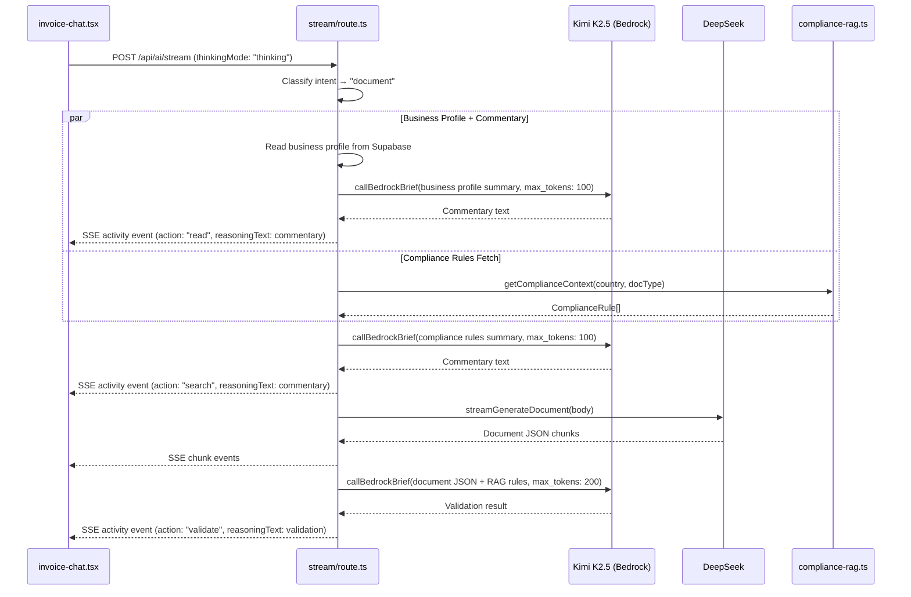

# Design Document: Kimi RAG Orchestrator

## Overview

This feature adds Kimi K2.5 (via Amazon Bedrock Mantle) as an orchestrator layer during **Thinking Mode** document generation. After each major step in the existing stream pipeline — business profile read, compliance rules fetch, and document generation — Kimi produces brief commentary (50–100 tokens) that appears in the agentic thinking UI's expandable sections. After DeepSeek completes document generation, Kimi performs a RAG validation pass comparing the generated document's tax rate, mandatory fields, and currency against the compliance rules retrieved earlier.

**Fast Mode remains completely unchanged** — zero additional API calls, zero additional latency.

### Key Design Decisions

1. **Non-streaming Bedrock calls**: Orchestrator commentary is short (≤200 tokens). A non-streaming `callBedrockBrief()` function avoids SSE parsing overhead and simplifies error handling.
2. **Parallel where possible**: Business profile commentary runs concurrently with the compliance rules fetch, since they are independent operations.
3. **Validation is sequential**: The RAG validation call requires the full generated document JSON, so it must run after DeepSeek completes.
4. **Graceful degradation**: Every Kimi call is wrapped in a try/catch with a 30-second timeout. Failures are logged server-side and skipped silently — the user still gets their document.
5. **Existing Bedrock API key**: Reuses `amazon_beadrocl_key` from the environment — no new secrets needed.

## Architecture

The orchestration layer sits inside the existing `ReadableStream.start()` function in `app/api/ai/stream/route.ts`. It adds up to 3 Kimi calls (only in Thinking Mode, only for document generation):



### Parallelism Strategy

After the business profile is read from Supabase, two operations run in parallel:

1. **Kimi commentary on business profile** — `callBedrockBrief()` with the profile summary
2. **Compliance rules fetch** — `getComplianceContext()` from Supabase

Both are independent and can complete in any order. We use `Promise.allSettled()` to ensure neither blocks the other. The compliance commentary call runs after both complete (it needs the rules data). The validation call runs after DeepSeek finishes (it needs the full document JSON).

## Components and Interfaces

### 1. `callBedrockBrief()` — New function in `lib/bedrock.ts`

A non-streaming Bedrock call for short orchestrator responses.

```typescript
/**
 * Non-streaming Bedrock call for brief orchestrator commentary.
 * Returns the full response text (not a generator).
 * 
 * @param systemPrompt - System instructions for the orchestrator role
 * @param userPrompt - The content to analyze/summarize
 * @param apiKey - Bedrock Mantle API key
 * @param maxTokens - Maximum response tokens (default: 100)
 * @returns The response text, or null if the call fails/times out
 */
export async function callBedrockBrief(
    systemPrompt: string,
    userPrompt: string,
    apiKey: string,
    maxTokens?: number
): Promise<string | null>
```

**Implementation details:**
- Uses the same `BEDROCK_MANTLE_URL` and `BEDROCK_MODEL` constants as `streamBedrockChat()`
- Sets `stream: false` in the request body
- Enforces a 30-second timeout via `AbortController`
- `max_tokens` defaults to 100, overridable for the validation call (200)
- `temperature: 0.2` (slightly lower than chat for more deterministic commentary)
- Returns `null` on any error (timeout, HTTP error, parse failure) — never throws
- Logs errors to `console.error` with structured context

### 2. Orchestrator Prompts — Constants in `lib/bedrock.ts`

Three prompt templates for the orchestrator calls:

```typescript
/** System prompt for all Kimi orchestrator calls */
export const ORCHESTRATOR_SYSTEM_PROMPT: string

/** Prompt template for business profile commentary */
export const BUSINESS_PROFILE_COMMENTARY_PROMPT: string

/** Prompt template for compliance rules commentary */  
export const COMPLIANCE_COMMENTARY_PROMPT: string

/** Prompt template for RAG validation */
export const RAG_VALIDATION_PROMPT: string
```

**Prompt design principles:**
- System prompt establishes Kimi as a brief, factual reviewer (not a chatbot)
- Each user prompt template accepts interpolated data (profile fields, rule summaries, document JSON)
- Validation prompt instructs Kimi to compare specific fields: tax rate, mandatory fields, currency
- All prompts instruct Kimi to respond in ≤3 sentences for commentary, ≤5 sentences for validation

### 3. Updated `ActivityItem` Interface — `components/ui/agentic-thinking-block.tsx`

Add `"validate"` to the action union type:

```typescript
export interface ActivityItem {
    id: string
    action: "read" | "think" | "search" | "generate" | "analyze" | "route" | "context" | "validate"
    label: string
    detail?: string
    reasoningText?: string
}
```

Add a `ShieldCheck` icon mapping for the `"validate"` action in `ACTION_ICONS`.

### 4. Updated Stream Route — `app/api/ai/stream/route.ts`

The orchestration logic is added inside the existing `ReadableStream.start()` function, gated by:

```typescript
const isThinkingMode = body.thinkingMode === "thinking"
const isDocGeneration = classifyIntent(body.prompt) === "document"
const shouldOrchestrate = isThinkingMode && isDocGeneration && bedrockKey && bedrockKey.length > 10
```

**Orchestration steps (only when `shouldOrchestrate` is true):**

1. After business profile read → fire `callBedrockBrief()` for profile commentary (parallel with compliance fetch)
2. After compliance rules fetch → fire `callBedrockBrief()` for compliance commentary
3. After DeepSeek completes → fire `callBedrockBrief()` for RAG validation (only if rules were found)

Each step updates the existing activity event's `reasoningText` field via `sendEvent()`.

### 5. Updated SSE Consumer — `components/invoice-chat.tsx`

The existing SSE consumer already handles `activity` events with `reasoningText`. The only change needed is recognizing the `"validate"` action type for proper rendering. The `AgenticThinkingBlock` component already renders `reasoningText` for any action — no structural changes needed there beyond the icon mapping.

## Data Models

### SSE Activity Event (existing, extended)

```typescript
// Sent from route handler to client via SSE
interface ActivitySSEEvent {
    type: "activity"
    action: "read" | "think" | "search" | "generate" | "analyze" | "route" | "context" | "validate"
    label: string
    detail?: string
    content?: string       // Displayed as reasoningText in the thinking UI
}
```

The `"validate"` action is the only new value. All other fields are unchanged.

### Kimi Orchestrator Call Parameters

```typescript
// Internal to stream/route.ts — not persisted
interface OrchestratorCallConfig {
    type: "business_commentary" | "compliance_commentary" | "rag_validation"
    systemPrompt: string
    userPrompt: string
    maxTokens: number  // 100 for commentary, 200 for validation
}
```

### Validation Result Shape

The Kimi validation response is free-form text (not structured JSON). The route handler sends it directly as the `content` field of a `"validate"` activity event. The prompt instructs Kimi to format mismatches as:
- "✅ Compliant" if no issues found
- "⚠️ Tax rate: expected X% (RAG), found Y% in document" for mismatches

No new database tables or persistent storage is needed. All orchestrator data flows through the SSE stream and is displayed in the thinking UI only.


## Correctness Properties

*A property is a characteristic or behavior that should hold true across all valid executions of a system — essentially, a formal statement about what the system should do. Properties serve as the bridge between human-readable specifications and machine-verifiable correctness guarantees.*

### Property 1: Business profile commentary produces valid activity event

*For any* valid business profile (with varying name, country, currency, tax registration status, and business type), when `callBedrockBrief()` is invoked with the profile data and returns a non-null string, the emitted SSE activity event SHALL have `action: "read"` and a non-empty `content` field containing the returned commentary text.

**Validates: Requirements 1.1**

### Property 2: Compliance commentary produces valid activity event

*For any* non-empty array of `ComplianceRule` objects (with varying countries, categories, requirement values, and descriptions), when `callBedrockBrief()` is invoked with the rules summary and returns a non-null string, the emitted SSE activity event SHALL have `action: "search"` and a non-empty `content` field containing the returned commentary text.

**Validates: Requirements 2.1**

### Property 3: Validation prompt includes document data and RAG rules

*For any* valid document JSON (with varying tax rates, currencies, mandatory fields, and item structures) and *any* non-empty array of `ComplianceRule` objects, the user prompt constructed for the RAG validation call SHALL contain both the document's tax rate/currency values and the compliance rules' requirement values, and the emitted SSE activity event SHALL have `action: "validate"`.

**Validates: Requirements 3.1**

### Property 4: Orchestrator call count invariant

*For any* document generation request with `thinkingMode: "thinking"`, the total number of `callBedrockBrief()` invocations during the complete stream lifecycle SHALL be at most 3. *For any* request with `thinkingMode: "fast"`, the count SHALL be exactly 0.

**Validates: Requirements 8.1, 5.1, 8.6**

## Error Handling

### Kimi API Call Failures

Each of the 3 orchestrator calls is independently wrapped in a try/catch. The `callBedrockBrief()` function returns `null` on any failure:

| Failure Type | Behavior | User Impact |
|---|---|---|
| HTTP 401/403 (auth) | Return `null`, log error | Step skipped, no commentary shown |
| HTTP 429 (rate limit) | Return `null`, log error | Step skipped, no commentary shown |
| HTTP 500/502/503 (server) | Return `null`, log error | Step skipped, no commentary shown |
| Timeout (30s) | Abort via `AbortController`, return `null` | Step skipped, no commentary shown |
| Network error | Catch, return `null`, log error | Step skipped, no commentary shown |
| JSON parse error | Catch, return `null`, log error | Step skipped, no commentary shown |

**Key principle**: No orchestrator failure ever blocks document delivery. The user always gets their document — commentary and validation are additive enhancements.

### Compliance Data Unavailability

When `getComplianceContext()` returns zero rules or throws:
1. The compliance commentary call still fires, but with a prompt noting "no rules found" — Kimi advises manual verification
2. The RAG validation step is skipped entirely (no rules to validate against)
3. No `"validate"` activity event is emitted

### Bedrock API Key Missing

If `amazon_beadrocl_key` is empty or too short (< 10 chars), the `shouldOrchestrate` flag is `false` and all orchestrator logic is bypassed. This matches the existing behavior for chat routing.

### Timeout Budget

- Individual call timeout: 30 seconds (via `AbortController` in `callBedrockBrief()`)
- No global orchestration timeout is enforced at the route level — the 120-second budget is a design guideline. Each call independently times out at 30s, and the parallel execution of profile commentary + compliance fetch means the worst case is ~90s (30s profile commentary + 30s compliance commentary + 30s validation), well within the 120s budget.

## Testing Strategy

### Unit Tests (Example-Based)

| Test | What it verifies | Criteria |
|---|---|---|
| Fast mode makes zero orchestrator calls | `callBedrockBrief` not called when `thinkingMode: "fast"` | 1.2, 2.2, 3.4, 5.1, 5.2, 8.6 |
| Business commentary uses max_tokens: 100 | Correct parameter passed to `callBedrockBrief` | 1.4, 8.2 |
| Compliance commentary uses max_tokens: 100 | Correct parameter passed to `callBedrockBrief` | 2.4, 8.3 |
| Validation uses max_tokens: 200 | Correct parameter passed to `callBedrockBrief` | 3.6, 8.4 |
| Mismatch text appears in validate event | `content` field contains Kimi's mismatch response | 3.2 |
| Compliant text appears in validate event | `content` field contains Kimi's confirmation | 3.3 |
| Validate action renders ShieldCheck icon | `ACTION_ICONS["validate"]` maps to ShieldCheck | 4.2, 4.4 |
| reasoningText renders in expandable section | AgenticThinkingBlock shows text when expanded | 4.1, 4.3 |
| No validation when rules are empty | `callBedrockBrief` not called for validation step | 7.3 |
| Uses existing Bedrock API key | Same `amazon_beadrocl_key` passed to `callBedrockBrief` | 8.5 |

### Edge Case Tests

| Test | What it verifies | Criteria |
|---|---|---|
| Orchestrator timeout → stream continues | `callBedrockBrief` returns null, document still delivered | 1.3, 3.5, 6.3 |
| Empty compliance rules → advisory commentary | Prompt mentions "no compliance data" | 2.3, 7.1, 7.2 |
| Bedrock key missing → orchestration skipped | `shouldOrchestrate` is false, zero calls | 8.5 |

### Property-Based Tests

Property-based testing is appropriate for this feature because the orchestrator logic processes varying inputs (business profiles, compliance rules, document JSON) and must maintain invariants across all valid combinations.

**Library**: `fast-check` (already available in the JS/TS ecosystem, works with Vitest)

**Configuration**: Minimum 100 iterations per property test.

| Property Test | Tag | Criteria |
|---|---|---|
| Business profile → valid activity event | Feature: kimi-rag-orchestrator, Property 1: Business profile commentary produces valid activity event | 1.1 |
| Compliance rules → valid activity event | Feature: kimi-rag-orchestrator, Property 2: Compliance commentary produces valid activity event | 2.1 |
| Document + rules → valid validation prompt and event | Feature: kimi-rag-orchestrator, Property 3: Validation prompt includes document data and RAG rules | 3.1 |
| Call count ≤ 3 in thinking, = 0 in fast | Feature: kimi-rag-orchestrator, Property 4: Orchestrator call count invariant | 8.1, 5.1, 8.6 |

### Integration Tests

| Test | What it verifies | Criteria |
|---|---|---|
| Full thinking mode flow (mocked Bedrock) | All 3 orchestrator calls fire in correct order, events emitted | 1.1, 2.1, 3.1, 8.1 |
| Full fast mode flow | Zero orchestrator calls, identical to current behavior | 5.1, 5.2 |
| Parallel execution timing | Profile commentary and compliance fetch overlap | Architecture |
