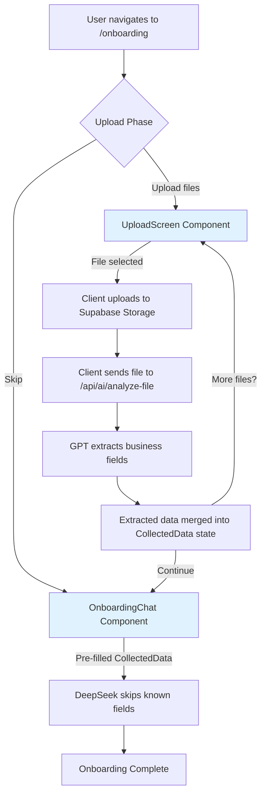

# Design Document: Onboarding Document Upload

## Overview

This feature adds a dedicated document upload screen to the onboarding flow, positioned before the existing conversational Q&A chat. The upload screen allows users to upload business documents (PDFs, images) such as catalogues, business cards, letterheads, and invoices. The system extracts business information from these uploads using the existing `/api/ai/analyze-file` endpoint and passes the extracted data to the `OnboardingChat` component, reducing the number of questions the AI needs to ask.

The design follows a two-phase onboarding approach:
1. **Upload Phase** — New `UploadScreen` component where users optionally upload documents
2. **Chat Phase** — Existing `OnboardingChat` component, now pre-seeded with extracted data

All file uploads go directly from the client to Supabase Storage (no API route proxying) to stay within Cloudflare Workers' 3MB gzip limit. File analysis calls go directly from the client to `/api/ai/analyze-file` using `FormData`.

## Architecture



### Key Architectural Decisions

1. **Client-side uploads to Supabase Storage**: Files are uploaded directly from the browser to Supabase Storage using the Supabase JS client. This avoids routing binary data through Next.js API routes, which would violate Cloudflare Workers' memory constraints.

2. **Client-side file analysis calls**: The client sends files directly to `/api/ai/analyze-file` via `FormData` (same pattern already used in `onboarding-chat.tsx`). The API route handles authentication and calls OpenAI.

3. **State-driven phase transitions**: The onboarding page manages a `phase` state (`"upload" | "chat"`) and a shared `CollectedData` object. The upload screen populates `CollectedData`, then the chat component receives it as `initialData`.

4. **Merge strategy for multiple files**: Later uploads override conflicting fields from earlier uploads. This is a simple last-write-wins approach matching the existing merge logic in `onboarding-chat.tsx`.

## Components and Interfaces

### New Components

#### `UploadScreen` (`components/upload-screen.tsx`)

The main upload UI displayed before the chat phase.

```typescript
interface UploadScreenProps {
  onContinue: (extractedData: CollectedData) => void
  onSkip: () => void
}
```

Responsibilities:
- Render drag-and-drop zone and file browse button
- Validate file type (PDF, PNG, JPEG) and size (≤10MB) on the client
- Upload files to Supabase Storage under `onboarding-uploads/{userId}/{uuid}.{ext}`
- Send each file to `/api/ai/analyze-file` for extraction
- Display per-file status (pending, processing, complete, failed)
- Merge extracted data from multiple files (last-write-wins)
- Show summary of extracted fields
- Provide "Continue" and "Skip" actions

#### Modified: `OnboardingPage` (`app/onboarding/page.tsx`)

Updated to manage two phases:

```typescript
// New state
const [phase, setPhase] = useState<"upload" | "chat">("upload")
const [extractedData, setExtractedData] = useState<CollectedData>({})
```

When `phase === "upload"`, renders `<UploadScreen>`. When `phase === "chat"`, renders `<OnboardingChat>` with `initialData` prop.

#### Modified: `OnboardingChat` (`components/onboarding-chat.tsx`)

Accepts a new optional prop:

```typescript
interface OnboardingChatProps {
  onComplete: (data: CollectedData) => void
  userEmail?: string
  initialData?: CollectedData  // NEW: pre-filled data from upload phase
}
```

When `initialData` is provided:
- Merge it into `collectedData` state on mount
- The initial greeting from DeepSeek will see the pre-filled fields and skip those questions
- The AI informs the user which fields were pre-filled

### Interfaces

```typescript
// File tracking for the upload screen
interface UploadedFile {
  id: string                    // UUID for uniqueness
  file: File                    // Original File object
  status: "pending" | "uploading" | "analyzing" | "complete" | "failed"
  storagePath?: string          // Supabase Storage path after upload
  extractedData?: Partial<CollectedData>
  fieldsFound?: number
  error?: string
}
```

## Data Models

### Supabase Storage

Files are stored in the existing Supabase Storage bucket under a user-scoped path:

```
onboarding-uploads/
  {userId}/
    {uuid}.pdf
    {uuid}.png
    {uuid}.jpg
```

No new database tables are required. The uploaded files are transient — used only for extraction during onboarding. They can be cleaned up via a Supabase Storage lifecycle policy or left as-is.

### State Model

The `CollectedData` interface (already defined in `onboarding-chat.tsx`) is reused as the shared data model between the upload screen and the chat. No changes to the interface are needed — the existing fields cover everything the extraction endpoint returns:

```typescript
// Existing CollectedData (no changes)
interface CollectedData {
  businessType?: string
  country?: string
  businessName?: string
  ownerName?: string
  email?: string
  phone?: string
  address?: { street?: string; city?: string; state?: string; postalCode?: string }
  taxId?: string
  clientCountries?: string[]
  defaultCurrency?: string
  paymentTerms?: string
  paymentInstructions?: string
  bankDetails?: { bankName?: string; accountName?: string; accountNumber?: string; ifscCode?: string; swiftCode?: string; routingNumber?: string }
  bankDetailsSkipped?: boolean
  logoUrl?: string | null
  signatureUrl?: string | null
  additionalNotes?: string
  services?: string
}
```

### Data Flow

1. User uploads file → client validates type/size
2. Client uploads to Supabase Storage → gets `storagePath`
3. Client creates `FormData` with the `File` object → sends to `/api/ai/analyze-file`
4. API returns `{ extracted: {...}, fieldsFound: N }`
5. Client merges `extracted` into local `CollectedData` (last-write-wins)
6. On "Continue", `CollectedData` is passed to `OnboardingChat` as `initialData`
7. `OnboardingChat` merges `initialData` into its internal `collectedData` state
8. DeepSeek sees pre-filled fields and skips those questions


## Correctness Properties

*A property is a characteristic or behavior that should hold true across all valid executions of a system — essentially, a formal statement about what the system should do. Properties serve as the bridge between human-readable specifications and machine-verifiable correctness guarantees.*

### Property 1: File validation accepts only allowed types and sizes

*For any* file with a MIME type and size, the validation function SHALL accept the file if and only if its type is one of `application/pdf`, `image/png`, or `image/jpeg` AND its size is less than or equal to 10MB (10 * 1024 * 1024 bytes). All other combinations SHALL be rejected.

**Validates: Requirements 2.1, 2.3, 2.4, 8.3**

### Property 2: Filename generation produces unique values

*For any* set of N generated filenames (using the same userId), all N filenames SHALL be distinct. No two calls to the filename generation function SHALL produce the same output.

**Validates: Requirements 3.2**

### Property 3: Multi-file data merge follows last-write-wins semantics

*For any* ordered sequence of partial `CollectedData` objects extracted from multiple files, merging them in order SHALL produce a result where each field's value equals the value from the last object in the sequence that defined that field. Fields not defined in any object SHALL remain undefined.

**Validates: Requirements 4.3**

### Property 4: File list rendering includes all metadata

*For any* list of `UploadedFile` objects, the rendered file list SHALL include the file name, formatted file size, and current status for every file in the list. For files with status "complete", the rendered output SHALL also include the `fieldsFound` count.

**Validates: Requirements 6.2, 6.3, 4.2**

### Property 5: Continue button enablement logic

*For any* list of `UploadedFile` objects, the "Continue" button SHALL be enabled if and only if at least one file in the list has status `"complete"`. If no files exist or all files have status other than `"complete"`, the button SHALL be disabled (though the skip option remains available).

**Validates: Requirements 6.4**

## Error Handling

### Client-Side Errors

| Error Scenario | Handling |
|---|---|
| Invalid file type selected | Show inline error: "Unsupported format. Please upload PDF, PNG, or JPEG files." Reject the file before upload. |
| File exceeds 10MB | Show inline error: "File too large. Maximum size is 10MB." Reject the file before upload. |
| Supabase Storage upload fails | Show error on the specific file card: "Upload failed. Tap to retry." Allow retry. Other files unaffected. |
| `/api/ai/analyze-file` returns error | Show error on the specific file card: "Analysis failed." Allow user to continue with other files or proceed to chat. |
| HTTP 429 from analyze-file | Wait 5 seconds, retry once. If retry fails, show: "Service is busy. You can continue to the chat and type your details." |
| Network error during upload/analysis | Show: "Connection issue. Check your internet and try again." Allow retry. |
| User not authenticated | Redirect to `/auth/login` (handled by existing `useEffect` in onboarding page). |
| User hasn't selected a plan | Redirect to `/choose-plan` (handled by existing `useEffect` in onboarding page). |

### State Recovery

- If the user refreshes during the upload phase, the page reloads in the upload phase (no persistence needed — uploads are quick).
- If the user refreshes during the chat phase, the existing `SESSION_KEY` localStorage mechanism in `OnboardingChat` restores the session with the pre-filled data.
- Extracted data is held in React state during the upload phase. If lost, the user can re-upload or type details in the chat.

## Testing Strategy

### Property-Based Tests

Use `fast-check` as the property-based testing library (TypeScript/JavaScript ecosystem).

Each property test runs a minimum of 100 iterations and is tagged with the corresponding design property.

| Property | Test Description |
|---|---|
| Property 1 | Generate random `{ type: string, size: number }` objects. Assert validation accepts iff type ∈ allowed set AND size ≤ 10MB. |
| Property 2 | Generate N filenames with the same userId. Assert all are unique (Set size === N). |
| Property 3 | Generate random sequences of `Partial<CollectedData>` objects. Merge in order. Assert each field equals the last-defined value. |
| Property 4 | Generate random `UploadedFile[]` arrays. Render the file list. Assert output contains name, size, status for each. Assert "complete" files show fieldsFound. |
| Property 5 | Generate random `UploadedFile[]` arrays with varying statuses. Assert Continue button enabled iff any file has status "complete". |

Tag format: `Feature: onboarding-document-upload, Property {N}: {description}`

### Unit Tests (Example-Based)

- Upload screen renders with instructional text and skip button (Req 1.3, 6.1)
- Phase transitions from upload to chat on "Continue" and "Skip" (Req 1.2)
- Drag-and-drop and click-to-browse both trigger file input (Req 2.5)
- Multiple files can be added to the upload list (Req 2.2)
- Storage upload failure shows error with retry option (Req 3.3)
- API error for one file doesn't block other files (Req 4.5)
- 429 retry logic waits 5 seconds then retries once (Req 7.3)
- Extracted data is passed to OnboardingChat as initialData (Req 5.1)
- Data persists when navigating between upload and chat phases (Req 5.4)

### Integration Tests

- File upload to Supabase Storage creates file at correct path (Req 3.1)
- Analyze-file endpoint returns extracted fields for a known test PDF (Req 4.4)
- OnboardingChat with pre-filled data skips already-answered questions (Req 5.2, 5.3)
- Unauthenticated requests to endpoints return 401 (Req 8.4)
