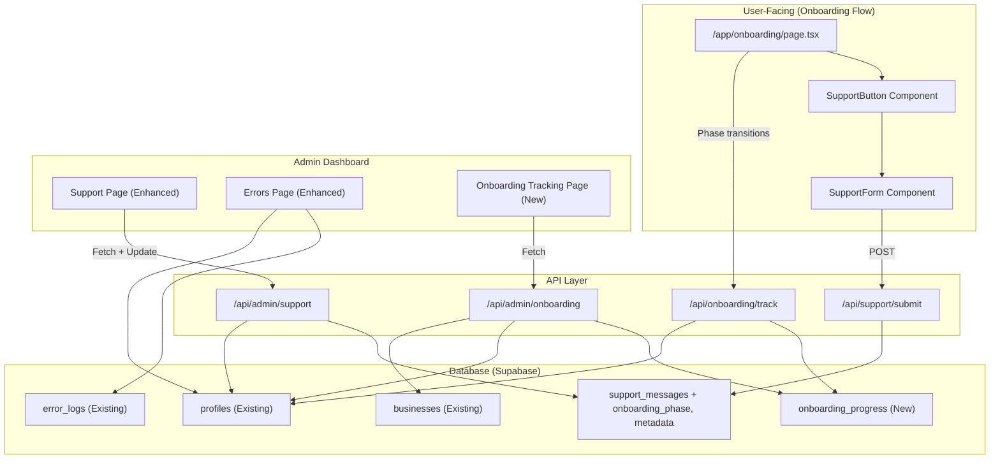

# Design Document: Onboarding Support Tracking

## Overview

This feature adds three interconnected capabilities to Clorefy:

1. **User-facing support button** — A contextual help button rendered during the onboarding flow that lets users submit support messages tagged with their current onboarding phase.
2. **Onboarding state persistence** — Server-side tracking of each user's onboarding progress (current phase, field completion, extraction method) so admin dashboards can query it without relying on client-side localStorage.
3. **Admin dashboard enhancements** — A new Onboarding Tracking page plus upgrades to the existing Support and Errors pages with richer user context, onboarding phase badges, filtering, search, and status management.

The system builds on the existing `support_messages`, `error_logs`, `profiles`, and `businesses` tables in Supabase, extending them with new columns and a new `onboarding_progress` table. All admin queries use the service role client to bypass RLS, consistent with the existing admin dashboard pattern.

### Design Decisions

- **New `onboarding_progress` table vs. extending `profiles`**: A dedicated table keeps onboarding-specific tracking data (phase timestamps, extraction method, field counts) separate from the core user profile. This avoids bloating the `profiles` table and allows efficient indexed queries for admin filtering.
- **Server-side phase tracking via API calls**: Rather than relying solely on localStorage, the onboarding page will call a lightweight API endpoint on each phase transition. This ensures the database always reflects the user's current state.
- **Client components for admin pages with interactivity**: The existing admin support and errors pages are server components. Pages that need filtering, search, and status updates will use a client component pattern (server page fetches initial data, client component handles interactivity), matching the pattern used by `users-client.tsx` and `subscriptions-client.tsx`.

## Architecture



### Data Flow

1. **Support submission**: User clicks support button → form opens as sheet overlay → user types message → POST to `/api/support/submit` with `user_id`, `message`, `onboarding_phase`, and `metadata` → inserted into `support_messages`.
2. **Phase tracking**: When the onboarding page transitions between phases (upload → chat → logo → payments), it calls POST `/api/onboarding/track` with the new phase. This upserts the `onboarding_progress` record and updates `profiles.last_active_at`.
3. **Field tracking**: When the chat phase extracts or updates a field, the onboarding page calls the tracking endpoint with the updated field count.
4. **Admin views**: Admin pages fetch data via API routes that use the service role client. The onboarding tracking page joins `onboarding_progress` with `profiles` and `businesses` to compute status, field counts, and user details.

## Components and Interfaces

### New Components

#### `SupportButton` (`components/onboarding-support-button.tsx`)
- Fixed-position button in the bottom-right corner of the onboarding screen
- Monochromatic `HelpCircle` icon from Lucide, 40×40px visible area, 44×44px touch target
- Opens the `SupportForm` sheet on click
- Only rendered within the onboarding flow

#### `SupportForm` (`components/onboarding-support-form.tsx`)
- Sheet (bottom sheet on mobile, side sheet on desktop) overlay
- Contains: pre-filled email (read-only), textarea (3–2000 chars), submit button
- On submit: POST to `/api/support/submit`
- Shows success toast and auto-closes after 2 seconds
- On error: shows error message, preserves user text

#### `OnboardingTrackingPage` (`app/clorefy-ctrl-8x2m/(dashboard)/onboarding/page.tsx`)
- Server component that fetches initial data
- Renders `OnboardingTrackingClient` for interactive filtering/search

#### `OnboardingTrackingClient` (`app/clorefy-ctrl-8x2m/(dashboard)/onboarding/onboarding-client.tsx`)
- Client component with:
  - Filter dropdowns: Status (All/Completed/In Progress/Dropped Off), Phase (All/Upload/Chat/Logo/Payments), Errors (All/With Errors/Without Errors)
  - Search input for email (case-insensitive partial match)
  - Paginated table (25 per page) with columns: Email, Name, Status, Phase, Fields (X/12), Last Active
  - Expandable row detail view showing per-field completion, extraction method, phase history

#### Enhanced `AdminSupportPage` → `SupportClient` (`app/clorefy-ctrl-8x2m/(dashboard)/support/support-client.tsx`)
- Client component replacing the current server-only support page
- Adds: onboarding phase badges, status toggle buttons (unread → read → resolved), admin notes editing, search by email

#### Enhanced `AdminErrorsPage` → `ErrorsClient` (`app/clorefy-ctrl-8x2m/(dashboard)/errors/errors-client.tsx`)
- Client component replacing the current server-only errors page
- Adds: onboarding phase filter, user email search, onboarding phase badge on error rows

### New API Routes

#### `POST /api/support/submit`
- Auth: `authenticateRequest()`
- Body: `{ message: string, onboarding_phase?: string, metadata?: object }`
- Inserts into `support_messages` with user_id from auth
- Returns `{ success: true }` or error

#### `POST /api/onboarding/track`
- Auth: `authenticateRequest()`
- Body: `{ phase: string, fields_completed?: number, used_extraction?: boolean }`
- Upserts `onboarding_progress` record for the user
- Updates `profiles.last_active_at`
- Returns `{ success: true }` or error

#### `GET /api/admin/support`
- Auth: `verifyAdminSession()`
- Query params: `status`, `search`, `page`
- Returns paginated support messages with user profiles and onboarding phase

#### `PATCH /api/admin/support`
- Auth: `verifyAdminSession()`
- Body: `{ id: string, status?: string, admin_notes?: string }`
- Updates support message status/notes

#### `GET /api/admin/onboarding`
- Auth: `verifyAdminSession()`
- Query params: `status`, `phase`, `errors`, `search`, `page`
- Returns paginated onboarding progress with user details, computed status, field counts

#### `GET /api/admin/errors` (enhanced)
- Auth: `verifyAdminSession()`
- Query params: `context_filter`, `search`, `page`
- Returns paginated error logs with user profiles, filtered by onboarding context

## Data Models

### New Table: `onboarding_progress`

```sql
CREATE TABLE onboarding_progress (
    id UUID PRIMARY KEY DEFAULT gen_random_uuid(),
    user_id UUID NOT NULL UNIQUE REFERENCES profiles(id) ON DELETE CASCADE,
    current_phase TEXT NOT NULL DEFAULT 'upload'
        CHECK (current_phase IN ('upload', 'chat', 'logo', 'payments', 'completed')),
    used_extraction BOOLEAN NOT NULL DEFAULT false,
    fields_completed INTEGER NOT NULL DEFAULT 0
        CHECK (fields_completed >= 0 AND fields_completed <= 12),
    upload_started_at TIMESTAMPTZ,
    chat_started_at TIMESTAMPTZ,
    logo_started_at TIMESTAMPTZ,
    payments_started_at TIMESTAMPTZ,
    completed_at TIMESTAMPTZ,
    created_at TIMESTAMPTZ NOT NULL DEFAULT NOW(),
    updated_at TIMESTAMPTZ NOT NULL DEFAULT NOW()
);

-- Indexes for admin filtering
CREATE INDEX idx_onboarding_progress_user_id ON onboarding_progress(user_id);
CREATE INDEX idx_onboarding_progress_current_phase ON onboarding_progress(current_phase);
CREATE INDEX idx_onboarding_progress_updated_at ON onboarding_progress(updated_at DESC);
```

### Extended Table: `support_messages`

```sql
-- Add columns to existing support_messages table
ALTER TABLE support_messages
    ADD COLUMN IF NOT EXISTS onboarding_phase TEXT
        CHECK (onboarding_phase IN ('upload', 'chat', 'logo', 'payments') OR onboarding_phase IS NULL),
    ADD COLUMN IF NOT EXISTS metadata JSONB;
```

### Existing Tables Used (no schema changes)

- **`profiles`**: Uses existing `last_active_at`, `onboarding_complete`, `email`, `full_name` columns
- **`businesses`**: Queried for per-field completion detail in admin drill-down (name, business_type, owner_name, email, phone, country, address, tax_ids, client_countries, default_currency, additional_notes, payment_methods)
- **`error_logs`**: Queried with existing `error_context`, `user_id`, `metadata` columns; no schema changes needed

### Computed Onboarding Status Logic

The admin onboarding page computes status from database fields:

```typescript
function computeOnboardingStatus(
    profile: { onboarding_complete: boolean; last_active_at: string | null },
    progress: { current_phase: string; completed_at: string | null } | null
): 'completed' | 'in-progress' | 'dropped-off' {
    if (profile.onboarding_complete && progress?.completed_at) return 'completed'
    if (!progress) return 'dropped-off' // never started tracking
    const lastActive = new Date(profile.last_active_at || progress.updated_at)
    const hoursSinceActive = (Date.now() - lastActive.getTime()) / (1000 * 60 * 60)
    if (hoursSinceActive > 48) return 'dropped-off'
    return 'in-progress'
}
```

### Field Completion Mapping

The 12 tracked fields map to `businesses` table columns:

| # | Tracked Field | `businesses` Column | Check |
|---|---|---|---|
| 1 | businessType | `business_type` | Non-empty string |
| 2 | country | `country` | Non-empty string |
| 3 | businessName | `name` | Non-empty string |
| 4 | ownerName | `owner_name` | Non-empty string |
| 5 | email | `email` | Non-empty string |
| 6 | phone | `phone` | Non-empty string |
| 7 | address | `address` | JSONB with at least one non-empty value |
| 8 | taxDetails | `tax_ids` | JSONB with at least one key, or explicitly skipped |
| 9 | services | `additional_notes` | Non-empty string |
| 10 | clientCountries | `client_countries` | Non-empty array |
| 11 | defaultCurrency | `default_currency` | Non-empty string |
| 12 | bankDetails | `payment_methods` | JSONB with at least one key, or explicitly skipped |

## Correctness Properties

*A property is a characteristic or behavior that should hold true across all valid executions of a system — essentially, a formal statement about what the system should do. Properties serve as the bridge between human-readable specifications and machine-verifiable correctness guarantees.*

### Property 1: Support message length validation

*For any* string, the support form validation function SHALL accept it if and only if its trimmed length is between 3 and 2000 characters inclusive. Strings outside this range (including whitespace-only strings shorter than 3 characters) SHALL be rejected.

**Validates: Requirements 2.2**

### Property 2: Support submission includes onboarding phase

*For any* valid onboarding phase (`upload`, `chat`, `logo`, `payments`) and any valid support message, the support submission payload SHALL include the current onboarding phase value in the `onboarding_phase` field.

**Validates: Requirements 2.6**

### Property 3: Support messages rendered with full user context

*For any* support message that has an associated user profile and an onboarding phase, the admin support page rendering SHALL include the sender's full name, email address, and a phase badge indicating the onboarding phase. For messages without a user profile, "Anonymous" SHALL be displayed.

**Validates: Requirements 3.1, 3.2, 3.3**

### Property 4: Support messages sorted by creation date descending

*For any* list of support messages returned by the admin support API, the messages SHALL be ordered such that for every consecutive pair (message[i], message[i+1]), message[i].created_at >= message[i+1].created_at.

**Validates: Requirements 3.4**

### Property 5: Onboarding status computation correctness

*For any* user profile and onboarding progress record, `computeOnboardingStatus` SHALL return:
- `"completed"` if `onboarding_complete` is true and `completed_at` is set
- `"in-progress"` if onboarding is not complete and `last_active_at` is within 48 hours of the current time
- `"dropped-off"` if onboarding is not complete and `last_active_at` is more than 48 hours ago, or if no progress record exists

**Validates: Requirements 5.2, 5.3, 5.4**

### Property 6: Field completion detection accuracy

*For any* business record from the `businesses` table, the field completion checker SHALL correctly classify each of the 12 tracked fields as "completed" (non-empty/non-null value present) or "pending" (empty/null), and the total count of completed fields SHALL equal the number of fields classified as completed.

**Validates: Requirements 6.2, 5.1**

### Property 7: Error logs rendered with user context and onboarding phase

*For any* error log with a non-null `user_id` and an `error_context` starting with "onboarding", the admin errors page rendering SHALL include the user's email, full name, and a badge showing the onboarding phase extracted from the context string.

**Validates: Requirements 8.1, 8.2**

### Property 8: Onboarding error logging includes correct context and metadata

*For any* error occurring during an onboarding phase, the error logged to the database SHALL have `error_context` equal to `"onboarding_{phase}"` and metadata containing the keys `onboarding_phase`, `fields_completed` (integer), and `used_extraction` (boolean).

**Validates: Requirements 9.1, 9.2**

### Property 9: Case-insensitive email search filtering

*For any* search string and list of records with email addresses, the email search filter SHALL return only records whose email contains the search string as a case-insensitive substring. Records whose email does not contain the search string SHALL be excluded.

**Validates: Requirements 10.4, 11.4**

### Property 10: Combined filters use AND logic

*For any* combination of active filters (status, phase, error presence, search) applied to the onboarding tracking list, every record in the result set SHALL satisfy ALL active filter conditions simultaneously. No record that fails any single filter condition SHALL appear in the results.

**Validates: Requirements 10.5**

### Property 11: Error context filtering correctness

*For any* list of error logs and any selected context filter, the filter SHALL return only error logs matching the filter criteria:
- Phase-specific filters (Upload, Chat, Logo, Payments) return only logs where `error_context` contains `"onboarding_{phase}"`
- "Non-Onboarding" returns only logs where `error_context` does NOT start with `"onboarding"`
- "All" returns all logs unfiltered

**Validates: Requirements 11.1, 11.2, 11.3**

## Error Handling

### User-Facing Errors (Onboarding Flow)

| Error Scenario | Handling |
|---|---|
| Support message submission fails (network/DB) | Show error toast, keep form open with text preserved, allow retry |
| Onboarding tracking API fails | Silently fail — do not block the user's onboarding flow. Log to console. The tracking is best-effort. |
| `logErrorToDatabase` itself fails | Already handled by existing try/catch in `lib/error-logger.ts` — silently fails to avoid cascading errors |
| AI onboarding API returns non-200 | Log error with `onboarding_chat_ai_error` context, show user-friendly message in chat |

### Admin-Facing Errors

| Error Scenario | Handling |
|---|---|
| Admin API fetch fails | Show error state with retry button, consistent with existing admin pages |
| Support status update fails | Show error toast, revert optimistic UI update to previous status |
| Admin notes save fails | Show error toast, preserve the text in the input |
| Onboarding data fetch fails | Show error state with "Failed to load data" message and retry |

### API Error Responses

All admin API routes return consistent error format:
```json
{ "error": "Human-readable error message" }
```

Status codes:
- `400` — Invalid request body or parameters
- `401` — Not authenticated / invalid admin session
- `404` — Resource not found
- `500` — Internal server error (logged, sanitized message returned)

## Testing Strategy

### Unit Tests

Unit tests cover specific examples, edge cases, and component rendering:

- **SupportButton**: Renders on all 4 phases, hidden after onboarding completion, correct positioning
- **SupportForm**: Pre-fills email, validates message length, shows success/error states
- **OnboardingTrackingClient**: Renders table with correct columns, pagination controls, filter dropdowns
- **SupportClient**: Renders phase badges, status indicators, admin notes
- **ErrorsClient**: Renders user context, onboarding phase badges, filter options
- **computeOnboardingStatus**: Edge cases (null dates, exactly 48 hours boundary)
- **getFieldCompletion**: Edge cases (empty objects, null values, partial addresses)

### Property-Based Tests

Property-based tests verify universal properties across generated inputs. The project uses **fast-check** as the PBT library for TypeScript.

Configuration:
- Minimum 100 iterations per property test
- Each test references its design document property via tag comment

Properties to implement:
1. **Property 1**: Message length validation — generate random strings, verify accept/reject based on trimmed length
2. **Property 5**: Onboarding status computation — generate random profile/progress combinations, verify correct status
3. **Property 6**: Field completion detection — generate random business records, verify correct field counts
4. **Property 9**: Email search filtering — generate random email lists and search strings, verify correct filtering
5. **Property 10**: Combined filter AND logic — generate random data and filter combinations, verify all results match all filters
6. **Property 11**: Error context filtering — generate random error logs and filter selections, verify correct filtering

Properties 2, 3, 4, 7, 8 are better suited to example-based tests since they primarily test rendering output or API payload structure rather than pure computational logic.

### Integration Tests

Integration tests verify end-to-end flows with the database:

- Support message submission creates correct record in `support_messages`
- Phase transition tracking upserts `onboarding_progress` correctly
- Field count updates persist to database
- `last_active_at` updates on onboarding interaction
- Admin status update modifies `support_messages.status`
- Admin notes update modifies `support_messages.admin_notes`

### Test Tag Format

Each property-based test includes a comment tag:
```typescript
// Feature: onboarding-support-tracking, Property 5: Onboarding status computation correctness
```

