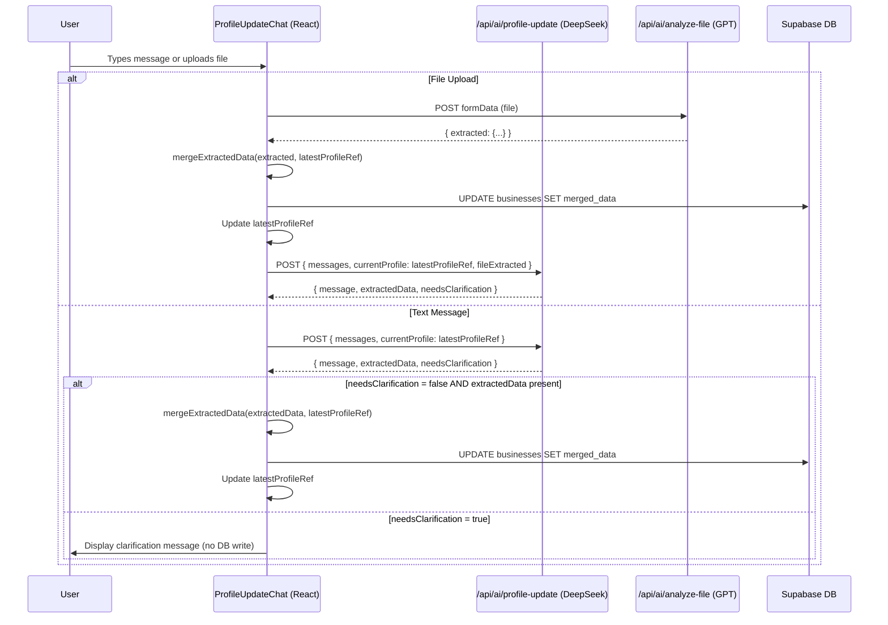

# Design Document: Profile Update AI Improvements

## Overview

This design addresses six interconnected issues in the profile update AI chat flow: destructive data overwrites on file upload, stale profile state between AI calls, fragile setTimeout-based follow-ups, inconsistent file attachment UI, missing merge instructions in the system prompt, and lack of graceful clarification handling.

The changes span four files: `components/profile-update-chat.tsx` (data merging, state management, UI swap, clarification flow), `app/api/ai/profile-update/route.ts` (system prompt merge instructions), `app/api/ai/analyze-file/route.ts` (minor — no structural changes needed), and `app/profile/page.tsx` (pass refreshed profile data callback).

All changes are client-side React + server-side Next.js API route modifications. No database schema changes are required.

## Architecture

The profile update flow involves three layers:



### Key Architectural Decisions

1. **Local `latestProfileRef` (useRef)**: A mutable ref holds the most recent profile state. After every successful DB write, the ref is updated with the merged result. This avoids depending on React state re-renders or parent prop updates for the next AI call.

2. **Pure merge function**: `mapExtractedToDbUpdate` is refactored into a pure function that takes `(extracted, currentProfile)` and returns a merged update object. The merge logic preserves existing non-null values, deep-merges nested objects (address, bankDetails), and deduplicates arrays (clientCountries).

3. **Await-based follow-up**: The setTimeout after file upload is replaced with a sequential `await` chain: upload → merge → DB write → update ref → follow-up API call.

4. **AIInputWithLoading swap**: In "full" mode, the current Input/Paperclip/staged-file-bar is replaced with the existing `AIInputWithLoading` component, matching the invoice chat's prop pattern exactly.

## Components and Interfaces

### 1. `mapExtractedToDbUpdate(extracted, currentProfile)` — Refactored Merge Function

**Location**: `components/profile-update-chat.tsx`

**Current behavior**: Overwrites top-level fields unconditionally. Partially merges address but uses `||` fallback which can still lose data. Does not deduplicate `clientCountries`.

**New behavior**:

```typescript
function mapExtractedToDbUpdate(
  extracted: Record<string, unknown>,
  currentProfile: ProfileData
): Record<string, unknown> {
  const update: Record<string, unknown> = {}

  // Helper: only set if extracted value is non-null and non-empty
  const setIfPresent = (extractedKey: string, dbKey: string) => {
    const val = extracted[extractedKey]
    if (val !== null && val !== undefined && val !== "") {
      update[dbKey] = val
    }
  }

  setIfPresent("businessName", "name")
  setIfPresent("businessType", "business_type")
  setIfPresent("ownerName", "owner_name")
  setIfPresent("email", "email")
  setIfPresent("phone", "phone")
  setIfPresent("country", "country")

  // Deep merge address: only overwrite sub-fields that are present in extracted
  if (extracted.address && typeof extracted.address === "object") {
    const a = extracted.address as Record<string, string>
    const existing = currentProfile.address || {}
    update.address = {
      street: (a.street && a.street.trim()) ? a.street : existing.street || "",
      city: (a.city && a.city.trim()) ? a.city : existing.city || "",
      state: (a.state && a.state.trim()) ? a.state : existing.state || "",
      postal_code: (a.postalCode || a.postal_code || "").trim()
        || existing.postal_code || "",
      country: (extracted.country as string) || currentProfile.country || "",
    }
    if (a.state && a.state.trim()) update.state_province = a.state
  }

  // Merge tax_ids (shallow merge, preserve existing keys)
  if (extracted.taxId) {
    update.tax_ids = {
      ...(currentProfile.tax_ids || {}),
      tax_id: extracted.taxId as string,
    }
  }

  // Deduplicated union of clientCountries
  if (extracted.clientCountries && Array.isArray(extracted.clientCountries)) {
    const existing = currentProfile.client_countries || []
    const merged = [...new Set([...existing, ...extracted.clientCountries])]
    update.client_countries = merged
  }

  setIfPresent("defaultCurrency", "default_currency")
  setIfPresent("paymentTerms", "default_payment_terms")
  setIfPresent("paymentInstructions", "default_payment_instructions")
  setIfPresent("additionalNotes", "additional_notes")

  // Deep merge bankDetails
  if (extracted.bankDetails && typeof extracted.bankDetails === "object") {
    const existingBank = (currentProfile.payment_methods as any)?.bank || {}
    const newBank = extracted.bankDetails as Record<string, string>
    // Only overwrite sub-fields that have non-empty values
    const merged: Record<string, string> = { ...existingBank }
    for (const [k, v] of Object.entries(newBank)) {
      if (v && String(v).trim()) merged[k] = v
    }
    update.payment_methods = { bank: merged }
  }

  return update
}
```

### 2. `latestProfileRef` — Mutable Profile State

**Location**: `components/profile-update-chat.tsx`, inside `ProfileUpdateChat` component.

```typescript
const latestProfileRef = useRef<ProfileData>(currentProfile)

// Sync ref when parent prop changes (e.g., after loadProfile())
useEffect(() => {
  latestProfileRef.current = currentProfile
}, [currentProfile])
```

After every successful `applyUpdates` call, the ref is updated:

```typescript
const applyUpdates = useCallback(async (updates: Record<string, unknown>) => {
  // ... existing DB write logic ...
  // After success:
  latestProfileRef.current = {
    ...latestProfileRef.current,
    ...updates,
  } as ProfileData
  onProfileUpdated() // triggers parent to reload from DB
}, [userId, onProfileUpdated])
```

### 3. Await-Based Follow-Up After File Upload

**Location**: `components/profile-update-chat.tsx`, `handleFileUpload` callback.

Replace the `setTimeout` block with:

```typescript
// After successful file extraction and DB write:
await applyUpdates(dbUpdates)

// Follow-up with DeepSeek using the freshest profile state
const followUp = await authFetch("/api/ai/profile-update", {
  method: "POST",
  headers: { "Content-Type": "application/json" },
  body: JSON.stringify({
    messages: [...messages, {
      role: "user",
      content: "I just uploaded a document. What fields are still missing?"
    }],
    currentProfile: latestProfileRef.current,
    fileExtracted: extracted,
  }),
})
const followResult = await followUp.json()
if (followResult.message) {
  setMessages(prev => [...prev, { role: "assistant", content: followResult.message }])
}
```

### 4. Clarification Flow Guard

**Location**: `components/profile-update-chat.tsx`, `handleSendMessage` callback.

```typescript
// After receiving API response:
if (result.needsClarification) {
  // Show message only, do NOT apply extractedData
  if (result.message) {
    setMessages(prev => [...prev, { role: "assistant", content: result.message }])
  }
} else if (result.extractedData && Object.keys(result.extractedData).length > 0) {
  const dbUpdates = mapExtractedToDbUpdate(result.extractedData, latestProfileRef.current)
  if (Object.keys(dbUpdates).length > 0) {
    await applyUpdates(dbUpdates)
  }
  if (result.message) {
    setMessages(prev => [...prev, { role: "assistant", content: result.message }])
  }
} else {
  if (result.message) {
    setMessages(prev => [...prev, { role: "assistant", content: result.message }])
  }
}
```

### 5. AIInputWithLoading Integration (Full Mode)

**Location**: `components/profile-update-chat.tsx`, render section.

In "full" mode, replace the current `<Input>` + `<Button>` + `<Paperclip>` + staged file bar with:

```tsx
{isFullMode ? (
  <AIInputWithLoading
    value={inputValue}
    onValueChange={setInputValue}
    isLoading={isLoading}
    isUploading={isUploading}
    onSubmit={(val) => {
      if (stagedFile) {
        handleFileUpload(stagedFile, val.trim() || undefined)
        setStagedFile(null)
        setInputValue("")
      } else {
        handleSendMessage()
      }
    }}
    placeholder="Tell me what to update..."
    disabled={false}
    statusText={isUploading ? "Analyzing file..." : undefined}
    showAttachButton={true}
    stagedFile={stagedFile}
    onFileSelect={(file) => setStagedFile(file)}
    onFileRemove={() => setStagedFile(null)}
  />
) : (
  // Section mode: keep existing simple Input + Send button (no file attach)
  <div className="relative flex items-center gap-2 max-w-xl mx-auto">
    <Input ... />
    <Button ... />
  </div>
)}
```

### 6. System Prompt Merge Instructions

**Location**: `app/api/ai/profile-update/route.ts`, `buildSystemPrompt` function.

Add to both the section-specific and general system prompts:

```
## MERGE RULES
- NEVER set a field to null or empty string if it already has a value in the current profile.
- Only include fields in extractedData that the user explicitly mentioned or that were extracted from a document.
- New data supplements existing data — it does not replace it.
- For nested objects (address, bankDetails), only include the sub-fields being changed.
```

This instruction is appended after the existing `CRITICAL EXTRACTION RULES` section in both prompt variants.

## Data Models

No new database tables or columns are required. All changes operate on the existing `businesses` table schema.

**Existing `businesses` table fields used**:
- `name` (text)
- `business_type` (text)
- `owner_name` (text)
- `email` (text)
- `phone` (text)
- `country` (text, 2-letter code)
- `state_province` (text)
- `address` (jsonb: `{ street, city, state, postal_code, country }`)
- `tax_ids` (jsonb: `{ [label]: value }`)
- `client_countries` (text[])
- `default_currency` (text, 3-letter code)
- `default_payment_terms` (text)
- `default_payment_instructions` (text)
- `additional_notes` (text)
- `payment_methods` (jsonb: `{ bank: { bankName, accountNumber, ... } }`)

**Data flow through merge**:
```
AI extractedData (camelCase) → mapExtractedToDbUpdate() → DB update (snake_case)
                                     ↑
                          latestProfileRef.current (snake_case)
```


## Correctness Properties

*A property is a characteristic or behavior that should hold true across all valid executions of a system — essentially, a formal statement about what the system should do. Properties serve as the bridge between human-readable specifications and machine-verifiable correctness guarantees.*

### Property 1: Top-level field preservation on merge

*For any* existing profile with non-null, non-empty values in top-level fields (name, email, phone, etc.) and *for any* extracted data object where those same fields are null, undefined, or empty string, the output of `mapExtractedToDbUpdate(extracted, profile)` SHALL NOT contain those fields (i.e., existing values are never overwritten with empty values).

**Validates: Requirements 1.1**

### Property 2: Nested object deep merge preserves existing sub-fields

*For any* existing profile with a populated nested object (address or bankDetails) and *for any* extracted data containing a partial nested object (only a subset of sub-fields with non-empty values), the merged output SHALL contain all existing sub-fields that were not present or were empty in the extracted data, unchanged from their original values.

**Validates: Requirements 1.2, 1.3**

### Property 3: Tax IDs shallow merge preserves existing keys

*For any* existing profile with a `tax_ids` object containing N keys and *for any* extracted `taxId` value, the merged `tax_ids` in the output SHALL contain all N original keys plus the new key, with original key values unchanged.

**Validates: Requirements 1.4**

### Property 4: Client countries deduplicated union

*For any* existing `client_countries` array and *for any* extracted `clientCountries` array, the merged result SHALL be a deduplicated array containing exactly the set union of both input arrays — no elements lost, no duplicates, no extra elements.

**Validates: Requirements 1.5**

### Property 5: Clarification flag prevents data application

*For any* API response where `needsClarification` is `true`, regardless of the contents of `extractedData`, the system SHALL NOT invoke `applyUpdates` or write any data to the database.

**Validates: Requirements 4.1, 4.4**

### Property 6: System prompt field categorization accuracy

*For any* profile object, the output of `buildSystemPrompt(profile)` SHALL list every field that has a non-null, non-empty value in the "Already filled" section, and every field that is null, empty, or missing in the "Missing fields" section, with no field appearing in both sections and no field omitted from both.

**Validates: Requirements 6.2**

## Error Handling

| Scenario | Handling |
|---|---|
| File analysis API returns error | Display error message in chat, do not modify profile state, re-enable input |
| File analysis returns no extracted data | Display "Could not extract information" message, no DB write |
| DeepSeek API returns error on follow-up | Silently skip follow-up (user already saw extraction success), log error |
| DeepSeek API returns malformed JSON | Fall back to `{ message: rawContent, extractedData: {}, needsClarification: false }` |
| DB write fails in `applyUpdates` | Show toast error "Failed to save changes", do NOT update `latestProfileRef`, keep chat functional |
| `needsClarification` response with empty message | Display generic "Could you clarify what you'd like to update?" fallback |
| Network timeout on any API call | Display "Something went wrong. Please try again." in chat |
| `latestProfileRef` becomes stale (parent re-renders) | `useEffect` syncs ref from `currentProfile` prop on every change |

## Testing Strategy

### Property-Based Tests

**Library**: `fast-check` (TypeScript property-based testing library)
**Minimum iterations**: 100 per property

The `mapExtractedToDbUpdate` function and `buildSystemPrompt` function are pure functions with clear input/output behavior, making them ideal candidates for property-based testing. The clarification guard is a simple conditional that can also be tested as a property.

Each property test will be tagged with:
**Feature: profile-update-ai-improvements, Property {N}: {title}**

Tests to implement:
1. Property 1 — Generate random profiles and extracted objects with null/empty fields, verify top-level preservation
2. Property 2 — Generate random address/bankDetails objects, verify deep merge sub-field preservation
3. Property 3 — Generate random tax_ids objects and new taxId values, verify shallow merge
4. Property 4 — Generate random country code arrays with overlaps, verify deduplicated union
5. Property 5 — Generate random API responses with `needsClarification: true`, verify no `applyUpdates` call
6. Property 6 — Generate random profile objects, verify `buildSystemPrompt` categorization

### Unit Tests (Example-Based)

- Verify `handleFileUpload` calls follow-up API with merged profile (Req 2.1, 2.2)
- Verify no `setTimeout` in follow-up path (Req 2.4)
- Verify `latestProfileRef` updates after each `applyUpdates` call (Req 3.1, 3.3)
- Verify subsequent API calls include latest profile from ref (Req 3.2)
- Verify input stays focused after clarification response (Req 4.2)
- Verify `AIInputWithLoading` renders in full mode with correct props (Req 5.1, 5.2)
- Verify file preview card appears when file is staged (Req 5.3)
- Verify no attach button in section mode (Req 5.4)
- Verify "Analyzing file..." status text during upload (Req 5.5)
- Verify system prompt contains merge instruction text (Req 6.1, 6.3)

### Integration Tests

- End-to-end file upload → merge → DB write → follow-up flow with mocked APIs
- Full conversation flow: message → extraction → DB write → next message uses updated profile
