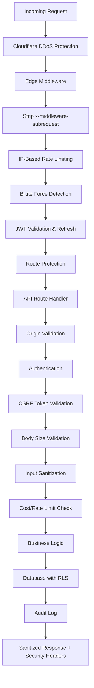
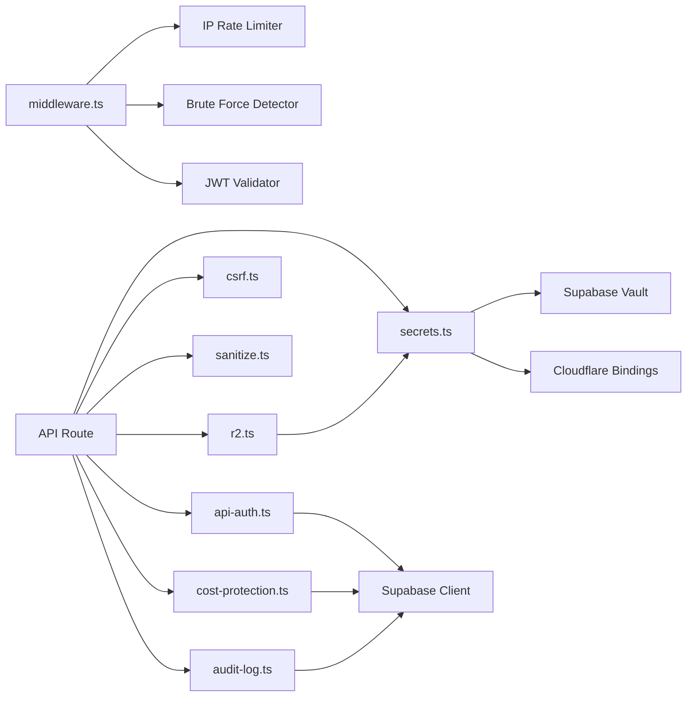

# Design Document: Security Hardening

## Overview

This design covers comprehensive security hardening for the Clorefy production application — a Next.js 16.1.6 app on Cloudflare Workers (OpenNext) with Supabase PostgreSQL, Cloudflare R2 storage, DeepSeek/OpenAI AI APIs, and Razorpay payments.

The hardening addresses 15 requirement areas across the full request lifecycle: edge middleware enforcement, CSRF protection, rate limiting, input sanitization, security headers, brute force protection, R2 storage security, AI abuse prevention, payment integrity, error handling, audit logging, CORS, signing endpoint security, database RLS, and secret management.

### Design Principles

1. **Defense in Depth** — Multiple overlapping security layers so a single bypass doesn't compromise the system
2. **Fail Secure** — Rate limiting and cost protection fail open (don't block users on infra failure), but auth and CSRF fail closed (reject on failure)
3. **Edge-First** — Block malicious requests in middleware before they reach route handlers or the database
4. **Zero Trust on Input** — Every user-provided value is sanitized and validated regardless of source
5. **Audit Everything** — All security-relevant events are logged for incident detection and forensics

### Request Lifecycle Security Layers



## Architecture

### System Context

The application runs on Cloudflare Workers paid plan ($5/month) which provides network-level DDoS protection. Application-level security is implemented across three tiers:

1. **Edge Tier** — `middleware.ts` runs on every request before route handlers. Handles IP rate limiting, brute force detection, JWT validation, and route protection.
2. **Route Tier** — Individual API route handlers in `/app/api/`. Handle origin validation, authentication, CSRF validation, input sanitization, cost protection, and business logic.
3. **Data Tier** — Supabase PostgreSQL with RLS policies. Enforces data isolation at the database level regardless of application bugs.

### Module Dependency Graph



### Security Module Responsibilities

| Module | File | Responsibility |
|--------|------|----------------|
| Edge Middleware | `middleware.ts` | IP rate limiting, brute force, JWT refresh, route protection, header stripping |
| Auth Module | `lib/api-auth.ts` | Authentication, origin validation, IP extraction, error sanitization |
| CSRF Module | `lib/csrf.ts` | HMAC-signed token generation/validation with timing-safe comparison |
| Sanitizer | `lib/sanitize.ts` | XSS prevention, input validation, recursive object sanitization |
| Rate Limiter | `lib/rate-limiter.ts` | Postgres-based per-user rate limiting (post-auth) |
| Cost Protector | `lib/cost-protection.ts` | Tier-based document/message limits |
| Audit Logger | `lib/audit-log.ts` | Security event recording to `audit_logs` table |
| Secrets | `lib/secrets.ts` | Supabase Vault + Cloudflare bindings secret retrieval |
| R2 Client | `lib/r2.ts` | Presigned URL generation with user-scoped keys |

## Components and Interfaces

### 1. CSRF Module (`lib/csrf.ts`)

**Changes Required:**
- Use dedicated `CSRF_SECRET` from environment, remove fallback to Supabase anon key
- Add timing-safe comparison for HMAC signature verification
- Add audit logging on CSRF validation failure
- Create `/api/csrf` GET endpoint for token generation

```typescript
// Public API
function generateCSRFToken(sessionId: string): string
async function validateCSRFToken(request: NextRequest, sessionId: string): Promise<NextResponse | null>
function generateCSRFResponse(sessionId: string): NextResponse

// New: CSRF endpoint
// GET /api/csrf → { csrfToken: string }
```

**Key Design Decision:** Use HMAC-signed tokens with session binding rather than database-stored tokens. This avoids a DB round-trip on every state-changing request and works well with Cloudflare Workers' stateless model. The token format is `{sessionId}:{random}:{timestamp}:{hmac}`.

### 2. Edge Middleware (`middleware.ts`)

**Changes Required:**
- Reduce auth route rate limit from 30/min to 10/min per requirements
- Add brute force detection (5 consecutive failures → 15-min block)
- Add signing endpoint rate limit (5/min per IP)
- Add webhook endpoint rate limit (30/min per IP)

```typescript
// Rate limit configuration
const RATE_LIMITS = {
  auth:     { maxRequests: 10,  windowMs: 60_000 },  // Reduced from 30
  api:      { maxRequests: 120, windowMs: 60_000 },
  signing:  { maxRequests: 5,   windowMs: 60_000 },  // New
  webhook:  { maxRequests: 30,  windowMs: 60_000 },  // New
  global:   { maxRequests: 300, windowMs: 60_000 },
}

// Brute force tracking
interface BruteForceEntry {
  failedAttempts: number
  lastFailure: number
  blockedUntil: number
}
const bruteForceStore = new Map<string, BruteForceEntry>()
```

**Key Design Decision:** Brute force detection uses in-memory tracking in the middleware. This resets on deploy/restart, which is acceptable because Cloudflare Workers have short lifetimes and an attacker would need to restart their attack. The 15-minute block window is short enough that legitimate users aren't permanently locked out.

### 3. Auth Module (`lib/api-auth.ts`)

**Changes Required:**
- Harden origin validation: reject state-changing requests with no Origin AND no Referer
- Remove localhost origins in production mode
- Add `sanitizeError` improvements for AI-specific error messages
- Ensure `cf-connecting-ip` is checked first for IP extraction

```typescript
// Updated origin validation
function validateOrigin(request: Request): NextResponse | null
// Updated error sanitization
function sanitizeError(error: unknown): string
// IP extraction (already exists, ensure cf-connecting-ip priority)
function getClientIP(request: Request): string
```

**Key Design Decision:** Origin validation allows missing Origin/Referer for same-origin GET requests (browsers don't always send Origin on same-origin). For POST/PUT/DELETE, both missing means the request is suspicious and gets rejected.

### 4. Sanitizer (`lib/sanitize.ts`)

**Changes Required:**
- Add control character removal (U+0000–U+001F except tab/newline/CR) — partially exists, needs refinement
- Add null byte removal to `sanitizeFileName`
- Ensure `sanitizeObject` throws at depth > 10 (already implemented)
- Add RFC 5322 email validation with consecutive dot and leading dot checks (partially exists)

```typescript
// Existing API (minor refinements)
function sanitizeHTML(input: string): string
function sanitizeText(input: string): string
function sanitizeEmail(input: string): string
function sanitizeFileName(input: string): string
function sanitizeObject<T>(obj: T, options?: { allowHTML?: boolean; maxDepth?: number }): T
```

### 5. Security Headers (`next.config.mjs`)

**Changes Required:**
- Add `preload` to HSTS directive
- Remove `unsafe-eval` from CSP `script-src` in production
- Add `Permissions-Policy` for payment, USB
- Remove `X-Powered-By` header
- Add `frame-ancestors 'none'` (already present in CSP)

```typescript
// Updated headers configuration
headers: [
  { key: "Strict-Transport-Security", value: "max-age=31536000; includeSubDomains; preload" },
  { key: "Permissions-Policy", value: "camera=(), microphone=(), geolocation=(), payment=(self https://checkout.razorpay.com), usb=()" },
  // X-Powered-By removed via poweredByHeader: false in next.config
]
```

**Key Design Decision:** `unsafe-eval` is removed from CSP in production but may be needed in development for Next.js hot reload. The CSP is environment-aware. `unsafe-inline` for scripts remains because Razorpay's checkout SDK requires it.

### 6. Audit Logger (`lib/audit-log.ts`)

**Changes Required:**
- Add security event types: `security.csrf_failure`, `security.rate_limit`, `security.auth_failure`, `security.origin_failure`, `security.payment_failure`, `security.brute_force_block`
- Ensure non-blocking behavior (already implemented — catches errors and logs to console)
- Add `cf-connecting-ip` as primary IP source

```typescript
// Extended AuditAction type
export type AuditAction =
    | "document.create" | "document.update" | "document.delete" | "document.export" | "document.sign"
    | "signature.create" | "signature.complete"
    | "business.create" | "business.update"
    | "auth.login" | "auth.logout" | "auth.signup"
    | "compliance.query"
    | "ai.generate" | "ai.onboarding"
    | "payment.verify" | "payment.webhook"
    // New security events
    | "security.csrf_failure"
    | "security.rate_limit"
    | "security.auth_failure"
    | "security.origin_failure"
    | "security.payment_failure"
    | "security.brute_force_block"
```

### 7. Cost Protector (`lib/cost-protection.ts`)

**Changes Required:**
- Update tier limits to match requirements: Free (5/month), Starter (50/month), Pro (150/month), Agency (unlimited)
- Update message limits: Free (10/session), Starter (30/session), Pro (50/session), Agency (unlimited)

The current implementation has Free at 5 docs/month which matches. Message limits need updating from 10/25/30/unlimited to 10/30/50/unlimited.

### 8. Payment Security (`app/api/razorpay/verify/route.ts` and `webhook/route.ts`)

**Changes Required:**
- Add plan ID validation against known plans (free, starter, pro, agency)
- Add audit logging for payment verification (success and failure)
- Ensure webhook idempotency (check for existing payment_history record before insert)
- Add rate limiting to webhook endpoint

### 9. Signing Endpoint (`app/api/signatures/sign/route.ts`)

**Changes Required:**
- Add IP-based rate limiting (5/min) — currently no rate limiting
- Validate decoded signature image size ≤ 500KB
- Already validates token format, expiry, and records IP/user-agent

### 10. R2 Storage Security (`app/api/storage/upload/route.ts` and `url/route.ts`)

**Current State:** Already well-implemented with MIME type validation, file size limits, user-scoped keys, and ownership verification. Presigned PUT URLs expire in 5 minutes (requirement says 15 min max — compliant). Presigned GET URLs expire in 1 hour (matches requirement).

**Minor Changes:**
- Ensure `sanitizeFileName` is called on uploaded file names

### 11. Secret Management (`lib/secrets.ts`)

**Changes Required:**
- Add startup validation for required secrets
- Ensure CSRF_SECRET is a dedicated env var (not falling back to anon key)
- Ensure Razorpay key secret is never in wrangler.json vars or client bundle

## Data Models

### Existing Tables (Security-Relevant)

```sql
-- audit_logs: Records all security-relevant events
CREATE TABLE audit_logs (
    id UUID PRIMARY KEY DEFAULT gen_random_uuid(),
    user_id UUID REFERENCES auth.users(id),
    action TEXT NOT NULL,
    resource_type TEXT,
    resource_id UUID,
    ip_address TEXT,
    user_agent TEXT,
    metadata JSONB,
    created_at TIMESTAMPTZ DEFAULT NOW()
);

-- user_usage: Tracks AI usage per user per month
CREATE TABLE user_usage (
    id UUID PRIMARY KEY DEFAULT gen_random_uuid(),
    user_id UUID REFERENCES auth.users(id),
    month TEXT NOT NULL,  -- 'YYYY-MM' format
    ai_requests_count INTEGER DEFAULT 0,
    ai_tokens_used INTEGER DEFAULT 0,
    estimated_cost_usd NUMERIC(10,6) DEFAULT 0,
    documents_count INTEGER DEFAULT 0,
    created_at TIMESTAMPTZ DEFAULT NOW(),
    updated_at TIMESTAMPTZ DEFAULT NOW(),
    UNIQUE(user_id, month)
);

-- payment_history: Audit trail for all payments
CREATE TABLE payment_history (
    id UUID PRIMARY KEY DEFAULT gen_random_uuid(),
    user_id UUID REFERENCES auth.users(id),
    razorpay_payment_id TEXT,
    razorpay_order_id TEXT,
    razorpay_signature TEXT,
    amount NUMERIC,
    currency TEXT,
    status TEXT,
    plan TEXT,
    billing_cycle TEXT,
    metadata JSONB,
    created_at TIMESTAMPTZ DEFAULT NOW()
);
```

### In-Memory Data Structures (Middleware)

```typescript
// IP rate limiting store (resets on deploy)
const ipStore = new Map<string, { timestamps: number[] }>()

// Brute force tracking store (resets on deploy)
const bruteForceStore = new Map<string, {
    failedAttempts: number
    lastFailure: number
    blockedUntil: number
}>()
```

### RLS Policy Model

All tables enforce user isolation via `auth.uid()`:

```sql
-- Standard pattern for all user-owned tables
CREATE POLICY "Users can read own data" ON {table}
    FOR SELECT USING (user_id = auth.uid());
CREATE POLICY "Users can update own data" ON {table}
    FOR UPDATE USING (user_id = auth.uid());
CREATE POLICY "Users can delete own data" ON {table}
    FOR DELETE USING (user_id = auth.uid());

-- Service role bypass for webhooks and audit logging
CREATE POLICY "Service role can insert" ON audit_logs
    FOR INSERT WITH CHECK (true);  -- service_role bypasses RLS

-- Signatures: public read by token, write by document owner
CREATE POLICY "Public read by token" ON signatures
    FOR SELECT USING (token IS NOT NULL);
CREATE POLICY "Owner can manage" ON signatures
    FOR ALL USING (
        document_id IN (SELECT id FROM documents WHERE user_id = auth.uid())
    );
```


## Correctness Properties

*A property is a characteristic or behavior that should hold true across all valid executions of a system — essentially, a formal statement about what the system should do. Properties serve as the bridge between human-readable specifications and machine-verifiable correctness guarantees.*

### Property 1: CSRF method filtering

*For any* HTTP request, the CSRF validator SHALL require token validation if and only if the method is POST, PUT, or DELETE. GET, HEAD, and OPTIONS requests SHALL skip CSRF validation entirely.

**Validates: Requirements 1.1**

### Property 2: CSRF token round-trip integrity

*For any* valid session ID, generating a CSRF token and then validating it with the same session ID SHALL succeed. Validating a token with a different session ID, a mutated signature, or after the 1-hour expiration SHALL fail with a 403 response.

**Validates: Requirements 1.3**

### Property 3: IP-based rate limit enforcement

*For any* IP address and route category (auth: 10/min, api: 120/min, signing: 5/min, webhook: 30/min, global: 300/min), after exactly N requests within the time window where N equals the configured limit, the (N+1)th request SHALL be rejected with a 429 status and a positive `Retry-After` header value.

**Validates: Requirements 2.1, 2.2, 2.3, 2.4, 2.5, 2.6, 2.7, 5.1, 12.5**

### Property 4: Brute force detection and reset

*For any* IP address, after 5 or more consecutive failed login attempts within 15 minutes, subsequent requests to auth routes SHALL be blocked for 15 minutes. After a successful login, the failed attempt counter SHALL reset to 0, allowing immediate access.

**Validates: Requirements 5.2, 5.4**

### Property 5: HTML and control character sanitization

*For any* input string, `sanitizeText` SHALL produce output containing no HTML tags (`<...>`) and no control characters (U+0000–U+001F) except tab (U+0009), newline (U+000A), and carriage return (U+000D). Whitespace SHALL be normalized to single spaces.

**Validates: Requirements 3.1, 3.2**

### Property 6: Email validation rejects malformed addresses

*For any* string containing consecutive dots (`..`), a leading dot before `@`, or not matching the basic `user@domain.tld` pattern, `sanitizeEmail` SHALL throw an error. For any well-formed email, it SHALL return the lowercase trimmed version.

**Validates: Requirements 3.3**

### Property 7: Recursive object sanitization with depth limit

*For any* nested object with string values at depth ≤ 10, `sanitizeObject` SHALL return an equivalent object where every string value has been sanitized. For any object nested deeper than 10 levels, `sanitizeObject` SHALL throw "Object nesting too deep".

**Validates: Requirements 3.4, 3.5**

### Property 8: File name sanitization removes dangerous sequences

*For any* input string, `sanitizeFileName` SHALL produce output containing no path traversal sequences (`..`), no path separators (`/`, `\`), no null bytes, and length ≤ 255 characters.

**Validates: Requirements 3.7**

### Property 9: Request body size enforcement

*For any* request body and configured size limit, `validateBodySize` SHALL return null (allow) when the serialized body size is ≤ the limit, and SHALL return a 413 response when the size exceeds the limit.

**Validates: Requirements 3.6**

### Property 10: File upload MIME type and size validation

*For any* upload request, the endpoint SHALL accept the request if and only if the content type is in the whitelist (`image/png`, `image/jpeg`, `image/webp`, `image/gif`, `application/pdf`) AND the file size is ≤ 10MB. All other combinations SHALL be rejected with a 400 response.

**Validates: Requirements 6.1, 6.2, 6.7**

### Property 11: R2 object key ownership verification

*For any* presigned GET URL request, access SHALL be granted if and only if the requesting user's ID matches the user ID segment in the object key (pattern: `{category}/{userId}/{uuid}.{ext}`), OR the key starts with `signatures/`. All other requests SHALL return 403.

**Validates: Requirements 6.3, 6.4**

### Property 12: Tier-based usage limit enforcement

*For any* user tier and usage count (documents per month or messages per session), the cost protector SHALL allow the operation when usage is below the tier limit and SHALL return a 429 response when usage meets or exceeds the limit. Unlimited tiers (agency) SHALL always allow.

**Validates: Requirements 7.3, 7.4, 7.5**

### Property 13: HMAC signature verification

*For any* payment order ID + payment ID pair (or webhook body), computing the HMAC-SHA256 with the correct secret SHALL produce a signature that passes verification. Any mutation to the order ID, payment ID, body, or signature SHALL cause verification to fail.

**Validates: Requirements 8.1, 8.2**

### Property 14: Plan ID validation

*For any* string, plan validation SHALL accept only the known plan IDs (`free`, `starter`, `pro`, `agency`) and SHALL reject all other values.

**Validates: Requirements 8.6**

### Property 15: Error message sanitization

*For any* Error object, `sanitizeError` SHALL return the original message only if it matches a known safe message pattern. For all other errors, it SHALL return "Internal server error" — never exposing stack traces, database error codes, or internal paths.

**Validates: Requirements 9.1, 9.2, 9.5**

### Property 16: Audit logger non-blocking behavior

*For any* audit log operation that fails (database insert error, network timeout), the `logAudit` function SHALL catch the error, log it to the server console, and SHALL NOT throw or reject — ensuring the original request completes unaffected.

**Validates: Requirements 10.4**

### Property 17: Origin validation

*For any* request with an `Origin` header, `validateOrigin` SHALL accept only origins in the allowed list (production domain, configured app URL, localhost in dev only) and SHALL reject all others with 403. When both `Origin` and `Referer` are absent on a state-changing request, it SHALL return 403.

**Validates: Requirements 11.1, 11.3, 11.5**

### Property 18: Signing token format validation

*For any* string, the signing endpoint SHALL accept the token only if it starts with `sign_` and has length ≤ 100 characters. All other formats SHALL be rejected.

**Validates: Requirements 12.1**

### Property 19: Signature data URL validation

*For any* signature data URL, the signing endpoint SHALL accept it only if it starts with `data:image/` and the decoded image size is ≤ 500KB. Invalid formats or oversized images SHALL be rejected.

**Validates: Requirements 12.6**

### Property 20: Middleware x-middleware-subrequest header stripping

*For any* incoming request containing the `x-middleware-subrequest` header, the middleware SHALL remove it from the forwarded request headers to prevent CVE-2025-29927 bypass attacks.

**Validates: Requirements 13.1**

### Property 21: Protected route redirect for unauthenticated requests

*For any* non-public route path and unauthenticated request, the middleware SHALL redirect to `/auth/login` with a `redirectTo` query parameter preserving the original path.

**Validates: Requirements 13.4**

## Error Handling

### Error Response Strategy

All API routes follow a consistent error handling pattern:

| Error Type | Status | Client Message | Server Action |
|-----------|--------|----------------|---------------|
| Missing/invalid CSRF token | 403 | "CSRF token missing or invalid" | Audit log |
| Rate limit exceeded | 429 | "Too many requests" + Retry-After | Audit log |
| Brute force block | 429 | "Too many login attempts. Please try again later." | Audit log |
| Authentication failure | 401 | "Unauthorized. Please log in." | — |
| Invalid origin | 403 | "Invalid origin" | Audit log |
| Body too large | 413 | "Request body too large. Maximum {N}KB allowed." | — |
| Invalid input | 400 | Specific validation message | — |
| Invalid file type | 400 | "Unsupported file type" | — |
| Payment verification failed | 400 | "Payment verification failed" | Audit log |
| Signing link expired | 410 | "Signing link has expired" | — |
| Cost limit exceeded | 429 | Usage details + upgrade suggestion | — |
| AI service unavailable | 503 | "AI service temporarily unavailable" | Console log |
| Unhandled error | 500 | "Internal server error" | Console log with full details |

### Error Sanitization Rules

The `sanitizeError` function maintains a whitelist of safe error messages that can be returned to clients. Any error not matching the whitelist is replaced with "Internal server error". This prevents leaking:
- Stack traces
- Database error codes (e.g., `PGRST116`)
- Internal file paths
- AI provider names or API key prefixes
- SQL query fragments

### Fail-Open vs Fail-Closed

| Component | Failure Mode | Rationale |
|-----------|-------------|-----------|
| Rate limiter (Postgres) | Fail open | Don't block users if DB is down |
| IP rate limiter (memory) | Fail open | Memory issues shouldn't block all traffic |
| CSRF validation | Fail closed | Security-critical, reject on any failure |
| Authentication | Fail closed | Never allow unauthenticated access |
| Origin validation | Fail closed | Reject suspicious origins |
| Audit logging | Fail open | Logging failure shouldn't break user operations |
| Cost protection | Fail open | Don't block paying users on tracking errors |

## Testing Strategy

### Testing Approach

This feature uses a dual testing approach:

1. **Property-based tests** — Verify universal security properties across many generated inputs using `fast-check`. Each property test runs a minimum of 100 iterations to catch edge cases that example-based tests miss.
2. **Unit tests** — Verify specific examples, integration points, and error conditions.
3. **Integration tests** — Verify database RLS policies, webhook flows, and end-to-end security chains.
4. **Smoke tests** — Verify security header configuration and environment setup.

### Property-Based Testing Configuration

- Library: `fast-check` (TypeScript property-based testing)
- Minimum iterations: 100 per property
- Tag format: `Feature: security-hardening, Property {N}: {title}`

### Test Organization

```
lib/__tests__/
  csrf.property.test.ts          — Properties 1, 2
  rate-limiter.property.test.ts  — Property 3
  brute-force.property.test.ts   — Property 4
  sanitize.property.test.ts      — Properties 5, 6, 7, 8
  api-auth.property.test.ts      — Properties 9, 15, 17
  cost-protection.property.test.ts — Property 12
  payment.property.test.ts       — Properties 13, 14
  audit-log.property.test.ts     — Property 16
  signing.property.test.ts       — Properties 18, 19
  middleware.property.test.ts    — Properties 3, 4, 20, 21

app/api/storage/__tests__/
  upload.property.test.ts        — Properties 10, 11
```

### Unit Test Coverage

- CSRF endpoint returns valid token for authenticated user
- Security headers are present on responses (smoke tests for Req 4)
- Brute force block triggers audit log entry
- Webhook processes duplicate events idempotently
- Expired signing token returns 410
- Missing AI API key returns 503
- RLS policies prevent cross-user data access (integration)

### What Is NOT Property-Tested

- Security header configuration (Req 4) — Smoke tests only, these are static config values
- Frontend CSRF integration (Req 1.5) — Integration/E2E test
- Database RLS policies (Req 14) — Integration tests against real Supabase
- JWT cookie refresh format (Req 13.3) — Integration test
- 90-day audit log retention (Req 10.6) — Ops/config verification
- Secret management (Req 15) — Smoke tests for env var presence
