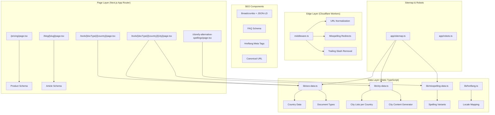

# Design Document: SEO Comprehensive Optimization

## Overview

This design addresses Clorefy's SEO gaps: GSC indexing errors, missing city-level landing pages, absent hreflang tags, incomplete structured data, and sitemap coverage holes. The solution extends the existing static SEO data layer (`lib/seo-data.ts`) with city data, adds middleware-level URL normalization and misspelling redirects, introduces hreflang tag generation, enriches JSON-LD structured data across all public pages, and expands the sitemap to cover all new URLs.

All changes are static/build-time or edge-runtime compatible — no database queries are needed for SEO pages. The architecture preserves the existing pattern of TypeScript data objects + Next.js App Router metadata API + ISR.

## Architecture



## Components and Interfaces

### 1. URL Normalization Middleware (middleware.ts extension)

Extends the existing middleware to enforce URL consistency before auth checks:

```typescript
// Added to middleware.ts, runs before auth logic
interface URLNormalizationResult {
  shouldRedirect: boolean
  redirectUrl: string | null
  statusCode: 301 | 308
}

function normalizeURL(request: NextRequest): URLNormalizationResult
```

Rules applied in order:
1. Lowercase the pathname
2. Remove trailing slashes (except root `/`)
3. Remove duplicate slashes
4. Check misspelling patterns → 301 redirect to correct URL

### 2. City Data Module (lib/city-data.ts)

New static data module defining cities per country:

```typescript
export interface CityData {
  slug: string
  name: string
  country: string // country slug reference
  population?: string
  businessContext: string
  industries: string[]
  taxNotes: string
}

export interface CityPageData {
  city: CityData
  country: CountryData
  documentType: DocumentTypeData
  title: string
  metaDescription: string
  heroHeading: string
  heroSubheading: string
  businessContextSection: string
  taxComplianceSection: string
  faqs: { question: string; answer: string }[]
  ctaMessage: string
  useCaseContent: string
  siblingCities: CityData[]
  parentCountryHref: string
  relatedBlogSlugs: string[]
}

export function getCityBySlug(countrySlug: string, citySlug: string): CityData | undefined
export function getCitiesForCountry(countrySlug: string): CityData[]
export function getCityPageData(docTypeSlug: string, countrySlug: string, citySlug: string): CityPageData | undefined
export function getAllCityPages(): { documentType: string; country: string; city: string }[]
```

### 3. Misspelling Data Module (lib/misspelling-data.ts)

```typescript
export const MISSPELLING_VARIANTS: string[] = [
  "clorify", "cloriphy", "clorephy", "clorafy", "clorefi", "clorfy", "clorifly"
]

export function isMisspellingPath(pathname: string): string | null
// Returns corrected pathname or null if no match
```

### 4. Hreflang Module (lib/hreflang.ts)

```typescript
export interface HreflangEntry {
  hrefLang: string  // e.g., "en-IN", "de-DE"
  href: string      // absolute URL
}

export function getCountryHreflangTags(documentTypeSlug: string): HreflangEntry[]
export function getCityHreflangTag(countrySlug: string, documentTypeSlug: string, citySlug: string): HreflangEntry
export function getLocaleForCountry(countrySlug: string): string
```

### 5. Structured Data Helpers (lib/structured-data.ts)

```typescript
export function generateBreadcrumbSchema(items: { name: string; url?: string }[]): object
export function generateFAQSchema(faqs: { question: string; answer: string }[]): object
export function generateProductSchema(plans: PricingPlan[]): object
export function generateArticleSchema(post: BlogPost): object
export function generateSoftwareAppSchema(city: CityData, docType: DocumentTypeData): object
export function generateOrganizationSchema(): object
```

### 6. City Landing Page (app/tools/[documentType]/[country]/[city]/page.tsx)

New dynamic route using the same ISR pattern as the country page:

- `generateStaticParams()` → returns all city combinations from `getAllCityPages()`
- `generateMetadata()` → unique title, description, canonical, OG tags, hreflang
- Page renders: breadcrumbs, hero, business context, tax compliance, FAQs, CTA, internal links, use-case content

### 7. Misspelling Landing Page (app/clorefy-alternative-spellings/page.tsx)

Static page with:
- Content mentioning all misspelling variants
- Organization schema with `sameAs` references
- Canonical URL, OG tags, breadcrumbs

### 8. Updated Country Landing Page (app/tools/[documentType]/[country]/page.tsx)

Extended to include:
- Hreflang tags for all 11 country variants + x-default
- "Available Cities" section linking to child city pages
- Updated internal linking

### 9. Updated Sitemap (app/sitemap.ts)

Extended to include:
- All city landing pages (priority 0.7, monthly)
- Misspelling landing page (priority 0.5, monthly)
- Proper `lastModified` dates

## Data Models

### City Data Structure

Top 3–5 cities per country (55–65 total city entries across 11 countries × 4 doc types = 220–260 city pages):

| Country | Cities |
|---------|--------|
| India | Mumbai, Delhi, Bangalore, Chennai, Hyderabad |
| USA | New York, Los Angeles, Chicago, Houston, San Francisco |
| UK | London, Manchester, Birmingham, Edinburgh, Leeds |
| Germany | Berlin, Munich, Hamburg, Frankfurt, Cologne |
| Canada | Toronto, Vancouver, Montreal, Calgary, Ottawa |
| Australia | Sydney, Melbourne, Brisbane, Perth, Adelaide |
| Singapore | Singapore (Central), Jurong East, Tampines |
| UAE | Dubai, Abu Dhabi, Sharjah |
| Philippines | Manila, Cebu, Davao, Quezon City |
| France | Paris, Lyon, Marseille, Toulouse, Nice |
| Netherlands | Amsterdam, Rotterdam, The Hague, Utrecht, Eindhoven |

### Hreflang Locale Mapping

| Country | Locale Code |
|---------|-------------|
| India | en-IN |
| USA | en-US |
| UK | en-GB |
| Germany | de-DE |
| Canada | en-CA |
| Australia | en-AU |
| Singapore | en-SG |
| UAE | en-AE |
| Philippines | en-PH |
| France | fr-FR |
| Netherlands | nl-NL |

The `x-default` tag always points to the USA variant.

### Misspelling Variants

Static array: `["clorify", "cloriphy", "clorephy", "clorafy", "clorefi", "clorfy", "clorifly"]`

Middleware checks if any path segment contains one of these strings and redirects to the equivalent path with "clorefy" substituted.


## Correctness Properties

*A property is a characteristic or behavior that should hold true across all valid executions of a system — essentially, a formal statement about what the system should do. Properties serve as the bridge between human-readable specifications and machine-verifiable correctness guarantees.*

### Property 1: Canonical URL correctness

*For any* public page generated by the platform, the canonical URL must be an absolute URL starting with "https://clorefy.com", must be self-referencing (matching the exact served URL path), and must contain no trailing slashes (except root "/"), no query parameters, and no fragment identifiers.

**Validates: Requirements 1.1, 7.1, 7.2, 7.4**

### Property 2: URL normalization produces canonical form

*For any* URL path string, the normalizeURL function must produce a lowercase path with no trailing slash (except root "/"), no duplicate slashes, and no uppercase characters. Applying normalizeURL to an already-canonical URL must return the same URL (idempotence).

**Validates: Requirements 1.2, 1.5**

### Property 3: Misspelling detection and correction

*For any* URL path containing a known misspelling variant of "Clorefy", the isMisspellingPath function must return the corrected path with the misspelling replaced by "clorefy". For any URL path not containing a known misspelling, it must return null.

**Validates: Requirements 3.2**

### Property 4: City page data completeness

*For any* valid combination of document type slug, country slug, and city slug in the city data, getCityPageData must return a non-null result where: the hero heading contains the city name and document type, the businessContextSection is non-empty and contains the city name, the taxComplianceSection mentions the country's tax system, the ctaMessage contains the city name, and the useCaseContent is non-empty and contains the city name.

**Validates: Requirements 2.1, 2.2, 8.1, 8.2, 8.3, 8.5, 8.6**

### Property 5: City page metadata constraints

*For any* city page, the title must follow the pattern "[Document Type] for [City], [Country] | Clorefy" and not exceed 60 characters, and the meta description must be between 120 and 160 characters and contain both the city name and document type name.

**Validates: Requirements 2.3, 2.4, 9.3, 9.7**

### Property 6: City page FAQ uniqueness

*For any* city page, the FAQ data must contain at least 3 entries, each with a non-empty question and answer containing the city name, and the set of FAQ questions must be entirely distinct from the parent country page's FAQ questions.

**Validates: Requirements 2.6, 5.3, 8.4**

### Property 7: City page internal linking

*For any* city page data, it must include a link to the parent country page and links to at least 2 sibling city pages in the same country, plus at least 1 related blog post slug.

**Validates: Requirements 2.7, 10.2, 10.3**

### Property 8: Country page links to all child cities

*For any* country that has cities defined in the city data, the country page must include internal links to every child city page for that country.

**Validates: Requirements 2.8, 10.1**

### Property 9: Hreflang tag completeness for country pages

*For any* document type, the getCountryHreflangTags function must return exactly 12 entries: one for each of the 11 supported country locales plus one x-default entry pointing to the USA variant.

**Validates: Requirements 4.1**

### Property 10: Hreflang locale format validity

*For any* country in the supported countries list, the locale code must match the ISO pattern `[a-z]{2}-[A-Z]{2}` (ISO 639-1 language + ISO 3166-1 Alpha-2 country code), and the city hreflang tag must use the correct locale for its parent country.

**Validates: Requirements 4.2, 4.3**

### Property 11: Hreflang reciprocity

*For any* pair of country pages (A, B) where page A includes a hreflang tag referencing page B, page B must also include a hreflang tag referencing page A.

**Validates: Requirements 4.4**

### Property 12: Breadcrumb schema hierarchy

*For any* public page below the root level, the generated BreadcrumbList schema must contain list items reflecting the correct page hierarchy, with each item having a non-empty name and (except the last item) a valid URL.

**Validates: Requirements 2.5, 5.1**

### Property 13: Country page FAQ completeness

*For any* country and document type combination, the FAQ generation function must return at least 3 entries with non-empty questions and answers that reference the country name.

**Validates: Requirements 5.2**

### Property 14: JSON-LD structural validity

*For any* generated JSON-LD object (BreadcrumbList, FAQPage, SoftwareApplication, Product, Article), all required fields per the schema type must be non-empty and the @type field must be present.

**Validates: Requirements 5.7**

### Property 15: Sitemap city page coverage

*For any* city defined in the city data, the sitemap output must contain that city's URL with priority 0.7 and changeFrequency "monthly".

**Validates: Requirements 6.1, 6.6**

### Property 16: Canonical URL uniqueness

*For all* public pages, the set of canonical URLs must contain no duplicates — no two distinct pages may share the same canonical URL.

**Validates: Requirements 7.3**

### Property 17: Canonical-sitemap consistency

*For any* public page that has a canonical URL, that canonical URL must appear in the sitemap output.

**Validates: Requirements 7.5**

### Property 18: Social meta tags presence

*For any* public page (including city pages), the metadata must include og:title, og:description, og:url, and twitter:card, twitter:title, twitter:description fields, all non-empty.

**Validates: Requirements 9.5, 9.6**

## Error Handling

| Scenario | Handling |
|----------|----------|
| Unknown city slug | `getCityPageData` returns `undefined` → page calls `notFound()` → 404 |
| Unknown document type or country slug | Existing behavior preserved: `getProgrammaticPageData` returns `undefined` → 404 |
| Misspelling in URL path | Middleware detects and returns 301 redirect to corrected URL |
| Malformed URL (double slashes, uppercase, trailing slash) | Middleware normalizes and returns 301 redirect |
| Missing city data for a country | `getCitiesForCountry` returns empty array → no city links rendered on country page |
| JSON-LD generation with missing data | Helper functions validate inputs and omit optional fields rather than emitting empty values |
| Sitemap generation failure | Graceful degradation: city pages omitted if city data module throws, existing pages still included |

## Testing Strategy

### Unit Tests (Example-Based)
- Verify specific city page renders with expected content (Mumbai invoice generator)
- Verify misspelling landing page includes all variant strings
- Verify pricing page Product schema has correct plan entries
- Verify blog post Article schema has required fields
- Verify sitemap includes misspelling page with priority 0.5
- Verify ISR revalidate export equals 86400
- Verify MISSPELLING_VARIANTS array contains all required variants
- Verify footer includes city page links and misspelling page link

### Property-Based Tests
- Use `fast-check` library for TypeScript property-based testing
- Minimum 100 iterations per property test
- Each test tagged with: **Feature: seo-comprehensive-optimization, Property {N}: {title}**
- Properties 1–18 from the Correctness Properties section above
- Generators will produce random combinations of country slugs, document type slugs, city slugs, and URL path strings from the valid data sets
- For URL normalization tests, generators will produce random strings with various malformations (uppercase, trailing slashes, duplicate slashes, misspelling insertions)

### Integration Tests
- Crawl all sitemap URLs and verify 200 status (Requirements 1.7, 6.5)
- Verify no redirect chains exist (Requirement 1.3)
- Verify no city page is an orphan — at least 2 internal links point to each (Requirement 10.5)
- Verify all existing pages still included in sitemap (Requirement 6.3)
