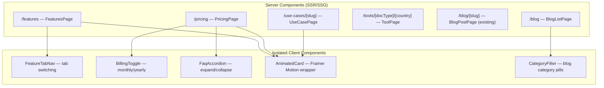
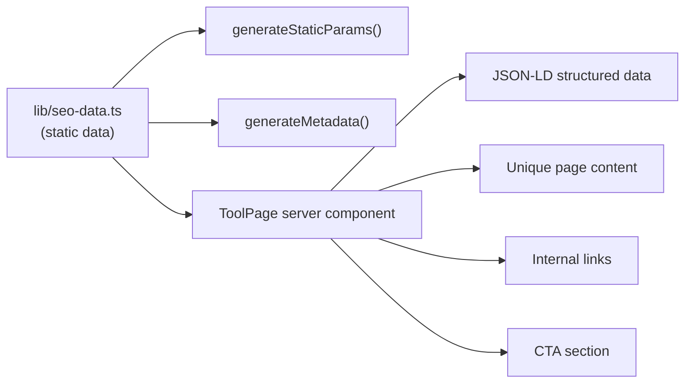

# Design Document: SEO Optimization

## Overview

This design covers a comprehensive SEO overhaul for Clorefy (clorefy.com), an AI document generation platform built on Next.js 16 with App Router. The initiative addresses five critical areas:

1. **Server-side rendering migration** — Converting three client-rendered public pages (`/use-cases/[slug]`, `/features`, `/pricing`) to server components so crawlers can index full content without JavaScript execution.
2. **Programmatic SEO** — Generating 44 landing pages from an 11-country × 4-document-type matrix at `/tools/[document-type]/[country]`, each with unique content, metadata, and structured data.
3. **Structured data & metadata** — Adding BreadcrumbList, Article, FAQPage, and per-page JSON-LD schemas; ensuring every public route has unique titles, descriptions, OG tags, and canonical URLs.
4. **Internal linking & content strategy** — Implementing a hub-and-spoke blog model with related posts, category filtering, cross-linking between programmatic pages, and breadcrumb navigation.
5. **Performance & AI visibility** — Optimizing Core Web Vitals through code-splitting, lazy loading, and font preloading; adding entity SEO markup for AI search engine discoverability.

The design preserves existing interactive behaviors (billing toggle, FAQ accordion, tab navigation, Framer Motion animations) by extracting them into isolated client components wrapped by server-rendered content shells.

## Architecture

### High-Level Page Rendering Strategy



### Route Structure

```
app/
├── features/
│   ├── layout.tsx          # Metadata (existing, enhanced)
│   └── page.tsx            # Server component (refactored)
├── pricing/
│   ├── layout.tsx          # Metadata + JSON-LD (existing, enhanced)
│   └── page.tsx            # Server component (refactored)
├── use-cases/
│   └── [slug]/
│       └── page.tsx        # Server component (refactored) + generateMetadata
├── tools/
│   └── [documentType]/
│       └── [country]/
│           └── page.tsx    # Programmatic SEO page + generateMetadata + generateStaticParams
├── blog/
│   ├── page.tsx            # Enhanced with category filtering
│   └── [slug]/
│       └── page.tsx        # Enhanced with related posts + CTA (existing)
├── sitemap.ts              # Enhanced with /tools/* pages
└── robots.ts               # Unchanged
```

### Data Flow for Programmatic SEO Pages



## Components and Interfaces

### New Components

| Component | Type | Location | Purpose |
|-----------|------|----------|---------|
| `FeatureTabNav` | Client | `components/landing/feature-tab-nav.tsx` | Interactive tab switching for features page |
| `BillingToggle` | Client | `components/landing/billing-toggle.tsx` | Monthly/yearly pricing toggle with country detection |
| `FaqAccordion` | Client | `components/landing/faq-accordion.tsx` | Expandable FAQ items with animation |
| `AnimatedCard` | Client | `components/landing/animated-card.tsx` | Framer Motion wrapper for scroll-triggered animations |
| `AnimatedHero` | Client | `components/landing/animated-hero.tsx` | Framer Motion wrapper for hero entrance animations |
| `Breadcrumbs` | Server | `components/seo/breadcrumbs.tsx` | Breadcrumb navigation with BreadcrumbList JSON-LD |
| `JsonLd` | Server | `components/seo/json-ld.tsx` | Reusable JSON-LD script tag renderer |
| `RelatedLinks` | Server | `components/seo/related-links.tsx` | Internal linking block for programmatic SEO pages |
| `BlogCategoryFilter` | Client | `components/blog/category-filter.tsx` | Client-side blog category filtering |
| `BlogRelatedPosts` | Server | `components/blog/related-posts.tsx` | Related posts section for blog detail pages |
| `BlogCta` | Server | `components/blog/blog-cta.tsx` | Reusable CTA block for blog posts |
| `ToolPage` | Server | `app/tools/[documentType]/[country]/page.tsx` | Programmatic SEO landing page |

### Key Interfaces

```typescript
// lib/seo-data.ts

export interface CountryData {
  slug: string            // e.g., "india"
  name: string            // e.g., "India"
  currency: string        // e.g., "INR"
  currencySymbol: string  // e.g., "₹"
  taxSystem: string       // e.g., "GST (CGST + SGST / IGST)"
  taxRate: string         // e.g., "18%"
  complianceNotes: string // Country-specific compliance summary
  locale: string          // e.g., "en-IN"
  flag: string            // e.g., "🇮🇳"
}

export interface DocumentTypeData {
  slug: string            // e.g., "invoice-generator"
  name: string            // e.g., "Invoice Generator"
  singularName: string    // e.g., "Invoice"
  description: string     // Generic description
  features: string[]      // Key features for this doc type
}

export interface ProgrammaticPageData {
  country: CountryData
  documentType: DocumentTypeData
  title: string           // e.g., "Invoice Generator for India"
  metaDescription: string
  heroHeading: string
  heroSubheading: string
  taxSection: string      // Country-specific tax content (HTML)
  complianceSection: string
  faqs: { question: string; answer: string }[]
  relatedPages: { href: string; label: string }[]
  relatedBlogSlugs: string[]
}

// components/seo/breadcrumbs.tsx
export interface BreadcrumbItem {
  label: string
  href?: string  // undefined for current page (last item)
}

export interface BreadcrumbsProps {
  items: BreadcrumbItem[]
}
```

### Refactoring Strategy for Existing Pages

**Features Page** (`app/features/page.tsx`):
- Remove `"use client"` directive
- Extract tab navigation into `FeatureTabNav` client component
- Keep all feature data (tabs, tabContent, feature grid) as static data in the server component
- Pass data as props to `FeatureTabNav`
- Wrap animated elements with `AnimatedCard` client component

**Pricing Page** (`app/pricing/page.tsx`):
- Remove `"use client"` directive
- Extract `BillingToggle` (monthly/yearly switch + country detection + price display) into a client component
- Extract `FaqAccordion` into a client component
- Keep plan data, FAQ data, and comparison section as server-rendered static HTML
- Pass plan data and FAQ data as props to respective client components

**Use Cases Page** (`app/use-cases/[slug]/page.tsx`):
- Remove `"use client"` directive
- Add `generateStaticParams()` returning all 7 use-case slugs
- Add `generateMetadata()` with per-slug title, description, OG tags, canonical URL
- Keep `USE_CASES` data object in the server component
- Wrap animated sections with `AnimatedCard` / `AnimatedHero` client components
- Add `Breadcrumbs` component
- Add internal links to relevant programmatic SEO pages

**LandingLayout** (`components/landing/landing-layout.tsx`):
- This component is `"use client"` due to Framer Motion page transitions and `usePathname`
- It will remain a client component since it wraps page content with animations
- The refactored pages will still use `LandingLayout` — the key improvement is that the page *content* is server-rendered and available in the initial HTML, even though the layout wrapper adds client-side animation on top

## Data Models

### Static SEO Data Architecture

All programmatic SEO data lives in `lib/seo-data.ts` as static TypeScript objects. This approach is chosen over a database because:
- Content is known at build time (11 countries × 4 doc types = 44 pages)
- No runtime database queries needed — pages are statically generated
- Easy to version control and review changes
- Zero latency for page rendering
- ISR revalidation handles content updates without full rebuilds

```typescript
// lib/seo-data.ts — Data structure overview

export const SUPPORTED_COUNTRIES: CountryData[] = [
  { slug: "india", name: "India", currency: "INR", currencySymbol: "₹", taxSystem: "GST (CGST + SGST / IGST)", taxRate: "18%", ... },
  { slug: "usa", name: "USA", currency: "USD", currencySymbol: "$", taxSystem: "Sales Tax (state-level)", taxRate: "0-10.25%", ... },
  { slug: "uk", name: "UK", currency: "GBP", currencySymbol: "£", taxSystem: "VAT", taxRate: "20%", ... },
  // ... 8 more countries
]

export const DOCUMENT_TYPES: DocumentTypeData[] = [
  { slug: "invoice-generator", name: "Invoice Generator", singularName: "Invoice", ... },
  { slug: "contract-generator", name: "Contract Generator", singularName: "Contract", ... },
  { slug: "quotation-generator", name: "Quotation Generator", singularName: "Quotation", ... },
  { slug: "proposal-generator", name: "Proposal Generator", singularName: "Proposal", ... },
]

// Lookup helpers
export function getCountryBySlug(slug: string): CountryData | undefined
export function getDocumentTypeBySlug(slug: string): DocumentTypeData | undefined
export function getProgrammaticPageData(documentTypeSlug: string, countrySlug: string): ProgrammaticPageData | undefined
export function getAllProgrammaticPages(): { documentType: string; country: string }[]

// Internal linking helpers
export function getRelatedProgrammaticPages(documentTypeSlug: string, countrySlug: string): { href: string; label: string }[]
export function getRelatedBlogSlugs(documentTypeSlug: string, countrySlug: string): string[]
```

### Blog Data Enhancements

The existing `lib/blog-data.ts` already has `relatedSlugs` and `category` fields. Enhancements:

```typescript
// Added to existing BlogPost interface
export interface BlogPost {
  // ... existing fields ...
  hub?: string              // Hub identifier for hub-and-spoke (e.g., "invoice", "contract")
  relatedToolPages?: string[] // Paths to related programmatic SEO pages (e.g., ["/tools/invoice-generator/india"])
}

// New helper functions
export function getPostsByCategory(category: string): BlogPost[]
export function getPostsByHub(hub: string): BlogPost[]
export function getAllCategories(): string[]
```

### Structured Data Models

Each page type gets specific JSON-LD schemas:

| Page Type | JSON-LD Schemas |
|-----------|----------------|
| All public pages | `BreadcrumbList` |
| Landing page | `WebSite`, `Organization`, `SoftwareApplication`, `FAQPage` (existing) |
| Pricing | `Product` with `Offer` entries (existing, enhanced) |
| Features | `WebPage` with `SoftwareApplication` features |
| Use cases | `WebPage` with audience type, `FAQPage` |
| Blog posts | `Article` (existing), `BreadcrumbList` (new) |
| Programmatic SEO | `SoftwareApplication` with country-specific offers, `FAQPage`, `BreadcrumbList`, `HowTo` |

### OG Image Generation

Use Next.js `ImageResponse` API (from `next/og`) for dynamic OG image generation:

```
app/
├── tools/[documentType]/[country]/
│   └── opengraph-image.tsx    # Dynamic OG image for programmatic pages
├── blog/[slug]/
│   └── opengraph-image.tsx    # Dynamic OG image for blog posts
├── use-cases/[slug]/
│   └── opengraph-image.tsx    # Dynamic OG image for use cases
```

Each `opengraph-image.tsx` uses `ImageResponse` to render a 1200×630 image with:
- Clorefy branding (logo, brand colors)
- Page-specific text (country + doc type, blog title, use case name)
- Consistent visual style across all pages

Images are automatically cached by Next.js — no manual caching needed.

## Correctness Properties

*A property is a characteristic or behavior that should hold true across all valid executions of a system — essentially, a formal statement about what the system should do. Properties serve as the bridge between human-readable specifications and machine-verifiable correctness guarantees.*

### Property 1: Programmatic page data completeness

*For any* valid (countrySlug, documentTypeSlug) pair from the 11 supported countries and 4 document types, `getProgrammaticPageData(documentTypeSlug, countrySlug)` SHALL return a non-undefined `ProgrammaticPageData` object containing the country's tax system, tax rate, currency, currency symbol, compliance notes, at least 2 FAQs, and a non-empty hero heading.

**Validates: Requirements 2.1, 2.4**

### Property 2: Programmatic page content uniqueness

*For any* two distinct (countrySlug, documentTypeSlug) pairs, the `ProgrammaticPageData` returned by `getProgrammaticPageData` SHALL have different `title`, `metaDescription`, and `heroHeading` values.

**Validates: Requirements 2.2, 2.3**

### Property 3: Breadcrumb generation correctness

*For any* non-root public page path (e.g., "/pricing", "/tools/invoice-generator/india", "/blog/some-slug"), the breadcrumb generator SHALL produce a `BreadcrumbList` with at least 2 items where the first item is "Home" linking to "/", the last item's label matches the current page, and each intermediate item has both a label and a valid href.

**Validates: Requirements 3.1, 4.5**

### Property 4: Structured data required fields

*For any* generated JSON-LD object with `@type` of "BreadcrumbList", "Article", "SoftwareApplication", "FAQPage", "Product", or "WebPage", all required fields per schema.org specification for that type SHALL be present and non-empty. Specifically: BreadcrumbList must have `itemListElement`; Article must have `headline`, `datePublished`, `author`; FAQPage must have `mainEntity` with at least one Question/Answer; SoftwareApplication must have `name` and `offers`.

**Validates: Requirements 3.2, 3.3, 3.5, 3.6**

### Property 5: Internal linking minimums

*For any* blog post with `relatedSlugs` and `relatedToolPages` fields populated, the post SHALL have at least 2 entries in `relatedSlugs` and at least 1 entry in `relatedToolPages`. *For any* programmatic SEO page, `getRelatedProgrammaticPages` SHALL return at least 2 pages and `getRelatedBlogSlugs` SHALL return at least 2 slugs.

**Validates: Requirements 4.1, 4.2**

### Property 6: Metadata completeness and constraints

*For any* public page, the generated metadata SHALL include a non-empty title, a meta description between 120 and 160 characters, a canonical URL starting with "https://clorefy.com/", and Open Graph tags (og:title, og:description, og:url) and Twitter Card tags (twitter:card, twitter:title, twitter:description). *For any* two distinct public pages, their title tags SHALL be different.

**Validates: Requirements 5.1, 5.2, 5.3, 5.4, 5.5**

### Property 7: Programmatic page keyword presence in metadata

*For any* valid (countrySlug, documentTypeSlug) pair, the generated title tag SHALL contain the country name (e.g., "India") and the document type name (e.g., "Invoice Generator"), and the meta description SHALL contain the country name.

**Validates: Requirements 5.6**

### Property 8: Sitemap completeness

*For any* known public page URL (marketing pages, all 44 programmatic SEO pages, all blog post slugs, all use-case slugs, legal pages), the sitemap output SHALL contain an entry with a matching URL and a valid `lastModified` Date.

**Validates: Requirements 6.1, 6.3**

### Property 9: Hub-based related posts

*For any* blog post that has a `hub` field set, the posts returned by `getRelatedPosts(slug)` SHALL include at least one post that shares the same `hub` value.

**Validates: Requirements 8.2**

### Property 10: Entity SEO consistency

*For any* public page that includes Organization JSON-LD, the schema SHALL consistently use `name: "Clorefy"`, `url: "https://clorefy.com"`, and include a `sameAs` array.

**Validates: Requirements 9.1, 9.4**

## Error Handling

### Invalid Route Slugs

- **Use cases**: If `params.slug` doesn't match any key in `USE_CASES`, call `notFound()` to return 404. This is already partially implemented; the refactored server component will use `generateStaticParams` so unknown slugs naturally 404 in production.
- **Programmatic SEO pages**: If `params.documentType` or `params.country` doesn't match any entry in `DOCUMENT_TYPES` or `SUPPORTED_COUNTRIES`, call `notFound()`. The `generateStaticParams` function enumerates all 44 valid combinations, so invalid slugs 404 automatically in static builds.
- **Blog posts**: Already handled — `getPostBySlug` returns undefined, triggering `notFound()`.

### Data Integrity

- If `lib/seo-data.ts` has a country without all 4 document type entries, the build-time `generateStaticParams` will still only generate valid combinations. The `getProgrammaticPageData` function returns `undefined` for missing combinations, and the page component calls `notFound()`.
- If a blog post references a `relatedSlug` that doesn't exist, `getRelatedPosts` filters out undefined results gracefully.

### OG Image Generation

- If `ImageResponse` fails (e.g., font loading error), Next.js falls back to the static `/og-image.png` defined in the root layout metadata.
- OG image routes use try/catch and return a simple fallback image on error.

### Structured Data

- JSON-LD generation functions validate inputs and omit optional fields rather than including empty values.
- If a page's FAQ data is empty, the FAQPage schema is omitted entirely rather than rendering an empty `mainEntity` array.

## Testing Strategy

### Property-Based Tests

Property-based testing is appropriate for this feature because the SEO data layer consists of pure functions with clear input/output behavior and a large input space (44 country×docType combinations, multiple page paths, multiple blog posts).

**Library**: `fast-check` (TypeScript PBT library for Node.js)

**Configuration**: Minimum 100 iterations per property test.

**Tag format**: `Feature: seo-optimization, Property {number}: {property_text}`

Each correctness property (1–10) maps to a single property-based test:

1. **Property 1 test**: Generate random (country, docType) pairs from the valid sets, verify `getProgrammaticPageData` returns complete data.
2. **Property 2 test**: Generate random pairs of distinct (country, docType) combinations, verify content uniqueness.
3. **Property 3 test**: Generate random valid page paths, verify breadcrumb output structure.
4. **Property 4 test**: Generate JSON-LD objects for random page types, verify required fields.
5. **Property 5 test**: Pick random blog posts and programmatic pages, verify minimum link counts.
6. **Property 6 test**: Generate metadata for random public pages, verify completeness and uniqueness.
7. **Property 7 test**: Generate metadata for random programmatic pages, verify keyword presence.
8. **Property 8 test**: Pick random public page URLs, verify sitemap inclusion.
9. **Property 9 test**: Pick random blog posts with hubs, verify related posts share the hub.
10. **Property 10 test**: Generate Organization JSON-LD for random pages, verify consistency.

### Unit Tests (Example-Based)

- Pricing page JSON-LD contains correct Offer entries for all 4 plans
- Footer contains links to pricing, features, use-cases, blog, and tools
- Blog page renders category filter pills for all categories
- Blog post CTA links to `/auth/signup`
- Robots.txt allows `/` and disallows private routes
- Robots.txt references sitemap URL
- OG images are configured at 1200×630 pixels
- Sitemap assigns correct priority values (homepage 1.0, programmatic 0.8, blog 0.7, legal 0.4)

### Integration Tests

- Core Web Vitals (LCP ≤ 2.5s, CLS ≤ 0.1, INP ≤ 200ms) via Lighthouse CI
- Heading hierarchy validation on rendered pages
- Server component verification (no "use client" on refactored pages)

### Smoke Tests

- Use-cases, features, pricing pages render without errors
- ISR revalidation is set to ≤ 86400 seconds
- Interactive components (BillingToggle, FaqAccordion, FeatureTabNav) have "use client" directive
- Font preload links present in HTML head
- Blog posts with hub field exist in the data

