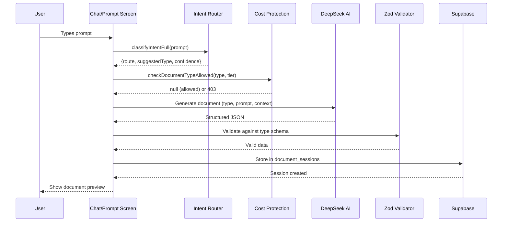

# Design Document: Service Business Document Workflow

## Overview

This design expands Clorefy from 4 document types to 10, covering the full client-work lifecycle for service businesses. The expansion adds: Quote (replacing "quotation"), SOW, Change Order, NDA, Client Onboarding Form, Payment Follow-up, and Recurring Invoice — while preserving all existing functionality.

The core architectural principle is a **centralized document type registry** that serves as the single source of truth for type metadata. All existing modules (intent classifier, document type detector, tier system, chat system prompt, PDF templates, editor panel, history UI) are extended via this registry rather than through scattered hardcoded values.

### Design Goals

1. **Registry-driven**: One constants file defines all 10 types; every module reads from it.
2. **Backward compatible**: Existing `quotation` data continues to work via display-layer mapping.
3. **No schema migration**: The `document_sessions.document_type` TEXT column accepts any string — no CHECK constraint exists.
4. **Minimal blast radius**: Existing split-screen layout, auth, billing infrastructure, R2 storage, admin dashboard, and landing pages remain unchanged.
5. **Type-safe**: Zod schemas + TypeScript interfaces for all new document types ensure consistency between AI output, editor, and PDF renderer.

### Key Design Decisions

| Decision | Rationale |
|----------|-----------|
| Centralized registry in `lib/document-type-registry.ts` | Single source of truth prevents drift between UI, backend, and AI modules |
| Reuse `InvoiceData` interface for invoice/quote/recurring_invoice | These share line-item structure; avoids duplication |
| Separate data interfaces for SOW, Change Order, NDA, Onboarding Form, Payment Follow-up | These have fundamentally different structures |
| `quote` as canonical value, `quotation` as legacy alias | Avoids data migration while modernizing naming |
| Signature workflow extended via registry `supports_signature` flag | No new signing infrastructure needed |
| Payment links gated by registry `supports_payment_link` flag | Clean enforcement without scattered conditionals |

---

## Architecture

### High-Level Component Diagram

```mermaid
graph TD
    subgraph "Client Layer"
        UI[UI Components]
        EP[Editor Panel]
        HP[History Page]
        SB[Session Sidebar]
        PS[Prompt Screen]
    end

    subgraph "Routing & Classification"
        IR[Intent Router]
        DTD[Document Type Detector]
        CSP[Chat System Prompt]
    end

    subgraph "Core Registry"
        DTR[Document Type Registry]
    end

    subgraph "Business Logic"
        CP[Cost Protection / Tier System]
        SIG[Signature Workflow]
        DL[Document Linking]
        MM[Mismatch Detection]
    end

    subgraph "Generation & Export"
        AI[DeepSeek AI Generation]
        PDF[PDF Templates]
        DOCX[DOCX Export]
        IMG[Image Export]
    end

    subgraph "Data Layer"
        ZOD[Zod Schemas]
        DB[(Supabase DB)]
    end

    DTR --> UI
    DTR --> EP
    DTR --> HP
    DTR --> SB
    DTR --> IR
    DTR --> DTD
    DTR --> CP
    DTR --> SIG
    DTR --> DL
    DTR --> MM
    DTR --> AI
    DTR --> PDF
    DTR --> CSP

    ZOD --> AI
    ZOD --> EP
    ZOD --> PDF

    AI --> DB
    EP --> DB
    DL --> DB
```



### Data Flow for Document Creation



---

## Components and Interfaces

### 1. Document Type Registry (`lib/document-type-registry.ts`)

The centralized registry that all modules consume.

```typescript
import type { LucideIcon } from "lucide-react"

export const ALL_DOCUMENT_TYPES = [
  "invoice", "contract", "quote", "proposal", "sow",
  "change_order", "nda", "client_onboarding_form",
  "payment_followup", "recurring_invoice",
] as const

export type DocumentType = typeof ALL_DOCUMENT_TYPES[number]

/** Legacy alias — maps to "quote" everywhere */
export type LegacyDocumentType = "quotation"

export interface DocumentTypeConfig {
  type: DocumentType
  label: string
  description: string
  icon: string // Lucide icon name (resolved at render time)
  color: string // Tailwind text color class
  bgColor: string // Tailwind bg color class
  capabilities: {
    supports_signature: boolean
    supports_payment_link: boolean
    supports_linking: boolean
    supports_recurring: boolean
  }
  /** Parent types this document can link to */
  validParentTypes: DocumentType[]
}

export const DOCUMENT_TYPE_REGISTRY: Record<DocumentType, DocumentTypeConfig>

/** Normalize legacy "quotation" to "quote" */
export function normalizeDocumentType(type: string): DocumentType | null

/** Get display label (handles quotation → Quote mapping) */
export function getDocumentTypeLabel(type: string): string

/** Get config, with fallback for unknown types */
export function getDocumentTypeConfig(type: string): DocumentTypeConfig | null
```

### 2. Tier System Update (`lib/cost-protection.ts`)

Update `TIER_LIMITS.allowedDocTypes` arrays:

```typescript
const TIER_LIMITS: Record<UserTier, TierLimits> = {
  free: {
    // ...existing limits...
    allowedDocTypes: ["invoice", "contract", "quote"],
  },
  starter: {
    // ...existing limits...
    allowedDocTypes: ALL_DOCUMENT_TYPES as unknown as string[],
  },
  pro: {
    // ...existing limits...
    allowedDocTypes: ALL_DOCUMENT_TYPES as unknown as string[],
  },
  agency: {
    // ...existing limits...
    allowedDocTypes: ALL_DOCUMENT_TYPES as unknown as string[],
  },
}
```

The existing `checkDocumentTypeAllowed()` function signature remains unchanged — it already accepts any `docType: string` and checks against the array.

**Invoice-always-allowed invariant**: Per Requirement 2.1, `invoice` SHALL never be denied on the basis of tier. To enforce this defensively (independent of `TIER_LIMITS` configuration drift), `checkDocumentTypeAllowed()` MUST short-circuit and return `null` (allowed) whenever the normalized document type is `"invoice"`, before consulting the tier's `allowedDocTypes` array:

```typescript
export function checkDocumentTypeAllowed(docType: string, tier: UserTier) {
  const normalized = normalizeDocumentType(docType) ?? docType
  // Invariant: invoice is always accessible regardless of tier
  if (normalized === "invoice") return null
  const limits = TIER_LIMITS[tier]
  if (!limits.allowedDocTypes.includes(normalized)) {
    return upgradeRequiredResponse(normalized, tier)
  }
  return null
}
```

This guarantees that even if a future configuration mistake removes `"invoice"` from `free.allowedDocTypes`, free-tier users still retain invoice access.

### 3. Intent Router Extension (`lib/intent-router.ts`)

Extend `TYPE_KEYWORDS` array and `DocumentType` union:

```typescript
export type DocumentType =
  | "invoice" | "contract" | "quote" | "proposal"
  | "sow" | "change_order" | "nda"
  | "client_onboarding_form" | "payment_followup"
  | "recurring_invoice"

const TYPE_KEYWORDS: Array<{ type: DocumentType; pattern: RegExp }> = [
  // Existing (quotation pattern updated to map to "quote")
  { type: "invoice", pattern: /\b(invoice|bill|receipt|billing|amount owed|services rendered)\b/i },
  { type: "quote", pattern: /\b(quotation|quote|price quote|pricing|estimate|cost estimate|bid)\b/i },
  { type: "contract", pattern: /\b(contract|service agreement|employment|hire|work agreement|legal terms)\b/i },
  { type: "proposal", pattern: /\b(proposal|business proposal|project proposal|pitch|selling capabilities)\b/i },
  // New types
  { type: "sow", pattern: /\b(statement of work|sow|deliverables|milestones|timeline|phases|project scope)\b/i },
  { type: "change_order", pattern: /\b(change order|amendment|scope change|modification|revision|addendum|extra work)\b/i },
  { type: "nda", pattern: /\b(nda|non-disclosure|confidentiality|confidential|secret|proprietary)\b/i },
  { type: "client_onboarding_form", pattern: /\b(onboarding|intake|client details|questionnaire|client form|project requirements)\b/i },
  { type: "payment_followup", pattern: /\b(reminder|follow.?up|overdue|payment reminder|past due|outstanding|unpaid)\b/i },
  { type: "recurring_invoice", pattern: /\b(recurring|monthly invoice|weekly billing|subscription billing|repeat invoice|monthly billing)\b/i },
]
```

#### Multi-Suggestion Return Type (Requirement 3.3a)

When a prompt contains keywords matching more than one document type category, the Intent_Classifier MUST be able to return more than one suggestion ranked by confidence so the calling layer can disambiguate with the user. The classifier therefore returns a ranked array of suggestions rather than a single type:

```typescript
export interface IntentSuggestion {
  type: DocumentType
  confidence: number // 0..1, normalized match score
  matchedKeywords: string[]
}

export interface IntentResult {
  route: "document" | "chat" | "unknown"
  /** Ranked list, highest confidence first. Empty when route !== "document". */
  suggestions: IntentSuggestion[]
  /**
   * Convenience accessor — equals suggestions[0]?.type.
   * Retained for callers that don't need disambiguation.
   */
  suggestedType: DocumentType | null
}

export function classifyIntentFull(prompt: string): IntentResult
```

Ranking rules:
- All `TYPE_KEYWORDS` entries whose pattern matches the prompt produce a candidate suggestion.
- Confidence is computed from match count and keyword specificity, normalized so the top match is in `[0, 1]`.
- Suggestions are sorted by descending confidence; ties are broken by registry order in `ALL_DOCUMENT_TYPES`.
- Suggestions whose confidence is more than `CONFIDENCE_GAP` (e.g. `0.25`) below the leader are dropped, so the array contains only plausibly-ambiguous candidates.

Calling-layer disambiguation behavior:
- If `suggestions.length <= 1`, the caller proceeds with `suggestedType` as before — no UX change.
- If `suggestions.length >= 2`, the chat / prompt screen MUST present a disambiguation prompt to the user, listing each candidate type's label and short description (sourced from `getDocumentTypeConfig(type)`). The user's selection is then used as the confirmed `documentType` for downstream tier checks, generation, and storage.
- The disambiguation prompt is rendered inline in the chat as a small card with one button per candidate type, plus a "Something else" escape hatch that falls through to the AI chat flow.
- The classifier itself remains pure and side-effect free; the disambiguation UX lives entirely in the calling layer.

Extended mismatch rules:

```typescript
export const MISMATCH_RULES: readonly MismatchRule[] = [
  // ...existing rules...
  {
    requestedType: "proposal",
    triggerPattern: /\b(deliverables|milestones|acceptance criteria|timeline|phases)\b/i,
    suggestedType: "sow",
    reason: "For detailed deliverables and milestones, a Statement of Work (SOW) is more appropriate than a proposal.",
  },
  {
    requestedType: "contract",
    triggerPattern: /\b(change|amendment|scope change|modification|revision|addendum)\b/i,
    suggestedType: "change_order",
    reason: "For changes to an existing agreement, a Change Order is the right document.",
  },
  {
    requestedType: "invoice",
    triggerPattern: /\b(reminder|follow.?up|overdue|past due|outstanding|unpaid invoice)\b/i,
    suggestedType: "payment_followup",
    reason: "For reminding a client about an unpaid invoice, a Payment Follow-up is more appropriate.",
  },
  {
    requestedType: "contract",
    triggerPattern: /\b(confidential|nda|non-disclosure|secret|proprietary)\b/i,
    suggestedType: "nda",
    reason: "For confidentiality protection only, an NDA is more appropriate than a full contract.",
  },
  {
    requestedType: "quote",
    triggerPattern: /\b(already agreed|final price|payment due|collect payment|invoice for)\b/i,
    suggestedType: "invoice",
    reason: "If the work is already agreed and you need to collect payment, use an invoice.",
  },
]
```

### 4. Document Type Detector Extension (`lib/server/document-type-detector.ts`)

Update `DocumentType` export and add keyword patterns for all 10 types:

```typescript
export type DocumentType =
  | "invoice" | "contract" | "quote" | "proposal"
  | "sow" | "change_order" | "nda"
  | "client_onboarding_form" | "payment_followup"
  | "recurring_invoice"
```

### 5. Chat System Prompt Update (`lib/chat-only-prompts.ts`)

- Update `CHAT_ONLY_SYSTEM_PROMPT` to list all 10 types with descriptions
- Update `CREATE_CARD_SIGNAL_REGEX` to accept all 10 type values
- Update `ParsedCreateCard.type` union to include all 10 types
- Add document linking suggestions to the prompt

### 6. Signature Workflow

No new infrastructure. The existing signing flow (token generation, email, signing page, storage) is reused. The registry's `supports_signature` flag gates which types show the "Request Signature" button:

- `contract`: ✅ (existing)
- `nda`: ✅ (new — parties: "Disclosing Party" / "Receiving Party")
- `sow`: ✅ (new — parties: "Client" / "Provider")
- `change_order`: ✅ (new — parties: "Client" / "Provider")
- All others: ❌

### 7. Document Linking Extension

The existing `chain_id` mechanism is reused. New parent-child relationships:

| Child Type | Valid Parent Types |
|-----------|-------------------|
| `sow` | `contract` |
| `change_order` | `sow`, `contract` |
| `payment_followup` | `invoice` |
| `recurring_invoice` | `invoice` |

The `document_sessions` table already has `chain_id`. Parent reference is stored in the session's `context` JSONB field as `parent_document_id`.

### 8. PDF Templates

New templates added to `lib/pdf-templates.tsx` using the existing `@react-pdf/renderer` infrastructure. Each new type gets a `DocumentConfig` entry in `getDocumentConfig()`:

- `SOWTemplate` — project overview, scope items, deliverables table, milestones, assumptions, signature blocks
- `ChangeOrderTemplate` — change order number, parent reference, additions/removals/modifications, cost/timeline impact, signature blocks
- `NDATemplate` — parties, confidential info definition, obligations, exclusions, term/duration, signature blocks
- `ClientOnboardingFormTemplate` — client details, Q&A sections, requirements summary
- `PaymentFollowupTemplate` — invoice reference, payment status, payment link, reminder message
- `RecurringInvoiceTemplate` — extends invoice template with recurrence info header

#### Signature Block Rendering — Fail-Closed Export (Requirement 6.4)

For document types that require signature blocks (`contract`, `nda`, `sow`, `change_order`), the PDF export pipeline MUST be fail-closed: if the signature block component cannot be rendered for any reason, the export MUST be aborted and an error surfaced to the user.

Implementation in `lib/pdf-templates.tsx`:

```typescript
function renderSignatureBlock(
  type: DocumentType,
  data: AnyDocumentData,
): ReactElement | never {
  if (!DOCUMENT_TYPE_REGISTRY[type]?.capabilities.supports_signature) {
    // Type does not require signatures — no block needed, proceed normally
    return <></>
  }

  const block = buildSignatureBlock(type, data)
  if (!block) {
    // Signature block is required but could not be built — hard error
    throw new SignatureBlockRenderError(
      `Cannot render signature block for document type "${type}". ` +
      `Export blocked to prevent producing an unsigned-and-unsigned PDF.`
    )
  }
  return block
}
```

In the PDF export route (`app/api/export/pdf/route.ts`), `SignatureBlockRenderError` is caught and mapped to a 422 response:

```typescript
try {
  const pdfBytes = await renderDocumentPDF(type, data)
  return new Response(pdfBytes, { headers: { "Content-Type": "application/pdf" } })
} catch (err) {
  if (err instanceof SignatureBlockRenderError) {
    return NextResponse.json(
      { error: "PDF export blocked: the signature section could not be rendered. Please check your document data and try again." },
      { status: 422 }
    )
  }
  throw err
}
```

The `pdf-download-button.tsx` component catches the 422 status and renders a descriptive toast error to the user rather than silently producing a broken PDF.

### 9. Editor Panel Extension

The editor panel (`components/editor-panel.tsx`) gains type-specific step layouts. The existing `Step` accordion component is reused. Each new type defines its own step configuration:

| Type | Steps |
|------|-------|
| SOW | Type → Parties → Scope & Deliverables → Milestones → Terms & Signature |
| Change Order | Type → Parent Reference → Changes → Impact → Signature |
| NDA | Type → Parties → Confidential Info → Terms & Duration → Signature |
| Onboarding Form | Type → Client Details → Questions → Summary |
| Payment Follow-up | Type → Invoice Reference → Reminder Settings → Message |
| Recurring Invoice | Type → Parties → Items → Recurrence Schedule → Payment |

#### Conditional (Lazy) Rendering — Active Tab Only (Requirement 10.1)

Type-specific field layouts are computationally expensive (they involve large Zod-controlled form trees). To avoid unnecessary renders, the editor panel MUST only mount type-specific layouts while the Editor tab is the active view. When the user is on the Chat or Preview tab, the editor panel MUST remain unmounted or render a lightweight placeholder.

Implementation pattern in the session view:

```typescript
// In the tab container (e.g. prompt-screen.tsx or the session page)
const [activeTab, setActiveTab] = useState<"chat" | "preview" | "editor">("chat")

// Editor panel is only rendered (not just hidden) when the editor tab is active
{activeTab === "editor" && (
  <EditorPanel
    session={session}
    documentType={documentType}
    data={documentData}
    onSave={handleEditorSave}
  />
)}
```

This prevents unnecessary form initialization, Zod schema instantiation, and React reconciliation for all 10 type layouts when the user is not actively editing. The `EditorPanel` component itself does not need to guard against inactive state — the parent conditionally mounts it.

#### Quote / Quotation Alias Resolution (Requirement 10.7)

Both `"quote"` and `"quotation"` values MUST load the identical line-item editor layout. The editor panel resolves the effective document type through `normalizeDocumentType` before selecting the step configuration:

```typescript
// Inside EditorPanel — resolve aliases before dispatching to layout
const effectiveType = normalizeDocumentType(documentType) ?? documentType

const editorSteps = useMemo(
  () => getEditorStepsForType(effectiveType),
  [effectiveType]
)
```

`getEditorStepsForType("quotation")` is never called directly — the alias resolution ensures it always receives `"quote"`, so only a single `QuoteEditorSteps` layout definition is needed. This avoids duplicate code for an effectively retired type value.

---

## Data Models

### New Document Type Schemas

All schemas use Zod for validation and derive TypeScript interfaces.

#### SOW Schema

```typescript
export const sowSchema = z.object({
  documentType: z.literal("sow"),
  title: z.string().min(1).max(200),
  referenceNumber: z.string(),
  projectOverview: z.string().min(1).max(5000),
  scopeItems: z.array(z.object({
    id: z.string(),
    title: z.string(),
    description: z.string(),
    included: z.boolean().default(true),
  })).min(1),
  deliverables: z.array(z.object({
    id: z.string(),
    description: z.string(),
    dueDate: z.string().optional(),
    acceptanceCriteria: z.string().optional(),
  })),
  milestones: z.array(z.object({
    id: z.string(),
    name: z.string(),
    date: z.string(),
    description: z.string().optional(),
  })),
  assumptions: z.array(z.string()),
  parentContractId: z.string().uuid().optional(),
  // Shared fields
  fromName: z.string(), fromEmail: z.string(), fromAddress: z.string(),
  toName: z.string(), toEmail: z.string(), toAddress: z.string(),
  effectiveDate: z.string(),
  endDate: z.string().optional(),
  currency: z.string().default("USD"),
  totalValue: z.number().optional(),
  signatureName: z.string().optional(),
  signatureTitle: z.string().optional(),
  notes: z.string().optional(),
  terms: z.string().optional(),
})
export type SOWData = z.infer<typeof sowSchema>
```

#### Change Order Schema

```typescript
export const changeOrderSchema = z.object({
  documentType: z.literal("change_order"),
  changeOrderNumber: z.string(),
  referenceNumber: z.string(),
  parentDocumentId: z.string().uuid(),
  parentDocumentType: z.enum(["sow", "contract"]),
  description: z.string().min(1).max(5000),
  additions: z.array(z.object({
    id: z.string(),
    description: z.string(),
    cost: z.number().optional(),
  })),
  removals: z.array(z.object({
    id: z.string(),
    description: z.string(),
    costReduction: z.number().optional(),
  })),
  modifications: z.array(z.object({
    id: z.string(),
    original: z.string(),
    revised: z.string(),
    costImpact: z.number().optional(),
  })),
  costImpact: z.object({
    originalTotal: z.number(),
    newTotal: z.number(),
    difference: z.number(),
  }).optional(),
  timelineImpact: z.string().optional(),
  effectiveDate: z.string(),
  // Shared fields
  fromName: z.string(), fromEmail: z.string(), fromAddress: z.string(),
  toName: z.string(), toEmail: z.string(), toAddress: z.string(),
  currency: z.string().default("USD"),
  signatureName: z.string().optional(),
  signatureTitle: z.string().optional(),
  notes: z.string().optional(),
  terms: z.string().optional(),
})
export type ChangeOrderData = z.infer<typeof changeOrderSchema>
```

#### NDA Schema

```typescript
export const ndaSchema = z.object({
  documentType: z.literal("nda"),
  referenceNumber: z.string(),
  parties: z.array(z.object({
    name: z.string(),
    role: z.enum(["disclosing", "receiving", "mutual"]),
    address: z.string().optional(),
    representative: z.string().optional(),
  })).min(2).max(4),
  confidentialInfoDefinition: z.string().min(1).max(5000),
  obligations: z.array(z.string()).min(1),
  exclusions: z.array(z.string()),
  termStart: z.string(),
  termDuration: z.number().min(1),
  termUnit: z.enum(["months", "years"]),
  governingLaw: z.string(),
  remedies: z.string().optional(),
  // Shared fields
  fromName: z.string(), fromEmail: z.string(), fromAddress: z.string(),
  toName: z.string(), toEmail: z.string(), toAddress: z.string(),
  signatureName: z.string().optional(),
  signatureTitle: z.string().optional(),
  notes: z.string().optional(),
  terms: z.string().optional(),
})
export type NDAData = z.infer<typeof ndaSchema>
```

#### Client Onboarding Form Schema

```typescript
export const clientOnboardingFormSchema = z.object({
  documentType: z.literal("client_onboarding_form"),
  referenceNumber: z.string(),
  clientName: z.string().min(1),
  clientEmail: z.string().email().optional(),
  clientPhone: z.string().optional(),
  clientAddress: z.string().optional(),
  projectName: z.string().min(1),
  projectDescription: z.string().max(5000),
  requirements: z.array(z.string()),
  timelinePreference: z.string().optional(),
  budgetRange: z.string().optional(),
  customQuestions: z.array(z.object({
    id: z.string(),
    question: z.string(),
    answer: z.string(),
  })),
  // Shared fields
  fromName: z.string(), fromEmail: z.string(), fromAddress: z.string(),
  notes: z.string().optional(),
})
export type ClientOnboardingFormData = z.infer<typeof clientOnboardingFormSchema>
```

#### Payment Follow-up Schema

```typescript
export const paymentFollowupSchema = z.object({
  documentType: z.literal("payment_followup"),
  referenceNumber: z.string(),
  linkedInvoiceId: z.string().uuid(),
  invoiceNumber: z.string(),
  invoiceAmount: z.number(),
  invoiceCurrency: z.string(),
  dueDate: z.string(),
  daysOverdue: z.number(),
  paymentLinkUrl: z.string().url().optional(),
  reminderTone: z.enum(["polite", "firm", "urgent"]),
  customMessage: z.string().max(2000),
  // Shared fields
  fromName: z.string(), fromEmail: z.string(), fromAddress: z.string(),
  toName: z.string(), toEmail: z.string(), toAddress: z.string(),
  notes: z.string().optional(),
})
export type PaymentFollowupData = z.infer<typeof paymentFollowupSchema>
```

#### Recurring Invoice Schema

The recurring invoice reuses the existing `InvoiceData` interface with additional recurrence fields stored in the session's `context` JSONB:

```typescript
export const recurringInvoiceContextSchema = z.object({
  recurrenceFrequency: z.enum(["weekly", "biweekly", "monthly", "quarterly", "annually"]),
  recurrenceStartDate: z.string(),
  recurrenceEndDate: z.string().optional(),
  maxOccurrences: z.number().optional(),
  autoSend: z.boolean().default(true),
})
export type RecurringInvoiceContext = z.infer<typeof recurringInvoiceContextSchema>
```

### Database Considerations

No schema migration required. The `document_sessions` table stores:
- `document_type: TEXT` — accepts any of the 10 type strings
- `context: JSONB` — stores type-specific structured data (SOW fields, NDA fields, etc.)
- `chain_id: UUID` — existing linking mechanism
- `parent_document_id` stored within `context` JSONB for Change Orders and SOWs

### Union Type for All Document Data

```typescript
export type AnyDocumentData =
  | InvoiceData          // invoice, quote, recurring_invoice
  | SOWData
  | ChangeOrderData
  | NDAData
  | ClientOnboardingFormData
  | PaymentFollowupData
```

---

## Correctness Properties

*A property is a characteristic or behavior that should hold true across all valid executions of a system — essentially, a formal statement about what the system should do. Properties serve as the bridge between human-readable specifications and machine-verifiable correctness guarantees.*

### Property 1: Type normalization consistency

*For any* string input to `normalizeDocumentType`, the function SHALL return a valid `DocumentType` or null. Additionally, *for any* input that is `"quotation"`, the function SHALL return `"quote"`. *For any* valid `DocumentType` value, normalization SHALL be idempotent: `normalizeDocumentType(normalizeDocumentType(x)) === normalizeDocumentType(x)`.

**Validates: Requirements 1.3, 16.1, 16.2, 16.5**

### Property 2: Registry completeness

*For any* document type in `ALL_DOCUMENT_TYPES`, calling `getDocumentTypeConfig(type)` SHALL return a non-null object containing all required fields: `label` (non-empty string), `icon` (non-empty string), `color` (non-empty string), `bgColor` (non-empty string), `description` (non-empty string), and `capabilities` (object with boolean fields `supports_signature`, `supports_payment_link`, `supports_linking`, `supports_recurring`).

**Validates: Requirements 1.4, 1.5**

### Property 3: Tier access control enforcement

*For any* `(documentType, userTier)` pair where `documentType` is a valid type and `userTier` is a valid tier, `checkDocumentTypeAllowed(documentType, userTier)` SHALL return `null` (allowed) when either (a) `documentType` normalizes to `"invoice"` (the invoice-always-accessible invariant), or (b) `documentType` is in `TIER_LIMITS[userTier].allowedDocTypes`. For all other cases it SHALL return a response with status 403. The `"invoice"` invariant takes precedence over the `allowedDocTypes` lookup.

**Validates: Requirements 2.1, 2.2**

### Property 4: Intent classifier keyword detection

*For any* document type in the 10 supported types and *for any* prompt string that contains at least one keyword from that type's keyword pattern, `classifyIntentFull(prompt)` SHALL return a result where `suggestedType` equals that document type (assuming no competing keywords from other types with higher match density).

**Validates: Requirements 3.1, 3.2, 3.3, 3.4, 3.5, 3.6, 3.7, 3.8, 3.9, 3.10, 3.11**

### Property 5: Document type detector keyword detection

*For any* document type in the 10 supported types and *for any* prompt string containing only keywords from that type's pattern, `detectDocumentType(prompt)` SHALL return that type as the detected type. Prompts containing "quotation" keywords SHALL detect as `"quote"` (never `"quotation"`).

**Validates: Requirements 4.1, 4.2, 4.3, 4.4, 4.5, 4.6, 4.7, 4.9**

### Property 6: Classification function determinism

*For any* prompt string, calling `classifyIntentFull(prompt)` multiple times SHALL always return the same `IntentResult`. Similarly, *for any* `(prompt, requestedType)` pair, calling `detectMismatch(prompt, requestedType)` multiple times SHALL always return the same result.

**Validates: Requirements 3.12, 13.7**

### Property 7: CREATE_CARD signal parsing for all types

*For any* document type in `ALL_DOCUMENT_TYPES` and *for any* summary string (1-200 chars, no double quotes), a well-formed CREATE_CARD signal `[CREATE_CARD:{"type":"<type>","summary":"<summary>"}]` SHALL be successfully parsed by `parseCreateCardSignal`, returning an object with the correct type and summary.

**Validates: Requirements 5.7, 5.8**

### Property 8: Signature capability correctness

*For any* document type in `ALL_DOCUMENT_TYPES`, `getDocumentTypeConfig(type).capabilities.supports_signature` SHALL be `true` if and only if `type` is in the set `{"contract", "nda", "sow", "change_order"}`.

**Validates: Requirements 6.1, 6.5**

### Property 9: Document linking parent validation

*For any* child document type and *for any* proposed parent document type, linking SHALL be allowed if and only if the parent type is in `DOCUMENT_TYPE_REGISTRY[childType].validParentTypes`. Specifically: SOW allows only `contract` as parent; Change Order allows `sow` or `contract`; Payment Follow-up allows only `invoice`.

**Validates: Requirements 7.1, 7.2, 7.3**

### Property 10: Schema validation for generated data

*For any* randomly generated valid document data object conforming to a document type's Zod schema, calling `schema.parse(data)` SHALL succeed without throwing. Conversely, *for any* data object missing a required field, `schema.parse(data)` SHALL throw a ZodError.

**Validates: Requirements 11.1, 11.2, 11.3, 11.4, 11.5, 11.6, 11.7**

### Property 11: Mismatch detection correctness

*For any* mismatch rule in `MISMATCH_RULES` and *for any* prompt string matching that rule's `triggerPattern` with `requestedType` equal to the rule's `requestedType`, `detectMismatch(prompt, requestedType)` SHALL return a non-null result with `suggestedType` equal to the rule's `suggestedType`.

**Validates: Requirements 13.1, 13.2, 13.3, 13.4, 13.5, 13.6**

### Property 12: Payment link capability correctness

*For any* document type in `ALL_DOCUMENT_TYPES`, `getDocumentTypeConfig(type).capabilities.supports_payment_link` SHALL be `true` if and only if `type` is in the set `{"invoice", "recurring_invoice"}`.

**Validates: Requirements 14.1, 14.2**

---

## Error Handling

### Document Type Errors

| Scenario | Handling |
|----------|----------|
| Unknown document type string | `normalizeDocumentType` returns `null`; UI falls back to generic document icon |
| Tier-restricted type requested | 403 response with upgrade message naming the restricted type and minimum tier |
| AI generates invalid schema | Retry generation once; if still invalid, return user-friendly error |
| Parent document not found for linking | Warn user; allow creation without parent link |
| Legacy "quotation" value in DB | Display as "Quote" via `getDocumentTypeLabel`; no error |

### AI Generation Errors

| Scenario | Handling |
|----------|----------|
| AI output fails Zod validation | Retry once with stricter prompt; if still fails, show error toast |
| AI suggests wrong document type | Mismatch detection catches it; user sees suggestion card |
| AI generates empty required fields | Zod validation catches it; retry with explicit field requirements |
| DeepSeek API timeout/error | Existing error handling in `lib/deepseek.ts` applies (exponential backoff) |

### Linking Errors

| Scenario | Handling |
|----------|----------|
| Invalid parent type for child | `validParentTypes` check prevents link; UI shows explanation |
| Parent document deleted | Orphaned child retains `parent_document_id` in context but shows "Parent unavailable" |
| Circular linking attempt | Chain system prevents cycles (existing behavior) |

### Export Errors

| Scenario | Handling |
|----------|----------|
| PDF template missing for type | Fall back to generic template with type label as header |
| Document data incomplete for export | Validate before export; show missing fields toast |
| Signature block fails to render for a signable type (`contract`, `nda`, `sow`, `change_order`) | **Block the export** — throw `SignatureBlockRenderError`; return 422 to client; show descriptive toast error. Never produce a PDF without the required signature section. |
| Signature images missing for signed doc | Show empty signature line with "Signed" text |

---

## Testing Strategy

### Property-Based Testing (PBT)

PBT is highly applicable to this feature because the core logic consists of pure functions with clear input/output behavior:
- Type normalization, registry lookups, tier checks, keyword detection, mismatch detection, signal parsing, and schema validation are all pure functions with large input spaces.

**Library**: `fast-check` (already available in the project's test infrastructure)

**Configuration**: Minimum 100 iterations per property test.

**Tag format**: `Feature: service-business-document-workflow, Property {N}: {title}`

Each of the 12 correctness properties above maps to a single property-based test.

### Unit Tests (Example-Based)

| Area | Tests |
|------|-------|
| Registry | Verify specific type configs (e.g., invoice has payment link, NDA has signature) |
| Tier system | Free tier blocks SOW; Starter allows all 10 |
| Intent classifier | Specific prompt → expected type mapping table |
| Mismatch detection | Each rule fires for its trigger pattern |
| CREATE_CARD parsing | Valid signals parse; malformed signals return null |
| Schema validation | Valid SOW data passes; missing `scopeItems` fails |
| Normalization | "quotation" → "quote"; "invoice" → "invoice"; "unknown" → null |

### Integration Tests

| Area | Tests |
|------|-------|
| AI generation | Generate each of 10 types; validate output against schema |
| Document creation flow | Create session → generate → validate → store |
| Signature flow | Request signature for NDA/SOW/Change Order |
| Document linking | Create SOW linked to contract; verify chain |
| Export | PDF/DOCX/image export for each type produces valid output |
| Tier enforcement | Free user blocked from SOW; Starter user allowed |

### Visual/Snapshot Tests

| Area | Tests |
|------|-------|
| PDF templates | Snapshot test for each of 10 types with sample data |
| Editor panel | Render test for each type's step layout |
| History page | Icons and colors render correctly for all types |
| Mobile responsiveness | Viewport tests at 375px, 768px widths |

### Test Coverage Goals

- Pure logic functions (registry, normalization, detection, validation): 100% branch coverage via PBT
- UI components: Render tests for all 10 type variations
- Integration: Happy path for each new type's creation flow
- Export: At least one export test per type per format
